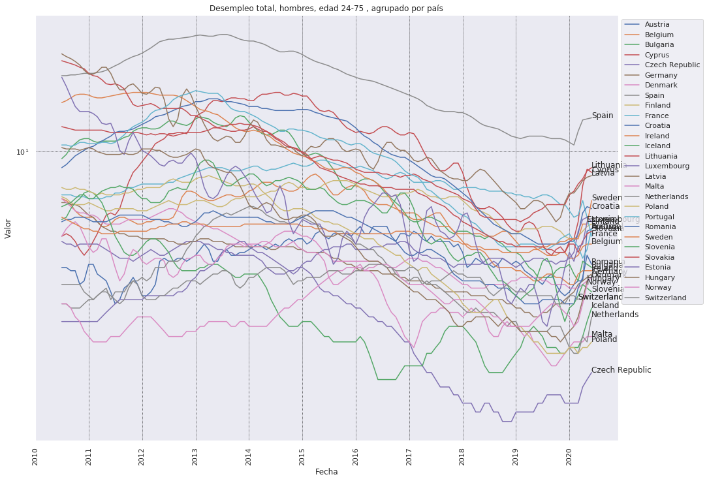

```python
import pandas as pd
import numpy as np
import matplotlib.pyplot as plt
%matplotlib inline
import seaborn as sns; sns.set()
```


```python
data = pd.read_csv("data/une_rt_m.tsv", sep="\t")
codes = pd.read_csv("data/wikipedia-iso-country-codes.csv")
```


```python
data.head()
```


<div>
<style scoped>
    .dataframe tbody tr th:only-of-type {
        vertical-align: middle;
    }

    .dataframe tbody tr th {
        vertical-align: top;
    }

    .dataframe thead th {
        text-align: right;
    }
</style>
<table border="1" class="dataframe">
  <thead>
    <tr style="text-align: right;">
      <th></th>
      <th>s_adj,age,unit,sex,geo\time</th>
      <th>2020M06</th>
      <th>2020M05</th>
      <th>2020M04</th>
      <th>2020M03</th>
      <th>2020M02</th>
      <th>2020M01</th>
      <th>2019M12</th>
      <th>2019M11</th>
      <th>2019M10</th>
      <th>...</th>
      <th>1983M10</th>
      <th>1983M09</th>
      <th>1983M08</th>
      <th>1983M07</th>
      <th>1983M06</th>
      <th>1983M05</th>
      <th>1983M04</th>
      <th>1983M03</th>
      <th>1983M02</th>
      <th>1983M01</th>
    </tr>
  </thead>
  <tbody>
    <tr>
      <th>0</th>
      <td>NSA,TOTAL,PC_ACT,F,AT</td>
      <td>6.3</td>
      <td>5.6</td>
      <td>5.2</td>
      <td>4.7</td>
      <td>4.1</td>
      <td>4.4</td>
      <td>4.0</td>
      <td>3.9</td>
      <td>4.2</td>
      <td>...</td>
      <td>:</td>
      <td>:</td>
      <td>:</td>
      <td>:</td>
      <td>:</td>
      <td>:</td>
      <td>:</td>
      <td>:</td>
      <td>:</td>
      <td>:</td>
    </tr>
    <tr>
      <th>1</th>
      <td>NSA,TOTAL,PC_ACT,F,BE</td>
      <td>5.0</td>
      <td>5.0</td>
      <td>5.2</td>
      <td>5.0</td>
      <td>4.9</td>
      <td>4.8</td>
      <td>4.6</td>
      <td>4.5</td>
      <td>4.7</td>
      <td>...</td>
      <td>:</td>
      <td>:</td>
      <td>:</td>
      <td>:</td>
      <td>:</td>
      <td>:</td>
      <td>:</td>
      <td>:</td>
      <td>:</td>
      <td>:</td>
    </tr>
    <tr>
      <th>2</th>
      <td>NSA,TOTAL,PC_ACT,F,BG</td>
      <td>3.9</td>
      <td>4.2</td>
      <td>4.7</td>
      <td>4.1</td>
      <td>4.2</td>
      <td>4.3</td>
      <td>3.9</td>
      <td>3.8</td>
      <td>3.6</td>
      <td>...</td>
      <td>:</td>
      <td>:</td>
      <td>:</td>
      <td>:</td>
      <td>:</td>
      <td>:</td>
      <td>:</td>
      <td>:</td>
      <td>:</td>
      <td>:</td>
    </tr>
    <tr>
      <th>3</th>
      <td>NSA,TOTAL,PC_ACT,F,CH</td>
      <td>:</td>
      <td>:</td>
      <td>:</td>
      <td>4.8</td>
      <td>4.5</td>
      <td>4.4</td>
      <td>4.1</td>
      <td>4.0</td>
      <td>4.2</td>
      <td>...</td>
      <td>:</td>
      <td>:</td>
      <td>:</td>
      <td>:</td>
      <td>:</td>
      <td>:</td>
      <td>:</td>
      <td>:</td>
      <td>:</td>
      <td>:</td>
    </tr>
    <tr>
      <th>4</th>
      <td>NSA,TOTAL,PC_ACT,F,CY</td>
      <td>9.2</td>
      <td>8.3</td>
      <td>7.9</td>
      <td>7.5</td>
      <td>7.4</td>
      <td>7.6</td>
      <td>7.4</td>
      <td>7.7</td>
      <td>5.8</td>
      <td>...</td>
      <td>:</td>
      <td>:</td>
      <td>:</td>
      <td>:</td>
      <td>:</td>
      <td>:</td>
      <td>:</td>
      <td>:</td>
      <td>:</td>
      <td>:</td>
    </tr>
  </tbody>
</table>
<p>5 rows × 451 columns</p>
</div>


```python
col = data["s_adj,age,unit,sex,geo\\time"]
```


```python
data.drop("s_adj,age,unit,sex,geo\\time", axis=1, inplace=True)
```


```python
data.columns = pd.to_datetime(list(data.columns), format='%YM%m ').date
```


```python
data.insert(0, "s_adj,age,unit,sex,geo\\time", col)
data.head()
```


<div>
<style scoped>
    .dataframe tbody tr th:only-of-type {
        vertical-align: middle;
    }

    .dataframe tbody tr th {
        vertical-align: top;
    }

    .dataframe thead th {
        text-align: right;
    }
</style>
<table border="1" class="dataframe">
  <thead>
    <tr style="text-align: right;">
      <th></th>
      <th>s_adj,age,unit,sex,geo\time</th>
      <th>2020-06-01</th>
      <th>2020-05-01</th>
      <th>2020-04-01</th>
      <th>2020-03-01</th>
      <th>2020-02-01</th>
      <th>2020-01-01</th>
      <th>2019-12-01</th>
      <th>2019-11-01</th>
      <th>2019-10-01</th>
      <th>...</th>
      <th>1983-10-01</th>
      <th>1983-09-01</th>
      <th>1983-08-01</th>
      <th>1983-07-01</th>
      <th>1983-06-01</th>
      <th>1983-05-01</th>
      <th>1983-04-01</th>
      <th>1983-03-01</th>
      <th>1983-02-01</th>
      <th>1983-01-01</th>
    </tr>
  </thead>
  <tbody>
    <tr>
      <th>0</th>
      <td>NSA,TOTAL,PC_ACT,F,AT</td>
      <td>6.3</td>
      <td>5.6</td>
      <td>5.2</td>
      <td>4.7</td>
      <td>4.1</td>
      <td>4.4</td>
      <td>4.0</td>
      <td>3.9</td>
      <td>4.2</td>
      <td>...</td>
      <td>:</td>
      <td>:</td>
      <td>:</td>
      <td>:</td>
      <td>:</td>
      <td>:</td>
      <td>:</td>
      <td>:</td>
      <td>:</td>
      <td>:</td>
    </tr>
    <tr>
      <th>1</th>
      <td>NSA,TOTAL,PC_ACT,F,BE</td>
      <td>5.0</td>
      <td>5.0</td>
      <td>5.2</td>
      <td>5.0</td>
      <td>4.9</td>
      <td>4.8</td>
      <td>4.6</td>
      <td>4.5</td>
      <td>4.7</td>
      <td>...</td>
      <td>:</td>
      <td>:</td>
      <td>:</td>
      <td>:</td>
      <td>:</td>
      <td>:</td>
      <td>:</td>
      <td>:</td>
      <td>:</td>
      <td>:</td>
    </tr>
    <tr>
      <th>2</th>
      <td>NSA,TOTAL,PC_ACT,F,BG</td>
      <td>3.9</td>
      <td>4.2</td>
      <td>4.7</td>
      <td>4.1</td>
      <td>4.2</td>
      <td>4.3</td>
      <td>3.9</td>
      <td>3.8</td>
      <td>3.6</td>
      <td>...</td>
      <td>:</td>
      <td>:</td>
      <td>:</td>
      <td>:</td>
      <td>:</td>
      <td>:</td>
      <td>:</td>
      <td>:</td>
      <td>:</td>
      <td>:</td>
    </tr>
    <tr>
      <th>3</th>
      <td>NSA,TOTAL,PC_ACT,F,CH</td>
      <td>:</td>
      <td>:</td>
      <td>:</td>
      <td>4.8</td>
      <td>4.5</td>
      <td>4.4</td>
      <td>4.1</td>
      <td>4.0</td>
      <td>4.2</td>
      <td>...</td>
      <td>:</td>
      <td>:</td>
      <td>:</td>
      <td>:</td>
      <td>:</td>
      <td>:</td>
      <td>:</td>
      <td>:</td>
      <td>:</td>
      <td>:</td>
    </tr>
    <tr>
      <th>4</th>
      <td>NSA,TOTAL,PC_ACT,F,CY</td>
      <td>9.2</td>
      <td>8.3</td>
      <td>7.9</td>
      <td>7.5</td>
      <td>7.4</td>
      <td>7.6</td>
      <td>7.4</td>
      <td>7.7</td>
      <td>5.8</td>
      <td>...</td>
      <td>:</td>
      <td>:</td>
      <td>:</td>
      <td>:</td>
      <td>:</td>
      <td>:</td>
      <td>:</td>
      <td>:</td>
      <td>:</td>
      <td>:</td>
    </tr>
  </tbody>
</table>
<p>5 rows × 451 columns</p>
</div>


```python
codes.head()
```


<div>
<style scoped>
    .dataframe tbody tr th:only-of-type {
        vertical-align: middle;
    }

    .dataframe tbody tr th {
        vertical-align: top;
    }

    .dataframe thead th {
        text-align: right;
    }
</style>
<table border="1" class="dataframe">
  <thead>
    <tr style="text-align: right;">
      <th></th>
      <th>English short name lower case</th>
      <th>Alpha-2 code</th>
      <th>Alpha-3 code</th>
      <th>Numeric code</th>
      <th>ISO 3166-2</th>
    </tr>
  </thead>
  <tbody>
    <tr>
      <th>0</th>
      <td>Afghanistan</td>
      <td>AF</td>
      <td>AFG</td>
      <td>4</td>
      <td>ISO 3166-2:AF</td>
    </tr>
    <tr>
      <th>1</th>
      <td>Åland Islands</td>
      <td>AX</td>
      <td>ALA</td>
      <td>248</td>
      <td>ISO 3166-2:AX</td>
    </tr>
    <tr>
      <th>2</th>
      <td>Albania</td>
      <td>AL</td>
      <td>ALB</td>
      <td>8</td>
      <td>ISO 3166-2:AL</td>
    </tr>
    <tr>
      <th>3</th>
      <td>Algeria</td>
      <td>DZ</td>
      <td>DZA</td>
      <td>12</td>
      <td>ISO 3166-2:DZ</td>
    </tr>
    <tr>
      <th>4</th>
      <td>American Samoa</td>
      <td>AS</td>
      <td>ASM</td>
      <td>16</td>
      <td>ISO 3166-2:AS</td>
    </tr>
  </tbody>
</table>
</div>


```python
codes.columns = ['country', 'C2', 'C3', 'numeric', 'iso']
codes.columns
```


    Index(['country', 'C2', 'C3', 'numeric', 'iso'], dtype='object')


```python
data['C2'] = data['s_adj,age,unit,sex,geo\\time'].apply(lambda x: x.split(",")[-1])
data['age'] = data['s_adj,age,unit,sex,geo\\time'].apply(lambda x: x.split(",")[1])
data['unit'] = data['s_adj,age,unit,sex,geo\\time'].apply(lambda x: x.split(",")[2])
data['sex'] = data['s_adj,age,unit,sex,geo\\time'].apply(lambda x: x.split(",")[3])
data['s_adj'] = data['s_adj,age,unit,sex,geo\\time'].apply(lambda x: x.split(",")[0])
data.head()
```


<div>
<style scoped>
    .dataframe tbody tr th:only-of-type {
        vertical-align: middle;
    }

    .dataframe tbody tr th {
        vertical-align: top;
    }

    .dataframe thead th {
        text-align: right;
    }
</style>
<table border="1" class="dataframe">
  <thead>
    <tr style="text-align: right;">
      <th></th>
      <th>s_adj,age,unit,sex,geo\time</th>
      <th>2020-06-01</th>
      <th>2020-05-01</th>
      <th>2020-04-01</th>
      <th>2020-03-01</th>
      <th>2020-02-01</th>
      <th>2020-01-01</th>
      <th>2019-12-01</th>
      <th>2019-11-01</th>
      <th>2019-10-01</th>
      <th>...</th>
      <th>1983-05-01</th>
      <th>1983-04-01</th>
      <th>1983-03-01</th>
      <th>1983-02-01</th>
      <th>1983-01-01</th>
      <th>C2</th>
      <th>age</th>
      <th>unit</th>
      <th>sex</th>
      <th>s_adj</th>
    </tr>
  </thead>
  <tbody>
    <tr>
      <th>0</th>
      <td>NSA,TOTAL,PC_ACT,F,AT</td>
      <td>6.3</td>
      <td>5.6</td>
      <td>5.2</td>
      <td>4.7</td>
      <td>4.1</td>
      <td>4.4</td>
      <td>4.0</td>
      <td>3.9</td>
      <td>4.2</td>
      <td>...</td>
      <td>:</td>
      <td>:</td>
      <td>:</td>
      <td>:</td>
      <td>:</td>
      <td>AT</td>
      <td>TOTAL</td>
      <td>PC_ACT</td>
      <td>F</td>
      <td>NSA</td>
    </tr>
    <tr>
      <th>1</th>
      <td>NSA,TOTAL,PC_ACT,F,BE</td>
      <td>5.0</td>
      <td>5.0</td>
      <td>5.2</td>
      <td>5.0</td>
      <td>4.9</td>
      <td>4.8</td>
      <td>4.6</td>
      <td>4.5</td>
      <td>4.7</td>
      <td>...</td>
      <td>:</td>
      <td>:</td>
      <td>:</td>
      <td>:</td>
      <td>:</td>
      <td>BE</td>
      <td>TOTAL</td>
      <td>PC_ACT</td>
      <td>F</td>
      <td>NSA</td>
    </tr>
    <tr>
      <th>2</th>
      <td>NSA,TOTAL,PC_ACT,F,BG</td>
      <td>3.9</td>
      <td>4.2</td>
      <td>4.7</td>
      <td>4.1</td>
      <td>4.2</td>
      <td>4.3</td>
      <td>3.9</td>
      <td>3.8</td>
      <td>3.6</td>
      <td>...</td>
      <td>:</td>
      <td>:</td>
      <td>:</td>
      <td>:</td>
      <td>:</td>
      <td>BG</td>
      <td>TOTAL</td>
      <td>PC_ACT</td>
      <td>F</td>
      <td>NSA</td>
    </tr>
    <tr>
      <th>3</th>
      <td>NSA,TOTAL,PC_ACT,F,CH</td>
      <td>:</td>
      <td>:</td>
      <td>:</td>
      <td>4.8</td>
      <td>4.5</td>
      <td>4.4</td>
      <td>4.1</td>
      <td>4.0</td>
      <td>4.2</td>
      <td>...</td>
      <td>:</td>
      <td>:</td>
      <td>:</td>
      <td>:</td>
      <td>:</td>
      <td>CH</td>
      <td>TOTAL</td>
      <td>PC_ACT</td>
      <td>F</td>
      <td>NSA</td>
    </tr>
    <tr>
      <th>4</th>
      <td>NSA,TOTAL,PC_ACT,F,CY</td>
      <td>9.2</td>
      <td>8.3</td>
      <td>7.9</td>
      <td>7.5</td>
      <td>7.4</td>
      <td>7.6</td>
      <td>7.4</td>
      <td>7.7</td>
      <td>5.8</td>
      <td>...</td>
      <td>:</td>
      <td>:</td>
      <td>:</td>
      <td>:</td>
      <td>:</td>
      <td>CY</td>
      <td>TOTAL</td>
      <td>PC_ACT</td>
      <td>F</td>
      <td>NSA</td>
    </tr>
  </tbody>
</table>
<p>5 rows × 456 columns</p>
</div>


```python
data['C2'].unique()
```


    array(['AT', 'BE', 'BG', 'CH', 'CY', 'CZ', 'DE', 'DK', 'EA', 'EA18',
           'EA19', 'EE', 'EL', 'ES', 'EU25', 'EU27_2007', 'EU27_2020', 'EU28',
           'FI', 'FR', 'HR', 'HU', 'IE', 'IS', 'IT', 'JP', 'LT', 'LU', 'LV',
           'MT', 'NL', 'NO', 'PL', 'PT', 'RO', 'SE', 'SI', 'SK', 'UK', 'US',
           'TR'], dtype=object)


```python
data['age'].unique()
```


    array(['TOTAL', 'Y25-74', 'Y_LT25'], dtype=object)


```python
data['unit'].unique()
# PC_ACT = Percentage of active population
# THS_PER = Thousand persons
```


    array(['PC_ACT', 'THS_PER'], dtype=object)


```python
data['sex'].unique()
```


    array(['F', 'M', 'T'], dtype=object)


```python
data['s_adj'].unique() # Seasonal adjustment
# NSA = Unadjusted data
# SA = Seasonally adjusted data
# TC = Trend cycle data
```


    array(['NSA', 'SA', 'TC'], dtype=object)


```python
data.drop("s_adj,age,unit,sex,geo\\time", axis=1, inplace=True)
```


```python
cols = ['C2','age','unit','sex', 's_adj']
```


```python
data_t = data.drop(cols, axis=1)
data_t.head()
```


<div>
<style scoped>
    .dataframe tbody tr th:only-of-type {
        vertical-align: middle;
    }

    .dataframe tbody tr th {
        vertical-align: top;
    }

    .dataframe thead th {
        text-align: right;
    }
</style>
<table border="1" class="dataframe">
  <thead>
    <tr style="text-align: right;">
      <th></th>
      <th>2020-06-01</th>
      <th>2020-05-01</th>
      <th>2020-04-01</th>
      <th>2020-03-01</th>
      <th>2020-02-01</th>
      <th>2020-01-01</th>
      <th>2019-12-01</th>
      <th>2019-11-01</th>
      <th>2019-10-01</th>
      <th>2019-09-01</th>
      <th>...</th>
      <th>1983-10-01</th>
      <th>1983-09-01</th>
      <th>1983-08-01</th>
      <th>1983-07-01</th>
      <th>1983-06-01</th>
      <th>1983-05-01</th>
      <th>1983-04-01</th>
      <th>1983-03-01</th>
      <th>1983-02-01</th>
      <th>1983-01-01</th>
    </tr>
  </thead>
  <tbody>
    <tr>
      <th>0</th>
      <td>6.3</td>
      <td>5.6</td>
      <td>5.2</td>
      <td>4.7</td>
      <td>4.1</td>
      <td>4.4</td>
      <td>4.0</td>
      <td>3.9</td>
      <td>4.2</td>
      <td>3.8</td>
      <td>...</td>
      <td>:</td>
      <td>:</td>
      <td>:</td>
      <td>:</td>
      <td>:</td>
      <td>:</td>
      <td>:</td>
      <td>:</td>
      <td>:</td>
      <td>:</td>
    </tr>
    <tr>
      <th>1</th>
      <td>5.0</td>
      <td>5.0</td>
      <td>5.2</td>
      <td>5.0</td>
      <td>4.9</td>
      <td>4.8</td>
      <td>4.6</td>
      <td>4.5</td>
      <td>4.7</td>
      <td>5.0</td>
      <td>...</td>
      <td>:</td>
      <td>:</td>
      <td>:</td>
      <td>:</td>
      <td>:</td>
      <td>:</td>
      <td>:</td>
      <td>:</td>
      <td>:</td>
      <td>:</td>
    </tr>
    <tr>
      <th>2</th>
      <td>3.9</td>
      <td>4.2</td>
      <td>4.7</td>
      <td>4.1</td>
      <td>4.2</td>
      <td>4.3</td>
      <td>3.9</td>
      <td>3.8</td>
      <td>3.6</td>
      <td>3.4</td>
      <td>...</td>
      <td>:</td>
      <td>:</td>
      <td>:</td>
      <td>:</td>
      <td>:</td>
      <td>:</td>
      <td>:</td>
      <td>:</td>
      <td>:</td>
      <td>:</td>
    </tr>
    <tr>
      <th>3</th>
      <td>:</td>
      <td>:</td>
      <td>:</td>
      <td>4.8</td>
      <td>4.5</td>
      <td>4.4</td>
      <td>4.1</td>
      <td>4.0</td>
      <td>4.2</td>
      <td>4.9</td>
      <td>...</td>
      <td>:</td>
      <td>:</td>
      <td>:</td>
      <td>:</td>
      <td>:</td>
      <td>:</td>
      <td>:</td>
      <td>:</td>
      <td>:</td>
      <td>:</td>
    </tr>
    <tr>
      <th>4</th>
      <td>9.2</td>
      <td>8.3</td>
      <td>7.9</td>
      <td>7.5</td>
      <td>7.4</td>
      <td>7.6</td>
      <td>7.4</td>
      <td>7.7</td>
      <td>5.8</td>
      <td>6.9</td>
      <td>...</td>
      <td>:</td>
      <td>:</td>
      <td>:</td>
      <td>:</td>
      <td>:</td>
      <td>:</td>
      <td>:</td>
      <td>:</td>
      <td>:</td>
      <td>:</td>
    </tr>
  </tbody>
</table>
<p>5 rows × 450 columns</p>
</div>


```python
columns = data_t.columns[data_t.columns > pd.Timestamp('2010-06')]
```


```python
cols
```


    ['C2', 'age', 'unit', 'sex', 's_adj']


```python
data_sel = data[columns]
for col in cols:
    data_sel.insert(0, col, data[col])
data_sel.head()
```


<div>
<style scoped>
    .dataframe tbody tr th:only-of-type {
        vertical-align: middle;
    }

    .dataframe tbody tr th {
        vertical-align: top;
    }

    .dataframe thead th {
        text-align: right;
    }
</style>
<table border="1" class="dataframe">
  <thead>
    <tr style="text-align: right;">
      <th></th>
      <th>s_adj</th>
      <th>sex</th>
      <th>unit</th>
      <th>age</th>
      <th>C2</th>
      <th>2020-06-01</th>
      <th>2020-05-01</th>
      <th>2020-04-01</th>
      <th>2020-03-01</th>
      <th>2020-02-01</th>
      <th>...</th>
      <th>2011-04-01</th>
      <th>2011-03-01</th>
      <th>2011-02-01</th>
      <th>2011-01-01</th>
      <th>2010-12-01</th>
      <th>2010-11-01</th>
      <th>2010-10-01</th>
      <th>2010-09-01</th>
      <th>2010-08-01</th>
      <th>2010-07-01</th>
    </tr>
  </thead>
  <tbody>
    <tr>
      <th>0</th>
      <td>NSA</td>
      <td>F</td>
      <td>PC_ACT</td>
      <td>TOTAL</td>
      <td>AT</td>
      <td>6.3</td>
      <td>5.6</td>
      <td>5.2</td>
      <td>4.7</td>
      <td>4.1</td>
      <td>...</td>
      <td>4.1</td>
      <td>4.7</td>
      <td>5.6</td>
      <td>4.4</td>
      <td>4.3</td>
      <td>4.3</td>
      <td>5.1</td>
      <td>4.7</td>
      <td>4.6</td>
      <td>4.7</td>
    </tr>
    <tr>
      <th>1</th>
      <td>NSA</td>
      <td>F</td>
      <td>PC_ACT</td>
      <td>TOTAL</td>
      <td>BE</td>
      <td>5.0</td>
      <td>5.0</td>
      <td>5.2</td>
      <td>5.0</td>
      <td>4.9</td>
      <td>...</td>
      <td>6.6</td>
      <td>6.6</td>
      <td>6.8</td>
      <td>7.2</td>
      <td>7.7</td>
      <td>8.0</td>
      <td>8.4</td>
      <td>8.8</td>
      <td>9.2</td>
      <td>9.0</td>
    </tr>
    <tr>
      <th>2</th>
      <td>NSA</td>
      <td>F</td>
      <td>PC_ACT</td>
      <td>TOTAL</td>
      <td>BG</td>
      <td>3.9</td>
      <td>4.2</td>
      <td>4.7</td>
      <td>4.1</td>
      <td>4.2</td>
      <td>...</td>
      <td>10.6</td>
      <td>10.7</td>
      <td>11.0</td>
      <td>11.1</td>
      <td>10.9 d</td>
      <td>10.6</td>
      <td>9.9</td>
      <td>9.2</td>
      <td>8.9</td>
      <td>8.9</td>
    </tr>
    <tr>
      <th>3</th>
      <td>NSA</td>
      <td>F</td>
      <td>PC_ACT</td>
      <td>TOTAL</td>
      <td>CH</td>
      <td>:</td>
      <td>:</td>
      <td>:</td>
      <td>4.8</td>
      <td>4.5</td>
      <td>...</td>
      <td>4.1</td>
      <td>4.8</td>
      <td>5.1</td>
      <td>5.0</td>
      <td>4.6</td>
      <td>4.5</td>
      <td>4.8</td>
      <td>5.5</td>
      <td>5.8</td>
      <td>5.6</td>
    </tr>
    <tr>
      <th>4</th>
      <td>NSA</td>
      <td>F</td>
      <td>PC_ACT</td>
      <td>TOTAL</td>
      <td>CY</td>
      <td>9.2</td>
      <td>8.3</td>
      <td>7.9</td>
      <td>7.5</td>
      <td>7.4</td>
      <td>...</td>
      <td>6.9</td>
      <td>7.4</td>
      <td>7.9</td>
      <td>7.5</td>
      <td>6.3</td>
      <td>6.0</td>
      <td>4.9</td>
      <td>5.0</td>
      <td>5.9</td>
      <td>6.6</td>
    </tr>
  </tbody>
</table>
<p>5 rows × 125 columns</p>
</div>


```python
data_sel = data_sel.merge(codes, on="C2")
data_sel.head()
```


<div>
<style scoped>
    .dataframe tbody tr th:only-of-type {
        vertical-align: middle;
    }

    .dataframe tbody tr th {
        vertical-align: top;
    }

    .dataframe thead th {
        text-align: right;
    }
</style>
<table border="1" class="dataframe">
  <thead>
    <tr style="text-align: right;">
      <th></th>
      <th>s_adj</th>
      <th>sex</th>
      <th>unit</th>
      <th>age</th>
      <th>C2</th>
      <th>2020-06-01</th>
      <th>2020-05-01</th>
      <th>2020-04-01</th>
      <th>2020-03-01</th>
      <th>2020-02-01</th>
      <th>...</th>
      <th>2010-12-01</th>
      <th>2010-11-01</th>
      <th>2010-10-01</th>
      <th>2010-09-01</th>
      <th>2010-08-01</th>
      <th>2010-07-01</th>
      <th>country</th>
      <th>C3</th>
      <th>numeric</th>
      <th>iso</th>
    </tr>
  </thead>
  <tbody>
    <tr>
      <th>0</th>
      <td>NSA</td>
      <td>F</td>
      <td>PC_ACT</td>
      <td>TOTAL</td>
      <td>AT</td>
      <td>6.3</td>
      <td>5.6</td>
      <td>5.2</td>
      <td>4.7</td>
      <td>4.1</td>
      <td>...</td>
      <td>4.3</td>
      <td>4.3</td>
      <td>5.1</td>
      <td>4.7</td>
      <td>4.6</td>
      <td>4.7</td>
      <td>Austria</td>
      <td>AUT</td>
      <td>40</td>
      <td>ISO 3166-2:AT</td>
    </tr>
    <tr>
      <th>1</th>
      <td>NSA</td>
      <td>M</td>
      <td>PC_ACT</td>
      <td>TOTAL</td>
      <td>AT</td>
      <td>6.1</td>
      <td>6.3</td>
      <td>5.2</td>
      <td>5.0</td>
      <td>5.5</td>
      <td>...</td>
      <td>4.4</td>
      <td>4.4</td>
      <td>4.0</td>
      <td>4.8</td>
      <td>4.7</td>
      <td>5.0</td>
      <td>Austria</td>
      <td>AUT</td>
      <td>40</td>
      <td>ISO 3166-2:AT</td>
    </tr>
    <tr>
      <th>2</th>
      <td>NSA</td>
      <td>T</td>
      <td>PC_ACT</td>
      <td>TOTAL</td>
      <td>AT</td>
      <td>6.2</td>
      <td>6.0</td>
      <td>5.2</td>
      <td>4.9</td>
      <td>4.9</td>
      <td>...</td>
      <td>4.4</td>
      <td>4.4</td>
      <td>4.5</td>
      <td>4.8</td>
      <td>4.7</td>
      <td>4.8</td>
      <td>Austria</td>
      <td>AUT</td>
      <td>40</td>
      <td>ISO 3166-2:AT</td>
    </tr>
    <tr>
      <th>3</th>
      <td>NSA</td>
      <td>F</td>
      <td>THS_PER</td>
      <td>TOTAL</td>
      <td>AT</td>
      <td>136</td>
      <td>116</td>
      <td>107</td>
      <td>97</td>
      <td>88</td>
      <td>...</td>
      <td>83</td>
      <td>85</td>
      <td>101</td>
      <td>93</td>
      <td>91</td>
      <td>92</td>
      <td>Austria</td>
      <td>AUT</td>
      <td>40</td>
      <td>ISO 3166-2:AT</td>
    </tr>
    <tr>
      <th>4</th>
      <td>NSA</td>
      <td>M</td>
      <td>THS_PER</td>
      <td>TOTAL</td>
      <td>AT</td>
      <td>146</td>
      <td>149</td>
      <td>121</td>
      <td>118</td>
      <td>133</td>
      <td>...</td>
      <td>99</td>
      <td>99</td>
      <td>91</td>
      <td>111</td>
      <td>109</td>
      <td>113</td>
      <td>Austria</td>
      <td>AUT</td>
      <td>40</td>
      <td>ISO 3166-2:AT</td>
    </tr>
  </tbody>
</table>
<p>5 rows × 129 columns</p>
</div>


```python
data_sel.shape
```


    (1645, 129)


```python
data_tr = data_sel.melt(id_vars=["country", "age", "unit", "sex", "s_adj", 
                                 "C2", "C3", "numeric", "iso"], 
                        var_name="Date", value_name="Value")
data_tr.head()
```


<div>
<style scoped>
    .dataframe tbody tr th:only-of-type {
        vertical-align: middle;
    }

    .dataframe tbody tr th {
        vertical-align: top;
    }

    .dataframe thead th {
        text-align: right;
    }
</style>
<table border="1" class="dataframe">
  <thead>
    <tr style="text-align: right;">
      <th></th>
      <th>country</th>
      <th>age</th>
      <th>unit</th>
      <th>sex</th>
      <th>s_adj</th>
      <th>C2</th>
      <th>C3</th>
      <th>numeric</th>
      <th>iso</th>
      <th>Date</th>
      <th>Value</th>
    </tr>
  </thead>
  <tbody>
    <tr>
      <th>0</th>
      <td>Austria</td>
      <td>TOTAL</td>
      <td>PC_ACT</td>
      <td>F</td>
      <td>NSA</td>
      <td>AT</td>
      <td>AUT</td>
      <td>40</td>
      <td>ISO 3166-2:AT</td>
      <td>2020-06-01</td>
      <td>6.3</td>
    </tr>
    <tr>
      <th>1</th>
      <td>Austria</td>
      <td>TOTAL</td>
      <td>PC_ACT</td>
      <td>M</td>
      <td>NSA</td>
      <td>AT</td>
      <td>AUT</td>
      <td>40</td>
      <td>ISO 3166-2:AT</td>
      <td>2020-06-01</td>
      <td>6.1</td>
    </tr>
    <tr>
      <th>2</th>
      <td>Austria</td>
      <td>TOTAL</td>
      <td>PC_ACT</td>
      <td>T</td>
      <td>NSA</td>
      <td>AT</td>
      <td>AUT</td>
      <td>40</td>
      <td>ISO 3166-2:AT</td>
      <td>2020-06-01</td>
      <td>6.2</td>
    </tr>
    <tr>
      <th>3</th>
      <td>Austria</td>
      <td>TOTAL</td>
      <td>THS_PER</td>
      <td>F</td>
      <td>NSA</td>
      <td>AT</td>
      <td>AUT</td>
      <td>40</td>
      <td>ISO 3166-2:AT</td>
      <td>2020-06-01</td>
      <td>136</td>
    </tr>
    <tr>
      <th>4</th>
      <td>Austria</td>
      <td>TOTAL</td>
      <td>THS_PER</td>
      <td>M</td>
      <td>NSA</td>
      <td>AT</td>
      <td>AUT</td>
      <td>40</td>
      <td>ISO 3166-2:AT</td>
      <td>2020-06-01</td>
      <td>146</td>
    </tr>
  </tbody>
</table>
</div>


```python
data_tr.shape
```


    (197400, 11)


```python
import re
data_tr['Value'] = data_tr['Value'].apply(lambda x: re.sub(r"[a-zA-Z: ]", "", x))
data_tr['Value'] = data_tr['Value'].apply(lambda x: x.replace(" ",""))

data_tr = data_tr.loc[~(data_tr.Value=="")]

data_tr['Value'] = data_tr['Value'].apply(lambda x: float(x))
```


```python
len(data_tr['Value'].unique())
```


    5185


# Estadísticas generales del desempleo en la unión Europea


```python
data_per = data_tr[(data_tr["unit"]=='PC_ACT')&
                   (data_tr["s_adj"]=="TC")]
```


```python
data_th = data_tr[(data_tr["unit"]=='THS_PER')&
                  (data_tr["s_adj"]=="TC")]
```


```python
tot_per = pd.DataFrame(data_per.groupby(["age", "sex"])["Value"].mean()).reset_index()
```


```python
tot_th = pd.DataFrame(data_th.groupby(["age", "sex"])["Value"].mean()).reset_index()
```


```python
plt.figure(figsize=(8,6))
ax = sns.barplot(x="age", y="Value", hue="sex", data=tot_per)
ax.set_title("Porcentaje de desempleo en la unión Europea")
ax.set_xlabel("Edad")
ax.set_ylabel("Porcentaje")
ax.set_xticklabels(["Total", "Mayores de 25", "Menores de 25"]);
```


```python
plt.figure(figsize=(8,6))
ax = sns.barplot(x="age", y="Value", hue="sex", data=tot_th)
ax.set_title("Desempleo total en la unión Europea")
ax.set_xlabel("Edad")
ax.set_ylabel("Miles de personas")
ax.set_xticklabels(["Total", "Mayores de 25", "Menores de 25"]);
```


```python
most_un = data_per.groupby("country")["Value"].mean().nlargest(10)
df_most = pd.DataFrame(most_un).reset_index()
df_most
```


<div>
<style scoped>
    .dataframe tbody tr th:only-of-type {
        vertical-align: middle;
    }

    .dataframe tbody tr th {
        vertical-align: top;
    }

    .dataframe thead th {
        text-align: right;
    }
</style>
<table border="1" class="dataframe">
  <thead>
    <tr style="text-align: right;">
      <th></th>
      <th>country</th>
      <th>Value</th>
    </tr>
  </thead>
  <tbody>
    <tr>
      <th>0</th>
      <td>Spain</td>
      <td>27.730185</td>
    </tr>
    <tr>
      <th>1</th>
      <td>Croatia</td>
      <td>19.411204</td>
    </tr>
    <tr>
      <th>2</th>
      <td>Portugal</td>
      <td>16.805556</td>
    </tr>
    <tr>
      <th>3</th>
      <td>Cyprus</td>
      <td>15.891944</td>
    </tr>
    <tr>
      <th>4</th>
      <td>Slovakia</td>
      <td>15.331944</td>
    </tr>
    <tr>
      <th>5</th>
      <td>Latvia</td>
      <td>13.633519</td>
    </tr>
    <tr>
      <th>6</th>
      <td>France</td>
      <td>13.529537</td>
    </tr>
    <tr>
      <th>7</th>
      <td>Ireland</td>
      <td>13.205556</td>
    </tr>
    <tr>
      <th>8</th>
      <td>Turkey</td>
      <td>12.830791</td>
    </tr>
    <tr>
      <th>9</th>
      <td>Lithuania</td>
      <td>12.817593</td>
    </tr>
  </tbody>
</table>
</div>


```python
plt.figure(figsize=(8,6))
ax = sns.barplot(x="Value", y="country", data=df_most)
for p in ax.patches:
    xy = ((p.get_width(), p.get_y()+.5))
    ax.annotate(s=round(p.get_width(),3), xy=xy)
ax.set_title("Países de la unión Europea con un mayor desempleo")
ax.set_xlabel("Porcentaje")
ax.set_ylabel("País");
```


```python
less_un = data_per.groupby("country")["Value"].mean().nsmallest(10)[::-1]
df_less = pd.DataFrame(less_un).reset_index()
df_less
```


<div>
<style scoped>
    .dataframe tbody tr th:only-of-type {
        vertical-align: middle;
    }

    .dataframe tbody tr th {
        vertical-align: top;
    }

    .dataframe thead th {
        text-align: right;
    }
</style>
<table border="1" class="dataframe">
  <thead>
    <tr style="text-align: right;">
      <th></th>
      <th>country</th>
      <th>Value</th>
    </tr>
  </thead>
  <tbody>
    <tr>
      <th>0</th>
      <td>Luxembourg</td>
      <td>9.303704</td>
    </tr>
    <tr>
      <th>1</th>
      <td>Denmark</td>
      <td>8.200000</td>
    </tr>
    <tr>
      <th>2</th>
      <td>Czech Republic</td>
      <td>7.310556</td>
    </tr>
    <tr>
      <th>3</th>
      <td>Malta</td>
      <td>6.900556</td>
    </tr>
    <tr>
      <th>4</th>
      <td>Netherlands</td>
      <td>6.755370</td>
    </tr>
    <tr>
      <th>5</th>
      <td>Austria</td>
      <td>6.506667</td>
    </tr>
    <tr>
      <th>6</th>
      <td>Iceland</td>
      <td>5.888333</td>
    </tr>
    <tr>
      <th>7</th>
      <td>Switzerland</td>
      <td>5.685755</td>
    </tr>
    <tr>
      <th>8</th>
      <td>Norway</td>
      <td>5.521289</td>
    </tr>
    <tr>
      <th>9</th>
      <td>Germany</td>
      <td>5.341019</td>
    </tr>
  </tbody>
</table>
</div>


```python
plt.figure(figsize=(8,6))
ax = sns.barplot(x="Value", y="country", data=df_less)
for p in ax.patches:
    xy = ((p.get_width(), p.get_y()+.5))
    ax.annotate(s=round(p.get_width(),3), xy=xy)
ax.set_title("Países de la unión Europea con un menor desempleo")
ax.set_xlabel("Porcentaje")
ax.set_ylabel("País");
```


```python
total_y25_74 = data_tr.loc[(data_tr.age=='Y25-74')&
                           (data_tr.unit=='PC_ACT')&
                           (data_tr.sex=='T')&
                           (data_tr.s_adj=='TC')]
```


```python
def plot_time_variation(df, y='Value', size=1, is_log=False, title=""):
    f, ax = plt.subplots(1,1, figsize=(4*size,3*size))

    countries = list(df.country.unique())
    for country in countries:
        df_ = df[(df['country']==country)] 
        g = sns.lineplot(x="Date", y=y, data=df_,  label=country)  
        ax.text(max(df_['Date']), (df_.loc[df_['Date']==max(df_['Date']), y]), str(country))
    plt.xticks(rotation=90)
    plt.title(f'Desempleo total, {title}, agrupado por país')
    ax.text(max(df_['Date']), (df_.loc[df_['Date']==max(df_['Date']), y]), str(country))
    plt.legend(loc="upper left", bbox_to_anchor=(1,1))
    if(is_log):
        ax.set(yscale="log")
    ax.grid(color='black', linestyle='dotted', linewidth=0.75)
    ax.set_xlabel("Fecha")
    ax.set_ylabel("Valor")
    plt.show()
```


```python
plot_time_variation(total_y25_74, size=4, 
                    is_log=True, title = "edad 24-75 -")
```


```python
total_F_y25_74 = data_tr.loc[(data_tr.age=='Y25-74')&
                             (data_tr.unit=='PC_ACT')&
                             (data_tr.sex=='F')&
                             (data_tr.s_adj=='TC')]
plot_time_variation(total_F_y25_74, size=4, is_log=True, 
                    title = "mujeres, edad 24-75 ")
```


```python
total_M_y25_74 = data_tr.loc[(data_tr.age=='Y25-74')&
                             (data_tr.unit=='PC_ACT')&
                             (data_tr.sex=='M')&
                             (data_tr.s_adj=='TC')]

plot_time_variation(total_M_y25_74, size=4, is_log=True, 
                    title = "hombres, edad 24-75 ")
```





```python
total_M_y25 = data_tr.loc[(data_tr.age=='Y_LT25')&
                          (data_tr.unit=='PC_ACT')&
                          (data_tr.sex=='M')&
                          (data_tr.s_adj=='TC')]

plot_time_variation(total_M_y25, size=4, is_log=True, 
                    title = "hombres, menores de 25 años ")
```


```python
total_F_y25 = data_tr.loc[(data_tr.age=='Y_LT25')&
                          (data_tr.unit=='PC_ACT')&
                          (data_tr.sex=='F')&
                          (data_tr.s_adj=='TC')]

plot_time_variation(total_F_y25, size=4, is_log=True, 
                    title = "mujeres, menores de 25 años")
```


```python
data_tr = data_tr[data_tr["s_adj"]=='TC']
data_tr.head()
```


<div>
<style scoped>
    .dataframe tbody tr th:only-of-type {
        vertical-align: middle;
    }

    .dataframe tbody tr th {
        vertical-align: top;
    }

    .dataframe thead th {
        text-align: right;
    }
</style>
<table border="1" class="dataframe">
  <thead>
    <tr style="text-align: right;">
      <th></th>
      <th>country</th>
      <th>age</th>
      <th>unit</th>
      <th>sex</th>
      <th>s_adj</th>
      <th>C2</th>
      <th>C3</th>
      <th>numeric</th>
      <th>iso</th>
      <th>Date</th>
      <th>Value</th>
    </tr>
  </thead>
  <tbody>
    <tr>
      <th>36</th>
      <td>Austria</td>
      <td>TOTAL</td>
      <td>PC_ACT</td>
      <td>F</td>
      <td>TC</td>
      <td>AT</td>
      <td>AUT</td>
      <td>40</td>
      <td>ISO 3166-2:AT</td>
      <td>2020-06-01</td>
      <td>5.0</td>
    </tr>
    <tr>
      <th>37</th>
      <td>Austria</td>
      <td>TOTAL</td>
      <td>PC_ACT</td>
      <td>M</td>
      <td>TC</td>
      <td>AT</td>
      <td>AUT</td>
      <td>40</td>
      <td>ISO 3166-2:AT</td>
      <td>2020-06-01</td>
      <td>6.4</td>
    </tr>
    <tr>
      <th>38</th>
      <td>Austria</td>
      <td>TOTAL</td>
      <td>PC_ACT</td>
      <td>T</td>
      <td>TC</td>
      <td>AT</td>
      <td>AUT</td>
      <td>40</td>
      <td>ISO 3166-2:AT</td>
      <td>2020-06-01</td>
      <td>5.7</td>
    </tr>
    <tr>
      <th>39</th>
      <td>Austria</td>
      <td>TOTAL</td>
      <td>THS_PER</td>
      <td>F</td>
      <td>TC</td>
      <td>AT</td>
      <td>AUT</td>
      <td>40</td>
      <td>ISO 3166-2:AT</td>
      <td>2020-06-01</td>
      <td>104.0</td>
    </tr>
    <tr>
      <th>40</th>
      <td>Austria</td>
      <td>TOTAL</td>
      <td>THS_PER</td>
      <td>M</td>
      <td>TC</td>
      <td>AT</td>
      <td>AUT</td>
      <td>40</td>
      <td>ISO 3166-2:AT</td>
      <td>2020-06-01</td>
      <td>151.0</td>
    </tr>
  </tbody>
</table>
</div>


```python
data_yr = data_per.groupby([data_tr['Date'].map(lambda x: x.year), "country", "age", "sex"]).mean()
dt_yr = data_yr.drop("numeric", axis=1).reset_index()
dt_yr
```


<div>
<style scoped>
    .dataframe tbody tr th:only-of-type {
        vertical-align: middle;
    }

    .dataframe tbody tr th {
        vertical-align: top;
    }

    .dataframe thead th {
        text-align: right;
    }
</style>
<table border="1" class="dataframe">
  <thead>
    <tr style="text-align: right;">
      <th></th>
      <th>Date</th>
      <th>country</th>
      <th>age</th>
      <th>sex</th>
      <th>Value</th>
    </tr>
  </thead>
  <tbody>
    <tr>
      <th>0</th>
      <td>2010</td>
      <td>Austria</td>
      <td>TOTAL</td>
      <td>F</td>
      <td>4.633333</td>
    </tr>
    <tr>
      <th>1</th>
      <td>2010</td>
      <td>Austria</td>
      <td>TOTAL</td>
      <td>M</td>
      <td>4.750000</td>
    </tr>
    <tr>
      <th>2</th>
      <td>2010</td>
      <td>Austria</td>
      <td>TOTAL</td>
      <td>T</td>
      <td>4.683333</td>
    </tr>
    <tr>
      <th>3</th>
      <td>2010</td>
      <td>Austria</td>
      <td>Y25-74</td>
      <td>F</td>
      <td>3.816667</td>
    </tr>
    <tr>
      <th>4</th>
      <td>2010</td>
      <td>Austria</td>
      <td>Y25-74</td>
      <td>M</td>
      <td>4.116667</td>
    </tr>
    <tr>
      <th>...</th>
      <td>...</td>
      <td>...</td>
      <td>...</td>
      <td>...</td>
      <td>...</td>
    </tr>
    <tr>
      <th>2799</th>
      <td>2020</td>
      <td>Switzerland</td>
      <td>Y_LT25</td>
      <td>M</td>
      <td>8.733333</td>
    </tr>
    <tr>
      <th>2800</th>
      <td>2020</td>
      <td>Switzerland</td>
      <td>Y_LT25</td>
      <td>T</td>
      <td>8.000000</td>
    </tr>
    <tr>
      <th>2801</th>
      <td>2020</td>
      <td>Turkey</td>
      <td>TOTAL</td>
      <td>T</td>
      <td>12.925000</td>
    </tr>
    <tr>
      <th>2802</th>
      <td>2020</td>
      <td>Turkey</td>
      <td>Y25-74</td>
      <td>T</td>
      <td>10.900000</td>
    </tr>
    <tr>
      <th>2803</th>
      <td>2020</td>
      <td>Turkey</td>
      <td>Y_LT25</td>
      <td>T</td>
      <td>24.375000</td>
    </tr>
  </tbody>
</table>
<p>2804 rows × 5 columns</p>
</div>


# Los 3 Países con mayor desempleo en la unión europea


```python
def plot_time_variation_age_sex(data_tr_df, y='Value', country="Netherlands"):
    c_df = data_tr_df.loc[(data_tr_df.country==country)&
                          (data_tr_df.unit=='PC_ACT')&
                          (data_tr_df.s_adj=='TC')]
    
    f, ax = plt.subplots(1,1, figsize=(16,12))
    sns.lineplot(x="Date", y=y, data=c_df.loc[(c_df.age=='Y_LT25')&
                                              (c_df.sex=='F')],  
                 label="Mujeres, menores de 25 años")  
    
    sns.lineplot(x="Date", y=y, data=c_df.loc[(c_df.age=='Y_LT25')&
                                              (c_df.sex=='M')],  
                 label="Hombres, menores de 25 años")  
    
    sns.lineplot(x="Date", y=y, data=c_df.loc[(c_df.age=='Y25-74')&
                                              (c_df.sex=='F')],  
                 label="Mujeres, mayores de 25 años")  
    
    sns.lineplot(x="Date", y=y, data=c_df.loc[(c_df.age=='Y25-74')&
                                              (c_df.sex=='M')],  
                 label="Hombres, mayores de 25 años")  

    plt.xticks(rotation=90)
    plt.title(f'Desempleo total en {country}, agrupados por edad y sexo')
    plt.legend(loc="upper left", bbox_to_anchor=(1,1))
    ax.grid(color='black', linestyle='dotted', linewidth=0.75)
    ax.set_xlabel("Fecha")
    ax.set_ylabel("Porcentaje")
    plt.show()  
```


```python
s_yr = dt_yr.groupby(["Date","sex","age"])["Value"].mean()
df_yr = pd.DataFrame(s_yr).reset_index()
```


```python
plt.figure(figsize=(12,9))
ax = sns.lineplot(x="Date", y="Value", hue="age", style="sex", data=df_yr)
ax.set_title("Evolución del desempleo en la Unión Europea")
ax.set_xlabel("Fecha")
ax.set_ylabel("Porcentaje");
```


```python
data_1920 = data_tr[data_tr["Date"]>pd.to_datetime("2019-02")]
```

## España 


```python
plot_time_variation_age_sex(data_tr, country="Spain")
```


```python
plot_time_variation_age_sex(data_1920, country="Spain")
```


## Croacia


```python
plot_time_variation_age_sex(data_tr, country="Croatia")
```


```python
plot_time_variation_age_sex(data_1920, country="Croatia")
```


## Portugal


```python
plot_time_variation_age_sex(data_tr,country="Portugal")
```


```python
plot_time_variation_age_sex(data_1920, country="Portugal")
```


# Los 3 Países con menor desempleo en la unión europea

## Suiza


```python
plot_time_variation_age_sex(data_tr,country="Switzerland")
```


```python
plot_time_variation_age_sex(data_1920, country="Switzerland")
```


## Noruega


```python
plot_time_variation_age_sex(data_tr,country="Norway")
```


```python
plot_time_variation_age_sex(data_1920,country="Norway")
```


## Alemania


```python
plot_time_variation_age_sex(data_tr, country="Germany")
```


```python
plot_time_variation_age_sex(data_1920, country="Germany")
```


