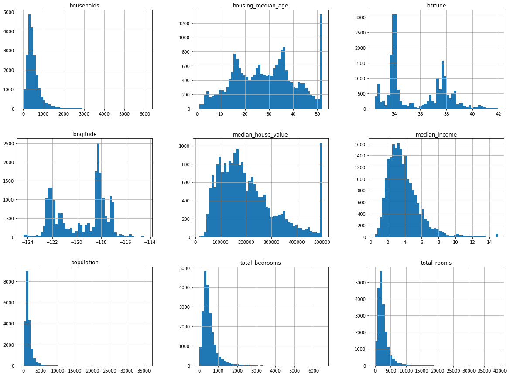
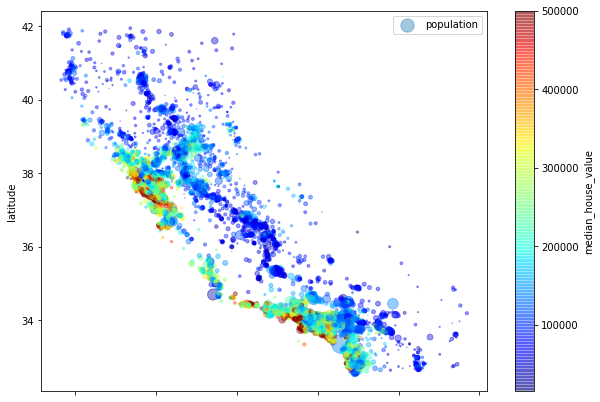
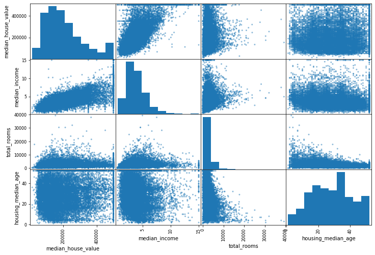
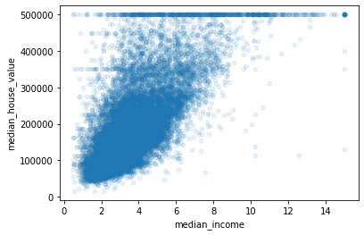

# Proyecto de punta a punta del libro "Hands-on Machine Learning"

## Setup


```python
import numpy as np
import pandas as pd
%matplotlib inline
import matplotlib.pyplot as plt
```

## Obtener los datos


```python
housing = pd.read_csv("data/housing.csv")
housing.head()
```


<div>
<style scoped>
    .dataframe tbody tr th:only-of-type {
        vertical-align: middle;
    }

    .dataframe tbody tr th {
        vertical-align: top;
    }

    .dataframe thead th {
        text-align: right;
    }
</style>
<table border="1" class="dataframe">
  <thead>
    <tr style="text-align: right;">
      <th></th>
      <th>longitude</th>
      <th>latitude</th>
      <th>housing_median_age</th>
      <th>total_rooms</th>
      <th>total_bedrooms</th>
      <th>population</th>
      <th>households</th>
      <th>median_income</th>
      <th>median_house_value</th>
      <th>ocean_proximity</th>
    </tr>
  </thead>
  <tbody>
    <tr>
      <th>0</th>
      <td>-122.23</td>
      <td>37.88</td>
      <td>41.0</td>
      <td>880.0</td>
      <td>129.0</td>
      <td>322.0</td>
      <td>126.0</td>
      <td>8.3252</td>
      <td>452600.0</td>
      <td>NEAR BAY</td>
    </tr>
    <tr>
      <th>1</th>
      <td>-122.22</td>
      <td>37.86</td>
      <td>21.0</td>
      <td>7099.0</td>
      <td>1106.0</td>
      <td>2401.0</td>
      <td>1138.0</td>
      <td>8.3014</td>
      <td>358500.0</td>
      <td>NEAR BAY</td>
    </tr>
    <tr>
      <th>2</th>
      <td>-122.24</td>
      <td>37.85</td>
      <td>52.0</td>
      <td>1467.0</td>
      <td>190.0</td>
      <td>496.0</td>
      <td>177.0</td>
      <td>7.2574</td>
      <td>352100.0</td>
      <td>NEAR BAY</td>
    </tr>
    <tr>
      <th>3</th>
      <td>-122.25</td>
      <td>37.85</td>
      <td>52.0</td>
      <td>1274.0</td>
      <td>235.0</td>
      <td>558.0</td>
      <td>219.0</td>
      <td>5.6431</td>
      <td>341300.0</td>
      <td>NEAR BAY</td>
    </tr>
    <tr>
      <th>4</th>
      <td>-122.25</td>
      <td>37.85</td>
      <td>52.0</td>
      <td>1627.0</td>
      <td>280.0</td>
      <td>565.0</td>
      <td>259.0</td>
      <td>3.8462</td>
      <td>342200.0</td>
      <td>NEAR BAY</td>
    </tr>
  </tbody>
</table>
</div>


```python
housing.info()
```

    <class 'pandas.core.frame.DataFrame'>
    RangeIndex: 20640 entries, 0 to 20639
    Data columns (total 10 columns):
     #   Column              Non-Null Count  Dtype  
    ---  ------              --------------  -----  
     0   longitude           20640 non-null  float64
     1   latitude            20640 non-null  float64
     2   housing_median_age  20640 non-null  float64
     3   total_rooms         20640 non-null  float64
     4   total_bedrooms      20433 non-null  float64
     5   population          20640 non-null  float64
     6   households          20640 non-null  float64
     7   median_income       20640 non-null  float64
     8   median_house_value  20640 non-null  float64
     9   ocean_proximity     20640 non-null  object 
    dtypes: float64(9), object(1)
    memory usage: 1.6+ MB


```python
housing['ocean_proximity'].value_counts()
```


    <1H OCEAN     9136
    INLAND        6551
    NEAR OCEAN    2658
    NEAR BAY      2290
    ISLAND           5
    Name: ocean_proximity, dtype: int64


```python
housing.describe()
```


<div>
<style scoped>
    .dataframe tbody tr th:only-of-type {
        vertical-align: middle;
    }

    .dataframe tbody tr th {
        vertical-align: top;
    }

    .dataframe thead th {
        text-align: right;
    }
</style>
<table border="1" class="dataframe">
  <thead>
    <tr style="text-align: right;">
      <th></th>
      <th>longitude</th>
      <th>latitude</th>
      <th>housing_median_age</th>
      <th>total_rooms</th>
      <th>total_bedrooms</th>
      <th>population</th>
      <th>households</th>
      <th>median_income</th>
      <th>median_house_value</th>
    </tr>
  </thead>
  <tbody>
    <tr>
      <th>count</th>
      <td>20640.000000</td>
      <td>20640.000000</td>
      <td>20640.000000</td>
      <td>20640.000000</td>
      <td>20433.000000</td>
      <td>20640.000000</td>
      <td>20640.000000</td>
      <td>20640.000000</td>
      <td>20640.000000</td>
    </tr>
    <tr>
      <th>mean</th>
      <td>-119.569704</td>
      <td>35.631861</td>
      <td>28.639486</td>
      <td>2635.763081</td>
      <td>537.870553</td>
      <td>1425.476744</td>
      <td>499.539680</td>
      <td>3.870671</td>
      <td>206855.816909</td>
    </tr>
    <tr>
      <th>std</th>
      <td>2.003532</td>
      <td>2.135952</td>
      <td>12.585558</td>
      <td>2181.615252</td>
      <td>421.385070</td>
      <td>1132.462122</td>
      <td>382.329753</td>
      <td>1.899822</td>
      <td>115395.615874</td>
    </tr>
    <tr>
      <th>min</th>
      <td>-124.350000</td>
      <td>32.540000</td>
      <td>1.000000</td>
      <td>2.000000</td>
      <td>1.000000</td>
      <td>3.000000</td>
      <td>1.000000</td>
      <td>0.499900</td>
      <td>14999.000000</td>
    </tr>
    <tr>
      <th>25%</th>
      <td>-121.800000</td>
      <td>33.930000</td>
      <td>18.000000</td>
      <td>1447.750000</td>
      <td>296.000000</td>
      <td>787.000000</td>
      <td>280.000000</td>
      <td>2.563400</td>
      <td>119600.000000</td>
    </tr>
    <tr>
      <th>50%</th>
      <td>-118.490000</td>
      <td>34.260000</td>
      <td>29.000000</td>
      <td>2127.000000</td>
      <td>435.000000</td>
      <td>1166.000000</td>
      <td>409.000000</td>
      <td>3.534800</td>
      <td>179700.000000</td>
    </tr>
    <tr>
      <th>75%</th>
      <td>-118.010000</td>
      <td>37.710000</td>
      <td>37.000000</td>
      <td>3148.000000</td>
      <td>647.000000</td>
      <td>1725.000000</td>
      <td>605.000000</td>
      <td>4.743250</td>
      <td>264725.000000</td>
    </tr>
    <tr>
      <th>max</th>
      <td>-114.310000</td>
      <td>41.950000</td>
      <td>52.000000</td>
      <td>39320.000000</td>
      <td>6445.000000</td>
      <td>35682.000000</td>
      <td>6082.000000</td>
      <td>15.000100</td>
      <td>500001.000000</td>
    </tr>
  </tbody>
</table>
</div>


```python
housing.hist(bins=50, figsize=(20,15))
plt.show()
```





Se pueden observar varias cosas en estos histogramas
1. El ingreso medio no parece expresado en dolares. Los datos fueron escalados y limitados a 15 para grandes ingresos medios, y a 5 para los ingresos medios más bajos. Los números representan decenas de miles de dolares.
2. La edad media de la vivienda y el valor medio de la vivienda también fueron limitados.
3. Los atributos tienen escalas muy diferentes.
4. Varios histogramas tienen una larga cola: Se extienden más a la derecha de la mediana que a la izquierda.

## Crear conjunto de pruebas


```python
from sklearn.model_selection import train_test_split
train_set, test_set = train_test_split(housing, test_size=0.2, random_state=42)
```


```python
housing["income_cat"] = pd.cut(housing["median_income"],
                               bins=[0., 1.5, 3.0, 4.5, 6., np.inf],
                               labels=[1, 2, 3, 4, 5])
```


```python
housing["income_cat"].value_counts()
```


    3    7236
    2    6581
    4    3639
    5    2362
    1     822
    Name: income_cat, dtype: int64


```python
from sklearn.model_selection import StratifiedShuffleSplit

split = StratifiedShuffleSplit(n_splits=1, test_size=0.2, random_state=42)
for train_index, test_index in split.split(housing, housing["income_cat"]):
    strat_train_set = housing.loc[train_index]
    strat_test_set = housing.loc[test_index]
```


```python
strat_test_set["income_cat"].value_counts() / len(strat_test_set)
```


    3    0.350533
    2    0.318798
    4    0.176357
    5    0.114583
    1    0.039729
    Name: income_cat, dtype: float64


```python
housing["income_cat"].value_counts() / len(housing)
```


    3    0.350581
    2    0.318847
    4    0.176308
    5    0.114438
    1    0.039826
    Name: income_cat, dtype: float64


```python
for set_ in (strat_train_set, strat_test_set):
    set_.drop("income_cat", axis=1, inplace=True)
```

## Visualizar los datos


```python
housing = strat_train_set.copy()
```


```python
housing.plot(kind="scatter", x="longitude", y="latitude", alpha=0.4,
             s=housing["population"]/100, label="population", figsize=(10,7),
             c="median_house_value", cmap=plt.get_cmap("jet"), colorbar=True,
)
plt.legend();
```





## Buscar correlaciones


```python
corr_matrix = housing.corr()
```


```python
corr_matrix["median_house_value"].sort_values(ascending=False)
```


    median_house_value    1.000000
    median_income         0.687160
    total_rooms           0.135097
    housing_median_age    0.114110
    households            0.064506
    total_bedrooms        0.047689
    population           -0.026920
    longitude            -0.047432
    latitude             -0.142724
    Name: median_house_value, dtype: float64


```python
from pandas.plotting import scatter_matrix

attributes = ["median_house_value", "median_income", "total_rooms",
              "housing_median_age"]
scatter_matrix(housing[attributes], figsize=(12, 8));
```





```python
housing.plot(kind="scatter", x="median_income", y="median_house_value",
             alpha=0.1);
```





Esta gráfica revela unas cuantas cosas. Primero, la correlación es muy fuerte; puedes ver claramente la tendencia y los puntos no están muy dispersos. Segundo, el límite de precio es claramente visible como una línea horizontal a los \\$500,000, pero también se revelan otras líneas menos obvias: una línea horizontal alrededor de \\$450,000, otra alrededor de \\$350,000, y tal vez una alrededor de \\$280,000 y algunas debajo de eso.

## Experimentar con combinaciones de atributos


```python
housing["rooms_per_household"] = housing["total_rooms"]/housing["households"]
housing["bedrooms_per_room"] = housing["total_bedrooms"]/housing["total_rooms"]
housing["population_per_household"]=housing["population"]/housing["households"]
```


```python
corr_matrix = housing.corr()
corr_matrix["median_house_value"].sort_values(ascending=False)
```


    median_house_value          1.000000
    median_income               0.687160
    rooms_per_household         0.146285
    total_rooms                 0.135097
    housing_median_age          0.114110
    households                  0.064506
    total_bedrooms              0.047689
    population_per_household   -0.021985
    population                 -0.026920
    longitude                  -0.047432
    latitude                   -0.142724
    bedrooms_per_room          -0.259984
    Name: median_house_value, dtype: float64


El nuevo atributo "bedrooms_per_room" está más correlacionado con el valor medio de las viviendas que el número de habitaciones o dormitorios. Aparentemente casas con un ratio dormitorios/habitaciones más bajo tienden a ser más caras. El atributo "rooms_per_household" es más informativo que el total de habitaciones en un distrito - obviamente las casas más grandes son más caras

## Preparar los datos


```python
housing = strat_train_set.drop("median_house_value", axis=1)
housing_labels = strat_train_set["median_house_value"].copy()
```

### Limpieza de datos


```python
from sklearn.impute import SimpleImputer
imputer = SimpleImputer(strategy="median")
```


```python
housing_num = housing.drop("ocean_proximity", axis=1)
```


```python
imputer.fit(housing_num)
```


    SimpleImputer(add_indicator=False, copy=True, fill_value=None,
                  missing_values=nan, strategy='median', verbose=0)


```python
imputer.statistics_
```


    array([-118.51  ,   34.26  ,   29.    , 2119.5   ,  433.    , 1164.    ,
            408.    ,    3.5409])


```python
X = imputer.transform(housing_num)
```


```python
housing_tr = pd.DataFrame(X, columns=housing_num.columns)
```

## Manejando el texto y los atributos categoricos


```python
housing_cat = housing[["ocean_proximity"]]
```


```python
housing_cat.head(10)
```


<div>
<style scoped>
    .dataframe tbody tr th:only-of-type {
        vertical-align: middle;
    }

    .dataframe tbody tr th {
        vertical-align: top;
    }

    .dataframe thead th {
        text-align: right;
    }
</style>
<table border="1" class="dataframe">
  <thead>
    <tr style="text-align: right;">
      <th></th>
      <th>ocean_proximity</th>
    </tr>
  </thead>
  <tbody>
    <tr>
      <th>17606</th>
      <td>&lt;1H OCEAN</td>
    </tr>
    <tr>
      <th>18632</th>
      <td>&lt;1H OCEAN</td>
    </tr>
    <tr>
      <th>14650</th>
      <td>NEAR OCEAN</td>
    </tr>
    <tr>
      <th>3230</th>
      <td>INLAND</td>
    </tr>
    <tr>
      <th>3555</th>
      <td>&lt;1H OCEAN</td>
    </tr>
    <tr>
      <th>19480</th>
      <td>INLAND</td>
    </tr>
    <tr>
      <th>8879</th>
      <td>&lt;1H OCEAN</td>
    </tr>
    <tr>
      <th>13685</th>
      <td>INLAND</td>
    </tr>
    <tr>
      <th>4937</th>
      <td>&lt;1H OCEAN</td>
    </tr>
    <tr>
      <th>4861</th>
      <td>&lt;1H OCEAN</td>
    </tr>
  </tbody>
</table>
</div>


```python
from sklearn.preprocessing import OrdinalEncoder
ordinal_encoder = OrdinalEncoder()
```


```python
housing_cat_encoded = ordinal_encoder.fit_transform(housing_cat)
housing_cat_encoded[:10]
```


    array([[0.],
           [0.],
           [4.],
           [1.],
           [0.],
           [1.],
           [0.],
           [1.],
           [0.],
           [0.]])


```python
ordinal_encoder.categories_
```


    [array(['<1H OCEAN', 'INLAND', 'ISLAND', 'NEAR BAY', 'NEAR OCEAN'],
           dtype=object)]


```python
from sklearn.preprocessing import OneHotEncoder
cat_encoder = OneHotEncoder()
housing_cat_1hot = cat_encoder.fit_transform(housing_cat)
housing_cat_1hot
```


    <16512x5 sparse matrix of type '<class 'numpy.float64'>'
    	with 16512 stored elements in Compressed Sparse Row format>


```python
from sklearn.base import BaseEstimator, TransformerMixin

# column index
rooms_ix, bedrooms_ix, population_ix, households_ix = 3, 4, 5, 6

class CombinedAttributesAdder(BaseEstimator, TransformerMixin):
    def __init__(self, add_bedrooms_per_room = True): # no *args or **kargs
        self.add_bedrooms_per_room = add_bedrooms_per_room
    def fit(self, X, y=None):
        return self  # nothing else to do
    def transform(self, X):
        rooms_per_household = X[:, rooms_ix] / X[:, households_ix]
        population_per_household = X[:, population_ix] / X[:, households_ix]
        if self.add_bedrooms_per_room:
            bedrooms_per_room = X[:, bedrooms_ix] / X[:, rooms_ix]
            return np.c_[X, rooms_per_household, population_per_household,
                         bedrooms_per_room]
        else:
            return np.c_[X, rooms_per_household, population_per_household]

attr_adder = CombinedAttributesAdder(add_bedrooms_per_room=False)
housing_extra_attribs = attr_adder.transform(housing.values)
```


```python
housing_extra_attribs = pd.DataFrame(
    housing_extra_attribs,
    columns=list(housing.columns)+["rooms_per_household", "population_per_household"],
    index=housing.index)
housing_extra_attribs.head()
```


<div>
<style scoped>
    .dataframe tbody tr th:only-of-type {
        vertical-align: middle;
    }

    .dataframe tbody tr th {
        vertical-align: top;
    }

    .dataframe thead th {
        text-align: right;
    }
</style>
<table border="1" class="dataframe">
  <thead>
    <tr style="text-align: right;">
      <th></th>
      <th>longitude</th>
      <th>latitude</th>
      <th>housing_median_age</th>
      <th>total_rooms</th>
      <th>total_bedrooms</th>
      <th>population</th>
      <th>households</th>
      <th>median_income</th>
      <th>ocean_proximity</th>
      <th>rooms_per_household</th>
      <th>population_per_household</th>
    </tr>
  </thead>
  <tbody>
    <tr>
      <th>17606</th>
      <td>-121.89</td>
      <td>37.29</td>
      <td>38</td>
      <td>1568</td>
      <td>351</td>
      <td>710</td>
      <td>339</td>
      <td>2.7042</td>
      <td>&lt;1H OCEAN</td>
      <td>4.62537</td>
      <td>2.0944</td>
    </tr>
    <tr>
      <th>18632</th>
      <td>-121.93</td>
      <td>37.05</td>
      <td>14</td>
      <td>679</td>
      <td>108</td>
      <td>306</td>
      <td>113</td>
      <td>6.4214</td>
      <td>&lt;1H OCEAN</td>
      <td>6.00885</td>
      <td>2.70796</td>
    </tr>
    <tr>
      <th>14650</th>
      <td>-117.2</td>
      <td>32.77</td>
      <td>31</td>
      <td>1952</td>
      <td>471</td>
      <td>936</td>
      <td>462</td>
      <td>2.8621</td>
      <td>NEAR OCEAN</td>
      <td>4.22511</td>
      <td>2.02597</td>
    </tr>
    <tr>
      <th>3230</th>
      <td>-119.61</td>
      <td>36.31</td>
      <td>25</td>
      <td>1847</td>
      <td>371</td>
      <td>1460</td>
      <td>353</td>
      <td>1.8839</td>
      <td>INLAND</td>
      <td>5.23229</td>
      <td>4.13598</td>
    </tr>
    <tr>
      <th>3555</th>
      <td>-118.59</td>
      <td>34.23</td>
      <td>17</td>
      <td>6592</td>
      <td>1525</td>
      <td>4459</td>
      <td>1463</td>
      <td>3.0347</td>
      <td>&lt;1H OCEAN</td>
      <td>4.50581</td>
      <td>3.04785</td>
    </tr>
  </tbody>
</table>
</div>


```python
from sklearn.pipeline import Pipeline
from sklearn.preprocessing import StandardScaler

num_pipeline = Pipeline([
        ('imputer', SimpleImputer(strategy="median")),
        ('attribs_adder', CombinedAttributesAdder()),
        ('std_scaler', StandardScaler()),
    ])

housing_num_tr = num_pipeline.fit_transform(housing_num)
```


```python
housing_num_tr
```


    array([[-1.15604281,  0.77194962,  0.74333089, ..., -0.31205452,
            -0.08649871,  0.15531753],
           [-1.17602483,  0.6596948 , -1.1653172 , ...,  0.21768338,
            -0.03353391, -0.83628902],
           [ 1.18684903, -1.34218285,  0.18664186, ..., -0.46531516,
            -0.09240499,  0.4222004 ],
           ...,
           [ 1.58648943, -0.72478134, -1.56295222, ...,  0.3469342 ,
            -0.03055414, -0.52177644],
           [ 0.78221312, -0.85106801,  0.18664186, ...,  0.02499488,
             0.06150916, -0.30340741],
           [-1.43579109,  0.99645926,  1.85670895, ..., -0.22852947,
            -0.09586294,  0.10180567]])


```python
from sklearn.compose import ColumnTransformer

num_attribs = list(housing_num)
cat_attribs = ["ocean_proximity"]

full_pipeline = ColumnTransformer([
        ("num", num_pipeline, num_attribs),
        ("cat", OneHotEncoder(), cat_attribs),
    ])

housing_prepared = full_pipeline.fit_transform(housing)
```

## Seleccionar un modelo y entrenarlo

### Entrenamiento y evaluación en el conjunto de entrenamiento


```python
from sklearn.linear_model import LinearRegression

lin_reg = LinearRegression()
lin_reg.fit(housing_prepared, housing_labels)
```


    LinearRegression(copy_X=True, fit_intercept=True, n_jobs=None, normalize=False)


```python
# let's try the full preprocessing pipeline on a few training instances
some_data = housing.iloc[:5]
some_labels = housing_labels.iloc[:5]
some_data_prepared = full_pipeline.transform(some_data)

print("Predictions:", lin_reg.predict(some_data_prepared))
```

    Predictions: [210644.60459286 317768.80697211 210956.43331178  59218.98886849
     189747.55849879]


```python
print("Labels:", list(some_labels))
```

    Labels: [286600.0, 340600.0, 196900.0, 46300.0, 254500.0]


```python
from sklearn.metrics import mean_squared_error

housing_predictions = lin_reg.predict(housing_prepared)
lin_mse = mean_squared_error(housing_labels, housing_predictions)
lin_rmse = np.sqrt(lin_mse)
lin_rmse
```


    68628.19819848923


```python
from sklearn.metrics import mean_squared_error

housing_predictions = lin_reg.predict(housing_prepared)
lin_mse = mean_squared_error(housing_labels, housing_predictions)
lin_rmse = np.sqrt(lin_mse)
lin_rmse
```


    68628.19819848923


```python
from sklearn.metrics import mean_absolute_error

lin_mae = mean_absolute_error(housing_labels, housing_predictions)
lin_mae
```


    49439.89599001897


```python
from sklearn.tree import DecisionTreeRegressor

tree_reg = DecisionTreeRegressor(random_state=42)
tree_reg.fit(housing_prepared, housing_labels)
```


    DecisionTreeRegressor(ccp_alpha=0.0, criterion='mse', max_depth=None,
                          max_features=None, max_leaf_nodes=None,
                          min_impurity_decrease=0.0, min_impurity_split=None,
                          min_samples_leaf=1, min_samples_split=2,
                          min_weight_fraction_leaf=0.0, presort='deprecated',
                          random_state=42, splitter='best')


```python
housing_predictions = tree_reg.predict(housing_prepared)
tree_mse = mean_squared_error(housing_labels, housing_predictions)
tree_rmse = np.sqrt(tree_mse)
tree_rmse
```


    0.0


### Evaluación usando Cross validation


```python
from sklearn.model_selection import cross_val_score

scores = cross_val_score(tree_reg, housing_prepared, housing_labels,
                         scoring="neg_mean_squared_error", cv=10)
tree_rmse_scores = np.sqrt(-scores)
```


```python
def display_scores(scores):
    print("Scores:", scores)
    print("Mean:", scores.mean())
    print("Standard deviation:", scores.std())

display_scores(tree_rmse_scores)
```

    Scores: [70194.33680785 66855.16363941 72432.58244769 70758.73896782
     71115.88230639 75585.14172901 70262.86139133 70273.6325285
     75366.87952553 71231.65726027]
    Mean: 71407.68766037929
    Standard deviation: 2439.4345041191004


```python
lin_scores = cross_val_score(lin_reg, housing_prepared, housing_labels,
                             scoring="neg_mean_squared_error", cv=10)
lin_rmse_scores = np.sqrt(-lin_scores)
display_scores(lin_rmse_scores)
```

    Scores: [66782.73843989 66960.118071   70347.95244419 74739.57052552
     68031.13388938 71193.84183426 64969.63056405 68281.61137997
     71552.91566558 67665.10082067]
    Mean: 69052.46136345083
    Standard deviation: 2731.67400179835


```python
from sklearn.ensemble import RandomForestRegressor

forest_reg = RandomForestRegressor(n_estimators=100, random_state=42)
forest_reg.fit(housing_prepared, housing_labels)
```


    RandomForestRegressor(bootstrap=True, ccp_alpha=0.0, criterion='mse',
                          max_depth=None, max_features='auto', max_leaf_nodes=None,
                          max_samples=None, min_impurity_decrease=0.0,
                          min_impurity_split=None, min_samples_leaf=1,
                          min_samples_split=2, min_weight_fraction_leaf=0.0,
                          n_estimators=100, n_jobs=None, oob_score=False,
                          random_state=42, verbose=0, warm_start=False)


```python
housing_predictions = forest_reg.predict(housing_prepared)
forest_mse = mean_squared_error(housing_labels, housing_predictions)
forest_rmse = np.sqrt(forest_mse)
forest_rmse
```


    18603.515021376355


```python
from sklearn.model_selection import cross_val_score

forest_scores = cross_val_score(forest_reg, housing_prepared, housing_labels,
                                scoring="neg_mean_squared_error", cv=10)
forest_rmse_scores = np.sqrt(-forest_scores)
display_scores(forest_rmse_scores)
```

    Scores: [49519.80364233 47461.9115823  50029.02762854 52325.28068953
     49308.39426421 53446.37892622 48634.8036574  47585.73832311
     53490.10699751 50021.5852922 ]
    Mean: 50182.303100336096
    Standard deviation: 2097.0810550985693


```python
scores = cross_val_score(lin_reg, housing_prepared, housing_labels, scoring="neg_mean_squared_error", cv=10)
pd.Series(np.sqrt(-scores)).describe()
```


    count       10.000000
    mean     69052.461363
    std       2879.437224
    min      64969.630564
    25%      67136.363758
    50%      68156.372635
    75%      70982.369487
    max      74739.570526
    dtype: float64


```python
from sklearn.model_selection import GridSearchCV

param_grid = [
    # try 12 (3×4) combinations of hyperparameters
    {'n_estimators': [3, 10, 30], 'max_features': [2, 4, 6, 8]},
    # then try 6 (2×3) combinations with bootstrap set as False
    {'bootstrap': [False], 'n_estimators': [3, 10], 'max_features': [2, 3, 4]},
  ]

forest_reg = RandomForestRegressor(random_state=42)
# train across 5 folds, that's a total of (12+6)*5=90 rounds of training 
grid_search = GridSearchCV(forest_reg, param_grid, cv=5,
                           scoring='neg_mean_squared_error',
                           return_train_score=True)
grid_search.fit(housing_prepared, housing_labels)
```


    GridSearchCV(cv=5, error_score=nan,
                 estimator=RandomForestRegressor(bootstrap=True, ccp_alpha=0.0,
                                                 criterion='mse', max_depth=None,
                                                 max_features='auto',
                                                 max_leaf_nodes=None,
                                                 max_samples=None,
                                                 min_impurity_decrease=0.0,
                                                 min_impurity_split=None,
                                                 min_samples_leaf=1,
                                                 min_samples_split=2,
                                                 min_weight_fraction_leaf=0.0,
                                                 n_estimators=100, n_jobs=None,
                                                 oob_score=False, random_state=42,
                                                 verbose=0, warm_start=False),
                 iid='deprecated', n_jobs=None,
                 param_grid=[{'max_features': [2, 4, 6, 8],
                              'n_estimators': [3, 10, 30]},
                             {'bootstrap': [False], 'max_features': [2, 3, 4],
                              'n_estimators': [3, 10]}],
                 pre_dispatch='2*n_jobs', refit=True, return_train_score=True,
                 scoring='neg_mean_squared_error', verbose=0)


```python
grid_search.best_params_
```


    {'max_features': 8, 'n_estimators': 30}


```python
grid_search.best_estimator_
```


    RandomForestRegressor(bootstrap=True, ccp_alpha=0.0, criterion='mse',
                          max_depth=None, max_features=8, max_leaf_nodes=None,
                          max_samples=None, min_impurity_decrease=0.0,
                          min_impurity_split=None, min_samples_leaf=1,
                          min_samples_split=2, min_weight_fraction_leaf=0.0,
                          n_estimators=30, n_jobs=None, oob_score=False,
                          random_state=42, verbose=0, warm_start=False)


```python
cvres = grid_search.cv_results_
for mean_score, params in zip(cvres["mean_test_score"], cvres["params"]):
    print(np.sqrt(-mean_score), params)
```

    63669.11631261028 {'max_features': 2, 'n_estimators': 3}
    55627.099719926795 {'max_features': 2, 'n_estimators': 10}
    53384.57275149205 {'max_features': 2, 'n_estimators': 30}
    60965.950449450494 {'max_features': 4, 'n_estimators': 3}
    52741.04704299915 {'max_features': 4, 'n_estimators': 10}
    50377.40461678399 {'max_features': 4, 'n_estimators': 30}
    58663.93866579625 {'max_features': 6, 'n_estimators': 3}
    52006.19873526564 {'max_features': 6, 'n_estimators': 10}
    50146.51167415009 {'max_features': 6, 'n_estimators': 30}
    57869.25276169646 {'max_features': 8, 'n_estimators': 3}
    51711.127883959234 {'max_features': 8, 'n_estimators': 10}
    49682.273345071546 {'max_features': 8, 'n_estimators': 30}
    62895.06951262424 {'bootstrap': False, 'max_features': 2, 'n_estimators': 3}
    54658.176157539405 {'bootstrap': False, 'max_features': 2, 'n_estimators': 10}
    59470.40652318466 {'bootstrap': False, 'max_features': 3, 'n_estimators': 3}
    52724.9822587892 {'bootstrap': False, 'max_features': 3, 'n_estimators': 10}
    57490.5691951261 {'bootstrap': False, 'max_features': 4, 'n_estimators': 3}
    51009.495668875716 {'bootstrap': False, 'max_features': 4, 'n_estimators': 10}


```python
from sklearn.model_selection import RandomizedSearchCV
from scipy.stats import randint

param_distribs = {
        'n_estimators': randint(low=1, high=200),
        'max_features': randint(low=1, high=8),
    }

forest_reg = RandomForestRegressor(random_state=42)
rnd_search = RandomizedSearchCV(forest_reg, param_distributions=param_distribs,
                                n_iter=10, cv=5, scoring='neg_mean_squared_error', random_state=42)
rnd_search.fit(housing_prepared, housing_labels)
```


    RandomizedSearchCV(cv=5, error_score=nan,
                       estimator=RandomForestRegressor(bootstrap=True,
                                                       ccp_alpha=0.0,
                                                       criterion='mse',
                                                       max_depth=None,
                                                       max_features='auto',
                                                       max_leaf_nodes=None,
                                                       max_samples=None,
                                                       min_impurity_decrease=0.0,
                                                       min_impurity_split=None,
                                                       min_samples_leaf=1,
                                                       min_samples_split=2,
                                                       min_weight_fraction_leaf=0.0,
                                                       n_estimators=100,
                                                       n_jobs=None, oob_score=Fals...
                                                       warm_start=False),
                       iid='deprecated', n_iter=10, n_jobs=None,
                       param_distributions={'max_features': <scipy.stats._distn_infrastructure.rv_frozen object at 0x7f935d220d50>,
                                            'n_estimators': <scipy.stats._distn_infrastructure.rv_frozen object at 0x7f935e7bb3d0>},
                       pre_dispatch='2*n_jobs', random_state=42, refit=True,
                       return_train_score=False, scoring='neg_mean_squared_error',
                       verbose=0)


```python
cvres = rnd_search.cv_results_
for mean_score, params in zip(cvres["mean_test_score"], cvres["params"]):
    print(np.sqrt(-mean_score), params)
```

    49150.70756927707 {'max_features': 7, 'n_estimators': 180}
    51389.889203389284 {'max_features': 5, 'n_estimators': 15}
    50796.155224308866 {'max_features': 3, 'n_estimators': 72}
    50835.13360315349 {'max_features': 5, 'n_estimators': 21}
    49280.9449827171 {'max_features': 7, 'n_estimators': 122}
    50774.90662363929 {'max_features': 3, 'n_estimators': 75}
    50682.78888164288 {'max_features': 3, 'n_estimators': 88}
    49608.99608105296 {'max_features': 5, 'n_estimators': 100}
    50473.61930350219 {'max_features': 3, 'n_estimators': 150}
    64429.84143294435 {'max_features': 5, 'n_estimators': 2}


```python
feature_importances = grid_search.best_estimator_.feature_importances_
feature_importances
```


    array([7.33442355e-02, 6.29090705e-02, 4.11437985e-02, 1.46726854e-02,
           1.41064835e-02, 1.48742809e-02, 1.42575993e-02, 3.66158981e-01,
           5.64191792e-02, 1.08792957e-01, 5.33510773e-02, 1.03114883e-02,
           1.64780994e-01, 6.02803867e-05, 1.96041560e-03, 2.85647464e-03])


```python
extra_attribs = ["rooms_per_hhold", "pop_per_hhold", "bedrooms_per_room"]
#cat_encoder = cat_pipeline.named_steps["cat_encoder"] # old solution
cat_encoder = full_pipeline.named_transformers_["cat"]
cat_one_hot_attribs = list(cat_encoder.categories_[0])
attributes = num_attribs + extra_attribs + cat_one_hot_attribs
sorted(zip(feature_importances, attributes), reverse=True)
```


    [(0.36615898061813423, 'median_income'),
     (0.16478099356159054, 'INLAND'),
     (0.10879295677551575, 'pop_per_hhold'),
     (0.07334423551601243, 'longitude'),
     (0.06290907048262032, 'latitude'),
     (0.056419179181954014, 'rooms_per_hhold'),
     (0.053351077347675815, 'bedrooms_per_room'),
     (0.04114379847872964, 'housing_median_age'),
     (0.014874280890402769, 'population'),
     (0.014672685420543239, 'total_rooms'),
     (0.014257599323407808, 'households'),
     (0.014106483453584104, 'total_bedrooms'),
     (0.010311488326303788, '<1H OCEAN'),
     (0.0028564746373201584, 'NEAR OCEAN'),
     (0.0019604155994780706, 'NEAR BAY'),
     (6.0280386727366e-05, 'ISLAND')]


```python
final_model = grid_search.best_estimator_

X_test = strat_test_set.drop("median_house_value", axis=1)
y_test = strat_test_set["median_house_value"].copy()

X_test_prepared = full_pipeline.transform(X_test)
final_predictions = final_model.predict(X_test_prepared)

final_mse = mean_squared_error(y_test, final_predictions)
final_rmse = np.sqrt(final_mse)
```


```python
final_rmse
```


    47730.22690385927


```python
from scipy import stats

confidence = 0.95
squared_errors = (final_predictions - y_test) ** 2
np.sqrt(stats.t.interval(confidence, len(squared_errors) - 1,
                         loc=squared_errors.mean(),
                         scale=stats.sem(squared_errors)))

```


    array([45685.10470776, 49691.25001878])


```python
import joblib

joblib.dump(final_model, "final_model.pkl")
```


    ['final_model.pkl']


```python

```
