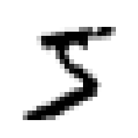
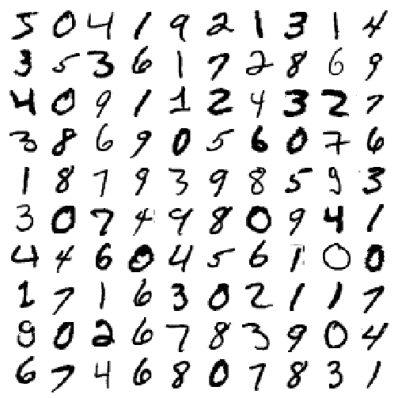
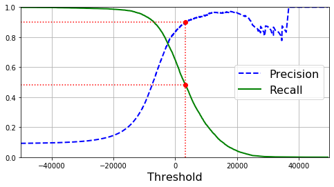
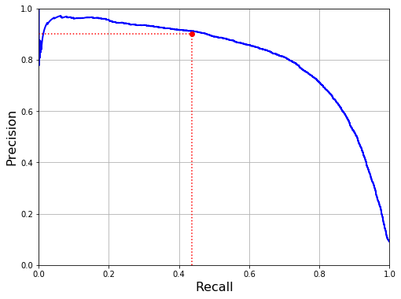
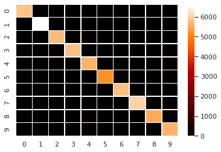
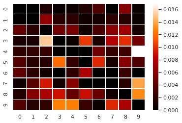
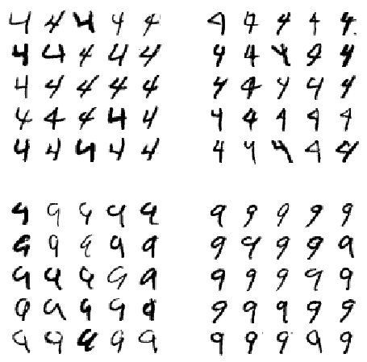
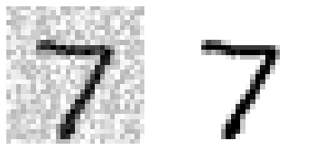
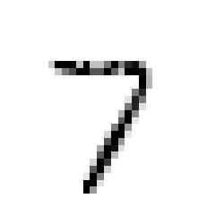

```python
import numpy as np
import pandas as pd
import matplotlib.pyplot as plt
```


```python
from sklearn.datasets import fetch_openml
mnist = fetch_openml('mnist_784', version=1)
mnist.keys()
```


    dict_keys(['data', 'target', 'frame', 'feature_names', 'target_names', 'DESCR', 'details', 'categories', 'url'])


```python
X, y = mnist["data"], mnist["target"]
print(X.shape)
print(y.shape)
```

    (70000, 784)
    (70000,)


```python
import matplotlib as mpl
import matplotlib.pyplot as plt

some_digit = X[0]
some_digit_image = some_digit.reshape(28, 28)

plt.imshow(some_digit_image, cmap = mpl.cm.binary, interpolation="nearest")
plt.axis("off")
plt.show()
```





```python
y[0]
```


    '5'


```python
y = y.astype(np.uint8)
```


```python
def plot_digit(data):
    image = data.reshape(28, 28)
    plt.imshow(image, cmap = mpl.cm.binary,
               interpolation="nearest")
    plt.axis("off")
```


```python
def plot_digits(instances, images_per_row=10, **options):
    size = 28
    images_per_row = min(len(instances), images_per_row)
    images = [instance.reshape(size,size) for instance in instances]
    n_rows = (len(instances) - 1) // images_per_row + 1
    row_images = []
    n_empty = n_rows * images_per_row - len(instances)
    images.append(np.zeros((size, size * n_empty)))
    for row in range(n_rows):
        rimages = images[row * images_per_row : (row + 1) * images_per_row]
        row_images.append(np.concatenate(rimages, axis=1))
    image = np.concatenate(row_images, axis=0)
    plt.imshow(image, cmap = mpl.cm.binary, **options)
    plt.axis("off")
```


```python
plt.figure(figsize=(9,9))
example_images = X[:100]
plot_digits(example_images, images_per_row=10)
plt.show()
```





```python
X_train, X_test, y_train, y_test = X[:60000], X[60000:], y[:60000], y[60000:]
```

# Binary classifier 


```python
y_train_5 = (y_train == 5)
y_test_5 = (y_test == 5)
```


```python
from sklearn.linear_model import SGDClassifier

sgd_clf = SGDClassifier(max_iter=1000, tol=1e-3, random_state=42)
sgd_clf.fit(X_train, y_train_5)
```


    SGDClassifier(alpha=0.0001, average=False, class_weight=None,
                  early_stopping=False, epsilon=0.1, eta0=0.0, fit_intercept=True,
                  l1_ratio=0.15, learning_rate='optimal', loss='hinge',
                  max_iter=1000, n_iter_no_change=5, n_jobs=None, penalty='l2',
                  power_t=0.5, random_state=42, shuffle=True, tol=0.001,
                  validation_fraction=0.1, verbose=0, warm_start=False)


```python
sgd_clf.predict([some_digit])
```


    array([ True])


# Medir el rendimiento


```python
from sklearn.model_selection import StratifiedKFold
from sklearn.base import clone

skfolds = StratifiedKFold(n_splits=3, random_state=42, shuffle=True)

for train_index, test_index in skfolds.split(X_train, y_train_5):
    clone_clf = clone(sgd_clf)
    X_train_folds = X_train[train_index]
    y_train_folds = y_train_5[train_index]
    X_test_fold = X_train[test_index]
    y_test_fold = y_train_5[test_index]
    clone_clf.fit(X_train_folds, y_train_folds)
    y_pred = clone_clf.predict(X_test_fold)
    n_correct = sum(y_pred == y_test_fold)
    print(n_correct / len(y_pred))
```

    0.9669
    0.91625
    0.96785


```python
from sklearn.model_selection import cross_val_score
cross_val_score(sgd_clf, X_train, y_train_5, cv=3, scoring="accuracy")
```


    array([0.95035, 0.96035, 0.9604 ])


```python
from sklearn.base import BaseEstimator

class Never5Classifier(BaseEstimator):
    def fit(self, X, y=None):
        pass
    def predict(self, X):
        return np.zeros((len(X), 1), dtype=bool)
```


```python
never_5_clf = Never5Classifier()
cross_val_score(never_5_clf, X_train, y_train_5, cv=3, scoring="accuracy")
```


    array([0.91125, 0.90855, 0.90915])


## Matriz de confusión


```python
from sklearn.model_selection import cross_val_predict

y_train_pred = cross_val_predict(sgd_clf, X_train, y_train_5, cv=3)
```


```python
from sklearn.metrics import confusion_matrix

confusion_matrix(y_train_5, y_train_pred)
```


    array([[53892,   687],
           [ 1891,  3530]])


## Precision and Recall


```python
from sklearn.metrics import precision_score, recall_score

precision_score(y_train_5, y_train_pred) # = 3530 / (3530 + 687)
```


    0.8370879772350012


```python
recall_score(y_train_5, y_train_pred) # = 3530 / (3530 + 1891)
```


    0.6511713705958311


```python
from sklearn.metrics import f1_score

f1_score(y_train_5, y_train_pred)
```


    0.7325171197343846


## Precision/Recall Tradeoff


```python
y_scores = sgd_clf.decision_function([some_digit])
y_scores
```


    array([2164.22030239])


```python
threshold = 0
y_some_digit_pred = (y_scores > threshold)
y_some_digit_pred
```


    array([ True])


```python
threshold = 8000
y_some_digit_pred = (y_scores > threshold)
y_some_digit_pred
```


    array([False])


```python
y_scores = cross_val_predict(sgd_clf, X_train, y_train_5, cv=3,
                             method="decision_function")
```


```python
from sklearn.metrics import precision_recall_curve

precisions, recalls, thresholds = precision_recall_curve(y_train_5, y_scores)
```


```python
def plot_precision_recall_vs_threshold(precisions, recalls, thresholds):
    plt.plot(thresholds, precisions[:-1], "b--", label="Precision", linewidth=2)
    plt.plot(thresholds, recalls[:-1], "g-", label="Recall", linewidth=2)
    plt.legend(loc="center right", fontsize=16) 
    plt.xlabel("Threshold", fontsize=16)        
    plt.grid(True)                              
    plt.axis([-50000, 50000, 0, 1])             

recall_90_precision = recalls[np.argmax(precisions >= 0.90)]
threshold_90_precision = thresholds[np.argmax(precisions >= 0.90)]


plt.figure(figsize=(8, 4))                                                                  
plot_precision_recall_vs_threshold(precisions, recalls, thresholds)
plt.plot([threshold_90_precision, threshold_90_precision], [0., 0.9], "r:")                 
plt.plot([-50000, threshold_90_precision], [0.9, 0.9], "r:")                                
plt.plot([-50000, threshold_90_precision], [recall_90_precision, recall_90_precision], "r:")
plt.plot([threshold_90_precision], [0.9], "ro")                                             
plt.plot([threshold_90_precision], [recall_90_precision], "ro")                             
plt.show()                                            
```





```python
def plot_precision_vs_recall(precisions, recalls):
    plt.plot(recalls, precisions, "b-", linewidth=2)
    plt.xlabel("Recall", fontsize=16)
    plt.ylabel("Precision", fontsize=16)
    plt.axis([0, 1, 0, 1])
    plt.grid(True)

plt.figure(figsize=(8, 6))
plot_precision_vs_recall(precisions, recalls)
plt.plot([0.4368, 0.4368], [0., 0.9], "r:")
plt.plot([0.0, 0.4368], [0.9, 0.9], "r:")
plt.plot([0.4368], [0.9], "ro")
plt.show()
```





```python
threshold_90_precision = thresholds[np.argmax(precisions >= 0.90)]
```


```python
y_train_pred_90 = (y_scores >= threshold_90_precision)
```


```python
precision_score(y_train_5, y_train_pred_90)
```


    0.9000345901072293


```python
recall_score(y_train_5, y_train_pred_90)
```


    0.4799852425751706


## Curva Roc


```python
from sklearn.metrics import roc_curve

fpr, tpr, thresholds = roc_curve(y_train_5, y_scores)
```


```python
def plot_roc_curve(fpr, tpr, label=None):
    plt.plot(fpr, tpr, linewidth=2, label=label)
    plt.plot([0, 1], [0, 1], 'k--') 
    plt.axis([0, 1, 0, 1])                                    
    plt.xlabel('False Positive Rate (Fall-Out)', fontsize=16) 
    plt.ylabel('True Positive Rate (Recall)', fontsize=16)    
    plt.grid(True)                                            

plt.figure(figsize=(8, 6))                         
plot_roc_curve(fpr, tpr)
plt.plot([4.837e-3, 4.837e-3], [0., 0.4368], "r:") 
plt.plot([0.0, 4.837e-3], [0.4368, 0.4368], "r:")  
plt.plot([4.837e-3], [0.4368], "ro")               

plt.show()
```


```python
from sklearn.metrics import roc_auc_score

roc_auc_score(y_train_5, y_scores)
```


    0.9604938554008616


```python
from sklearn.ensemble import RandomForestClassifier

forest_clf = RandomForestClassifier(random_state=42)
y_probas_forest = cross_val_predict(forest_clf, X_train, y_train_5, cv=3,
                                    method="predict_proba")
```


```python
y_scores_forest = y_probas_forest[:, 1]

fpr_forest, tpr_forest, thresholds_forest = roc_curve(y_train_5,y_scores_forest)
```


```python
plt.figure(figsize=(8, 6))
plt.plot(fpr, tpr, "b:", linewidth=2, label="SGD")
plot_roc_curve(fpr_forest, tpr_forest, "Random Forest")
plt.plot([4.837e-3, 4.837e-3], [0., 0.4368], "r:")
plt.plot([0.0, 4.837e-3], [0.4368, 0.4368], "r:")
plt.plot([4.837e-3], [0.4368], "ro")
plt.plot([4.837e-3, 4.837e-3], [0., 0.9487], "r:")
plt.plot([4.837e-3], [0.9487], "ro")
plt.grid(True)
plt.legend(loc="lower right", fontsize=16)

plt.show()
```


## Clasificación multiclase


```python
from sklearn.svm import SVC

svm_clf = SVC(gamma="auto", random_state=42)
svm_clf.fit(X_train[:1000], y_train[:1000]) # y_train, not y_train_5
svm_clf.predict([some_digit])
```


    array([5], dtype=uint8)


```python
some_digit_scores = svm_clf.decision_function([some_digit])
some_digit_scores
```


    array([[ 2.81585438,  7.09167958,  3.82972099,  0.79365551,  5.8885703 ,
             9.29718395,  1.79862509,  8.10392157, -0.228207  ,  4.83753243]])


```python
np.argmax(some_digit_scores)
```


    5


```python
svm_clf.classes_
```


    array([0, 1, 2, 3, 4, 5, 6, 7, 8, 9], dtype=uint8)


```python
svm_clf.classes_[5]
```


    5


```python
from sklearn.multiclass import OneVsRestClassifier
ovr_clf = OneVsRestClassifier(SVC(gamma="auto", random_state=42))
ovr_clf.fit(X_train[:1000], y_train[:1000])
ovr_clf.predict([some_digit])
```


    array([5], dtype=uint8)


```python
len(ovr_clf.estimators_)
```


    10


```python
sgd_clf.fit(X_train, y_train)
sgd_clf.predict([some_digit])
```


    array([3], dtype=uint8)


```python
sgd_clf.decision_function([some_digit])
```


    array([[-31893.03095419, -34419.69069632,  -9530.63950739,
              1823.73154031, -22320.14822878,  -1385.80478895,
            -26188.91070951, -16147.51323997,  -4604.35491274,
            -12050.767298  ]])


```python
forest_clf.fit(X_train, y_train)
forest_clf.predict([some_digit])
```


    array([5], dtype=uint8)


```python
forest_clf.predict_proba([some_digit])
```


    array([[0.  , 0.  , 0.01, 0.08, 0.  , 0.9 , 0.  , 0.  , 0.  , 0.01]])


```python
cross_val_score(sgd_clf, X_train, y_train, cv=3, scoring="accuracy")
```


    array([0.87365, 0.85835, 0.8689 ])


```python
cross_val_score(forest_clf, X_train, y_train, cv=3, scoring="accuracy")
```


    array([0.9646 , 0.96255, 0.9666 ])


```python
from sklearn.preprocessing import StandardScaler
scaler = StandardScaler()
X_train_scaled = scaler.fit_transform(X_train.astype(np.float64))
```


```python
cross_val_score(sgd_clf, X_train_scaled, y_train, cv=3, scoring="accuracy")
```


    array([0.8983, 0.891 , 0.9018])


```python
cross_val_score(forest_clf, X_train_scaled, y_train, cv=3, scoring="accuracy")
```


    array([0.96445, 0.96255, 0.96645])


```python
y_train_pred = cross_val_predict(forest_clf, X_train_scaled, y_train, cv=3)
conf_mx = confusion_matrix(y_train, y_train_pred)
conf_mx
```


    array([[5840,    1,    8,    2,    4,    9,   20,    1,   35,    3],
           [   1, 6634,   43,   12,   13,    5,    6,   13,   12,    3],
           [  26,   12, 5749,   29,   32,    5,   20,   37,   42,    6],
           [   7,    7,   93, 5809,    3,   63,    7,   49,   61,   32],
           [  12,   13,   14,    1, 5643,    0,   29,   14,   17,   99],
           [  20,    9,    9,   65,   13, 5195,   53,    6,   32,   19],
           [  25,   11,    5,    0,   12,   45, 5805,    0,   15,    0],
           [   4,   24,   58,    6,   37,    1,    0, 6037,   11,   87],
           [   9,   35,   44,   53,   26,   52,   27,    5, 5524,   76],
           [  21,   10,   13,   76,   75,   15,    3,   58,   45, 5633]])


```python
import seaborn as sns; sns.set()
ax = sns.heatmap(conf_mx, cmap='gist_heat', linewidths=.5)
```





```python
row_sums = conf_mx.sum(axis=1, keepdims=True)
norm_conf_mx = conf_mx / row_sums
```


```python
np.fill_diagonal(norm_conf_mx, 0)
ax = sns.heatmap(norm_conf_mx, cmap='gist_heat', linewidths=.5)
```





```python
cl_a, cl_b = 4, 9
X_aa = X_train[(y_train == cl_a) & (y_train_pred == cl_a)]
X_ab = X_train[(y_train == cl_a) & (y_train_pred == cl_b)]
X_ba = X_train[(y_train == cl_b) & (y_train_pred == cl_a)]
X_bb = X_train[(y_train == cl_b) & (y_train_pred == cl_b)]

plt.figure(figsize=(8,8))
plt.subplot(221); plot_digits(X_aa[:25], images_per_row=5)
plt.subplot(222); plot_digits(X_ab[:25], images_per_row=5)
plt.subplot(223); plot_digits(X_ba[:25], images_per_row=5)
plt.subplot(224); plot_digits(X_bb[:25], images_per_row=5)
plt.show()
```





## Clasificación multi-etiqueta


```python
from sklearn.neighbors import KNeighborsClassifier

y_train_large = (y_train >= 7)
y_train_odd = (y_train % 2 == 1)
y_multilabel = np.c_[y_train_large, y_train_odd]

knn_clf = KNeighborsClassifier()
knn_clf.fit(X_train, y_multilabel)
```


    KNeighborsClassifier(algorithm='auto', leaf_size=30, metric='minkowski',
                         metric_params=None, n_jobs=None, n_neighbors=5, p=2,
                         weights='uniform')


```python
knn_clf.predict([some_digit])
```


    array([[False,  True]])


## Multioutput Classification


```python
noise = np.random.randint(0, 100, (len(X_train), 784))
X_train_mod = X_train + noise
noise = np.random.randint(0, 100, (len(X_test), 784))
X_test_mod = X_test + noise
y_train_mod = X_train
y_test_mod = X_test
```


```python
some_index = 0
plt.subplot(121); plot_digit(X_test_mod[some_index])
plt.subplot(122); plot_digit(y_test_mod[some_index])
plt.show()
```





```python
knn_clf.fit(X_train_mod, y_train_mod)
clean_digit = knn_clf.predict([X_test_mod[some_index]])
plot_digit(clean_digit)
```




