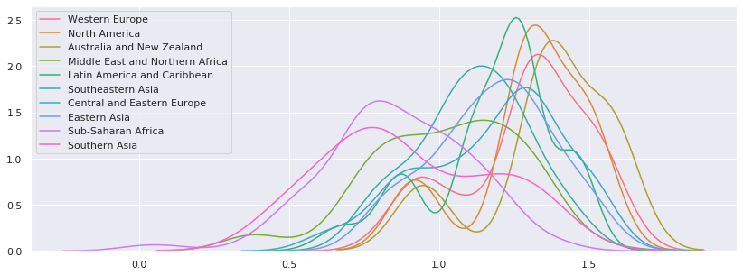
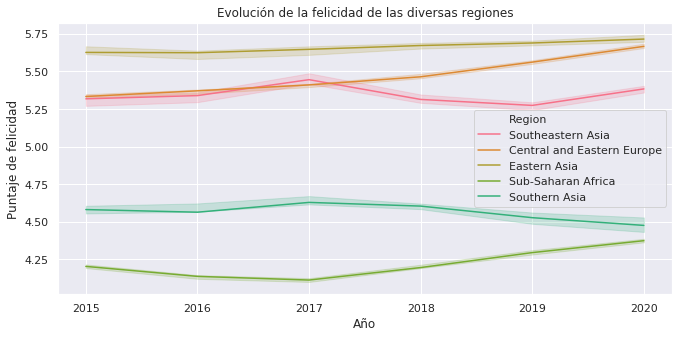

El índice global de felicidad es una publicación anual de la Red de Soluciones
para el Desarrollo Sostenible de las Naciones Unidas (UN SDSN). Contiene articulos
y rankings de felicidad nacional basado en las respuestas de personas encuestadas
sobre sus vidas.


```python
import pandas as pd
import numpy as np
import matplotlib.pyplot as plt
import seaborn as sns; sns.set()
```

## Obtener los datos


```python
H15 = pd.read_csv("data/2015.csv")
H16 = pd.read_csv("data/2016.csv")
H17 = pd.read_csv("data/2017.csv")
H18 = pd.read_csv("data/2018.csv")
H19 = pd.read_csv("data/2019.csv")
H20 = pd.read_csv("data/2020.csv")
```


```python
H15["Year"] = 2015
H16["Year"] = 2016
H17["Year"] = 2017
H18["Year"] = 2018
H19["Year"] = 2019
H20["Year"] = 2020
```

## Limpieza


```python
H15.drop(["Standard Error"], axis=1, inplace=True)
H16.drop(["Lower Confidence Interval", "Upper Confidence Interval"], 
          axis=1, inplace=True)
```


```python
CoRe = H15.groupby("Country")["Region"].apply(list).to_dict()
```


```python

```


```python
CoRe.update(H16.groupby("Country")["Region"].apply(list).to_dict())
```


```python
for key, value in CoRe.items():
    if type(value)==list:
        CoRe[key] = value[0]
    elif value:
        CoRe[key] = value
```


```python
set(CoRe.values())
```


    {'Australia and New Zealand',
     'Central and Eastern Europe',
     'Eastern Asia',
     'Latin America and Caribbean',
     'Middle East and Northern Africa',
     'North America',
     'Southeastern Asia',
     'Southern Asia',
     'Sub-Saharan Africa',
     'Western Europe'}


```python
H16["Region"] = H16["Country"].map(CoRe)
```


```python
H17["Region"] = H16["Country"].map(CoRe)
```


```python
H17.rename(columns={"Happiness.Rank":"Happiness Rank", 
                    "Happiness.Score":"Happiness Score",
                    "Economy..GDP.per.Capita.":"Economy (GDP per Capita)",
                    "Health..Life.Expectancy.":"Health (Life Expectancy)",
                    "Trust..Government.Corruption.":"Trust (Government Corruption)",
                    "Dystopia.Residual":"Dystopia Residual"
                    }, inplace=True)
```


```python
H17.drop(["Whisker.high", "Whisker.low"], axis=1, inplace=True)
```


```python
H18.rename(columns={"Country or region":"Country",
                    "Overall rank":"Happiness Rank",
                    "Score":"Happiness Score",
                    "GDP per capita":"Economy (GDP per Capita)",
                    "Healthy life expectancy":"Health (Life Expectancy)",
                    "Freedom to make life choices":"Freedom",
                    "Perceptions of corruption":"Trust (Government Corruption)"
                    }, inplace=True)
```


```python
H18["Country"].replace(["Northern Cyprus", "Trinidad & Tobago"], 
                       ["North Cyprus","Trinidad and Tobago"],
                       inplace=True)
H18["Region"] = H18["Country"].map(CoRe)
```


```python
for key, value in CoRe.items():
    if type(value)==list:
        CoRe[key] = value[0]
    elif value:
        CoRe[key] = value
```


```python
H19.rename(columns={"Overall rank":"Happiness Rank",
                    "Country or region":"Country",
                    "Score":"Happiness Score",
                    "GDP per capita":"Economy (GDP per Capita)",
                    "Healthy life expectancy":"Health (Life Expectancy)",
                    "Freedom to make life choices":"Freedom",
                    "Perceptions of corruption":"Trust (Government Corruption)"
                    }, inplace=True)
```


```python
CoRe.update({"Gambia":"Middle East and Northern Africa"})
```


```python
len(set(CoRe.values()))
```


    10


```python
H19["Country"].replace(["Northern Cyprus", "Trinidad & Tobago","North Macedonia"], 
                       ["North Cyprus","Trinidad and Tobago","Macedonia"],
                       inplace=True)
H19["Region"] = H19["Country"].map(CoRe)
```


```python
H20.drop(["upperwhisker", "lowerwhisker", 
          "Standard error of ladder score",
          "Ladder score in Dystopia"], axis=1, inplace=True)
```


```python
H20.drop(["Logged GDP per capita", "Explained by: Social support",
          "Explained by: Healthy life expectancy",
          "Explained by: Freedom to make life choices",
          "Explained by: Generosity",
          "Explained by: Perceptions of corruption"
         ], axis=1, inplace=True)
```


```python
H20.rename(columns={"Country name":"Country",
                    "Regional indicator":"Region",
                    "Ladder score":"Happiness Score",
                    "Freedom to make life choices":"Freedom",
                    "Perceptions of corruption":"Trust (Government Corruption)",
                    "Dystopia + residual":"Dystopia Residual",
                    "Healthy life expectancy":"Health (Life Expectancy)",
                    "Explained by: Log GDP per capita":"Economy (GDP per Capita)"
                   }, inplace=True)
```


```python
H20["Trust (Government Corruption)"] = 1 - H20["Trust (Government Corruption)"]
```


```python
H20["Happiness Rank"] = H20.index + 1
```


```python
H20["Health (Life Expectancy)"] = H20["Health (Life Expectancy)"]/100
```


```python
Happiness = pd.concat([H15,H16,H17,H18,H19,H20])
Happiness.isnull().sum()
```


    Country                            0
    Region                             0
    Happiness Rank                     0
    Happiness Score                    0
    Economy (GDP per Capita)           0
    Family                           465
    Health (Life Expectancy)           0
    Freedom                            0
    Trust (Government Corruption)      1
    Generosity                         0
    Dystopia Residual                312
    Year                               0
    Social support                   470
    dtype: int64


```python
Happiness["Country"].replace(["Hong Kong S.A.R., China", "Hong Kong S.A.R. of China"], 
                       "Hong Kong",
                       inplace=True)
```


```python
Happiness["Country"].replace(["Somaliland Region", "Somaliland region"], 
                       "Somalia",
                       inplace=True)
```


```python
Happiness["Country"].replace(["Taiwan Province of China"], 
                       "Taiwan",
                       inplace=True)
```


```python
Happiness["Health (Life Expectancy)"] = Happiness["Health (Life Expectancy)"]*100
```


```python
Happiness['Dystopia Residual'] =\
    Happiness['Dystopia Residual'].fillna(Happiness.groupby('Country')
                                          ['Dystopia Residual'].transform('mean'))
Happiness['Trust (Government Corruption)'] =\
    Happiness['Trust (Government Corruption)'].fillna(Happiness.groupby('Country')
                                          ['Trust (Government Corruption)'].transform('mean'))
Happiness['Social support'] =\
    Happiness['Social support'].fillna(Happiness.groupby('Country')
                                       ['Social support'].transform('mean'))
Happiness['Family'] =\
    Happiness['Family'].fillna(Happiness.groupby('Country')
                               ['Family'].transform('mean'))
```


```python
for index, value in Happiness["Region"].iteritems():
    if type(value) == list:
        Happiness.loc[index, "Region"] = value[0]
```


```python
Happiness['Social support'] =\
    Happiness['Social support'].fillna(Happiness.groupby('Region')
                                       ['Social support'].transform('mean'))
Happiness['Family'] =\
    Happiness['Family'].fillna(Happiness.groupby('Region')
                               ['Family'].transform('mean'))
```


```python
CoRe.update({"Maldives":"Southern Asia"})
```


```python
Happiness["Region"] = Happiness["Country"].map(CoRe)
```


```python
Happiness.describe()
```


<div>
<style scoped>
    .dataframe tbody tr th:only-of-type {
        vertical-align: middle;
    }

    .dataframe tbody tr th {
        vertical-align: top;
    }

    .dataframe thead th {
        text-align: right;
    }
</style>
<table border="1" class="dataframe">
  <thead>
    <tr style="text-align: right;">
      <th></th>
      <th>Happiness Rank</th>
      <th>Happiness Score</th>
      <th>Economy (GDP per Capita)</th>
      <th>Family</th>
      <th>Health (Life Expectancy)</th>
      <th>Freedom</th>
      <th>Trust (Government Corruption)</th>
      <th>Generosity</th>
      <th>Dystopia Residual</th>
      <th>Year</th>
      <th>Social support</th>
    </tr>
  </thead>
  <tbody>
    <tr>
      <th>count</th>
      <td>935.000000</td>
      <td>935.000000</td>
      <td>935.000000</td>
      <td>935.000000</td>
      <td>935.000000</td>
      <td>935.000000</td>
      <td>935.000000</td>
      <td>935.000000</td>
      <td>935.000000</td>
      <td>935.000000</td>
      <td>935.000000</td>
    </tr>
    <tr>
      <th>mean</th>
      <td>78.420321</td>
      <td>5.394436</td>
      <td>0.908311</td>
      <td>0.989542</td>
      <td>0.617658</td>
      <td>0.472008</td>
      <td>0.148801</td>
      <td>0.180425</td>
      <td>2.060878</td>
      <td>2017.485561</td>
      <td>1.080953</td>
    </tr>
    <tr>
      <th>std</th>
      <td>45.021905</td>
      <td>1.124935</td>
      <td>0.402023</td>
      <td>0.297888</td>
      <td>0.229147</td>
      <td>0.201962</td>
      <td>0.130846</td>
      <td>0.153977</td>
      <td>0.539708</td>
      <td>1.708260</td>
      <td>0.279657</td>
    </tr>
    <tr>
      <th>min</th>
      <td>1.000000</td>
      <td>2.566900</td>
      <td>0.000000</td>
      <td>0.000000</td>
      <td>0.000000</td>
      <td>0.000000</td>
      <td>0.000000</td>
      <td>-0.300907</td>
      <td>0.257241</td>
      <td>2015.000000</td>
      <td>0.000000</td>
    </tr>
    <tr>
      <th>25%</th>
      <td>39.500000</td>
      <td>4.540000</td>
      <td>0.600264</td>
      <td>0.812920</td>
      <td>0.500955</td>
      <td>0.337772</td>
      <td>0.061079</td>
      <td>0.098152</td>
      <td>1.739470</td>
      <td>2016.000000</td>
      <td>0.874162</td>
    </tr>
    <tr>
      <th>50%</th>
      <td>78.000000</td>
      <td>5.353500</td>
      <td>0.974380</td>
      <td>1.032809</td>
      <td>0.653133</td>
      <td>0.465820</td>
      <td>0.106285</td>
      <td>0.183000</td>
      <td>2.071238</td>
      <td>2017.000000</td>
      <td>1.105000</td>
    </tr>
    <tr>
      <th>75%</th>
      <td>117.000000</td>
      <td>6.198500</td>
      <td>1.228785</td>
      <td>1.221453</td>
      <td>0.779015</td>
      <td>0.585785</td>
      <td>0.187788</td>
      <td>0.262000</td>
      <td>2.399977</td>
      <td>2019.000000</td>
      <td>1.298576</td>
    </tr>
    <tr>
      <th>max</th>
      <td>158.000000</td>
      <td>7.808700</td>
      <td>2.096000</td>
      <td>1.610574</td>
      <td>1.141000</td>
      <td>0.974998</td>
      <td>0.890216</td>
      <td>0.838075</td>
      <td>3.837720</td>
      <td>2020.000000</td>
      <td>1.644000</td>
    </tr>
  </tbody>
</table>
</div>


```python
Happiness.columns
```


    Index(['Country', 'Region', 'Happiness Rank', 'Happiness Score',
           'Economy (GDP per Capita)', 'Family', 'Health (Life Expectancy)',
           'Freedom', 'Trust (Government Corruption)', 'Generosity',
           'Dystopia Residual', 'Year', 'Social support'],
          dtype='object')


## Análisis exploratorio


```python
Hg = Happiness.groupby("Country").mean()
Hg.drop("Year", axis=1, inplace=True)
Hg["Region"] = Hg.index.map(CoRe)
```


```python
sns.set_palette(sns.color_palette("husl", 10))
def regionDistplot(column):
    targets = []
    plt.figure(figsize=(14,5))
    for region in Happiness["Region"].unique():
        sns.distplot(Happiness.loc[Happiness["Region"] == region][[column]], 
                     hist=False, label=region)
```


```python
regionDistplot("Trust (Government Corruption)")
```


```python
regionDistplot("Economy (GDP per Capita)")
```


```python
regionDistplot("Freedom")
```


```python
regionDistplot("Generosity")
```


```python
regionDistplot("Dystopia Residual")
```


```python
regionDistplot("Social support")
```





```python
regionDistplot("Happiness Score")
```


```python
def C_barplot(grupo, columna, largest=True):
    if(largest):
        series = Hg.groupby(grupo)[columna].mean().nlargest(10)
    else:
        series = Hg.groupby(grupo)[columna].mean().nsmallest(10).sort_values(ascending=False)
    plt.figure(figsize=(10,5))
    g = sns.barplot(series, series.index);
    for p in g.patches:
        xy = ((p.get_width(), p.get_y()+.5))
        g.annotate(s=round(p.get_width(),3), xy=xy)
    return g
```

## Felicidad


```python
g = C_barplot("Country", "Happiness Score")
g.set_xlim(0,10)
g.set_title("Países más felices")
g.set_xlabel("Puntaje de felicidad")
g.set_ylabel("País");

```


```python
g = C_barplot("Country", "Happiness Score", False)
g.set_xlim(0,10)
g.set_title("Países menos felices")
g.set_xlabel("Puntaje de felicidad")
g.set_ylabel("País");
```


```python
g = C_barplot("Region", "Happiness Score", False)
g.set_xlim(0,10)
g.set_title("Felicidad de las diversas regiones")
g.set_xlabel("Puntaje de felicidad")
g.set_ylabel("Región");
```


```python
g = sns.boxplot(x="Happiness Score", y="Region", data=Hg);
g.set_xlim(3, 8)
g.set_title("Distribución de la felicidad de las diversas regiones")
g.set_xlabel("Puntaje de felicidad")
g.set_ylabel("Región");
```


```python
H1 = Happiness[Happiness["Region"].isin(Happiness["Region"].unique()[5:])]
H2 = Happiness[Happiness["Region"].isin(Happiness["Region"].unique()[:5])]
```


```python
plt.figure(figsize=(11,5))
g = sns.lineplot(x="Year", y="Happiness Score", hue="Region", data=H1, ci=10);
g.set_title("Evolución de la felicidad de las diversas regiones")
g.set_ylabel("Puntaje de felicidad")
g.set_xlabel("Año");
```





```python
plt.figure(figsize=(11,5))
g = sns.lineplot(x="Year", y="Happiness Score", hue="Region", data=H2, ci=10);
g.set_title("Evolución de la felicidad de las diversas regiones")
g.set_xlabel("Año")
g.set_ylabel("Puntaje");
```


## Confianza en el gobierno


```python
g = C_barplot("Region", "Trust (Government Corruption)")
g.set_title("Confianza en el gobierno de las diversas regiones")
g.set_xlabel("Confianza")
g.set_ylabel("Región");
```


```python
g = C_barplot("Region", "Economy (GDP per Capita)")
g.set_title("Economía (PIB per cápita)")
g.set_xlabel("(PIB per cápita)")
g.set_ylabel("Región");
```


```python
g = C_barplot("Region", "Family")
g.set_title("Familia")
g.set_xlabel("Familia")
g.set_ylabel("Región");
```


```python
g = C_barplot("Region", "Health (Life Expectancy)");
g.set_title("Esperanza de vida de las diversas regiones")
g.set_xlabel("Esperanza de vida")
g.set_ylabel("Región");
```


```python
g = C_barplot("Region", "Freedom");
g.set_title("Percepción de libertad de las diversas regiones")
g.set_xlabel("Libertad")
g.set_ylabel("Región");
```


```python
g = C_barplot("Region", "Generosity");
g.set_title("Generosidad de las diversas regiones")
g.set_xlabel("Generosidad")
g.set_ylabel("Región");
```


```python
g = C_barplot("Region", "Dystopia Residual");
g.set_title("Distopía residual de las diversas regiones")
g.set_xlabel("Distopía residual")
g.set_ylabel("Región");
```


```python
g = C_barplot("Region", "Social support");
g.set_title("Apoyo social de las diversas regiones")
g.set_xlabel("Apoyo social")
g.set_ylabel("Región");
```


```python
Hpp =  Happiness.drop(["Happiness Rank","Year"], axis=1)
```


```python
cols = Hn.columns
```


```python
countries = Happiness["Country"]
Hn = Happiness.drop(["Country", "Region", "Year", "Happiness Rank"], axis=1)
Hn.set_index(countries, inplace=True)
Hn.head()
Hn.shape
```


    (935, 9)


```python
from sklearn.preprocessing import MinMaxScaler
scaler = MinMaxScaler((0,10))
scaler.fit(Hn)
Ht = scaler.transform(Hn)
```


```python
countries.reset_index(drop=True, inplace=True)
years = Happiness["Year"].reset_index(drop=True)
regions = Happiness["Region"].reset_index(drop=True)
```


```python
mmH = pd.DataFrame(Ht, columns=cols)
mmH["Country"] = countries
mmH["Year"] = years
mmH["Region"] = regions
```


```python
Mexico.drop("Year", axis=1).describe()
```


<div>
<style scoped>
    .dataframe tbody tr th:only-of-type {
        vertical-align: middle;
    }

    .dataframe tbody tr th {
        vertical-align: top;
    }

    .dataframe thead th {
        text-align: right;
    }
</style>
<table border="1" class="dataframe">
  <thead>
    <tr style="text-align: right;">
      <th></th>
      <th>Happiness Score</th>
      <th>Economy (GDP per Capita)</th>
      <th>Family</th>
      <th>Health (Life Expectancy)</th>
      <th>Freedom</th>
      <th>Trust (Government Corruption)</th>
      <th>Generosity</th>
      <th>Dystopia Residual</th>
      <th>Social support</th>
    </tr>
  </thead>
  <tbody>
    <tr>
      <th>count</th>
      <td>6.000000</td>
      <td>6.000000</td>
      <td>6.000000</td>
      <td>6.000000</td>
      <td>6.000000</td>
      <td>6.000000</td>
      <td>6.000000</td>
      <td>6.000000</td>
      <td>6.000000</td>
    </tr>
    <tr>
      <th>mean</th>
      <td>7.850230</td>
      <td>5.105909</td>
      <td>5.877764</td>
      <td>6.632836</td>
      <td>5.200590</td>
      <td>1.667428</td>
      <td>3.149387</td>
      <td>8.121770</td>
      <td>6.921463</td>
    </tr>
    <tr>
      <th>std</th>
      <td>0.517101</td>
      <td>0.256946</td>
      <td>0.980499</td>
      <td>0.605890</td>
      <td>1.813721</td>
      <td>0.639608</td>
      <td>1.032332</td>
      <td>1.049725</td>
      <td>1.006216</td>
    </tr>
    <tr>
      <th>min</th>
      <td>7.436568</td>
      <td>4.868989</td>
      <td>4.436927</td>
      <td>5.985892</td>
      <td>3.867597</td>
      <td>0.820026</td>
      <td>1.103096</td>
      <td>6.717814</td>
      <td>5.101371</td>
    </tr>
    <tr>
      <th>25%</th>
      <td>7.523370</td>
      <td>4.903581</td>
      <td>5.728062</td>
      <td>6.225607</td>
      <td>4.285111</td>
      <td>1.173238</td>
      <td>3.258675</td>
      <td>7.434567</td>
      <td>6.921463</td>
    </tr>
    <tr>
      <th>50%</th>
      <td>7.668358</td>
      <td>5.028626</td>
      <td>5.877764</td>
      <td>6.452366</td>
      <td>4.676932</td>
      <td>1.776671</td>
      <td>3.481900</td>
      <td>8.121770</td>
      <td>6.921463</td>
    </tr>
    <tr>
      <th>75%</th>
      <td>7.946411</td>
      <td>5.266269</td>
      <td>5.877764</td>
      <td>7.020859</td>
      <td>4.934445</td>
      <td>2.142978</td>
      <td>3.696173</td>
      <td>8.946736</td>
      <td>7.442045</td>
    </tr>
    <tr>
      <th>max</th>
      <td>8.813957</td>
      <td>5.501831</td>
      <td>7.518203</td>
      <td>7.546012</td>
      <td>8.807292</td>
      <td>2.394026</td>
      <td>3.877561</td>
      <td>9.342043</td>
      <td>8.047445</td>
    </tr>
  </tbody>
</table>
</div>


```python
plt.figure(figsize=(12, 6))
sns.lineplot(x="Year", y="Freedom", data=Mexico)
sns.lineplot(x="Year", y="Trust (Government Corruption)", data=Mexico)
sns.lineplot(x="Year", y="Generosity", data=Mexico)
sns.lineplot(x="Year", y="Economy (GDP per Capita)", data=Mexico)
g = sns.lineplot(x="Year", y="Family", data=Mexico)

g.legend(["Libertad","Confianza en el gobierno","Generosidad","Economia","Familia"]);
g.set_xlabel("Año")
g.set_ylabel("Puntaje")
g.set_title("Evolución de los puntajes de México con respecto al resto del mundo");
```


```python
plt.figure(figsize=(12, 6))
sns.lineplot(x="Year", y="Happiness Score", data=Mexico)
sns.lineplot(x="Year", y="Health (Life Expectancy)", data=Mexico)
sns.lineplot(x="Year", y="Dystopia Residual", data=Mexico)
g = sns.lineplot(x="Year", y="Social support", data=Mexico)

g.legend(["Puntaje de Felicidad", "Esperanza de vida", "Distopia residual", "Soporte social"]);
g.set_xlabel("Año")
g.set_ylabel("Puntaje")
g.set_title("Evolución de los puntajes de México con respecto al resto del mundo");
```


## Correlation


```python
plt.figure(figsize=(16, 6))
g = sns.heatmap(Hpp.corr(), vmin=-1, vmax=1, annot=True, cmap='BrBG');
g.set_title("Mapa de correlación de las variables");
```


```python
Hpp.corr()["Happiness Score"]
```


    Happiness Score                  1.000000
    Economy (GDP per Capita)         0.784444
    Family                           0.676164
    Health (Life Expectancy)         0.714038
    Freedom                          0.426291
    Trust (Government Corruption)    0.374166
    Generosity                       0.085172
    Dystopia Residual                0.470774
    Social support                   0.636859
    Name: Happiness Score, dtype: float64


```python
plt.figure(figsize=(12, 6))
HS = Hpp.corr()["Happiness Score"].sort_values(ascending=False)
g = sns.barplot(x=HS, y=HS.index);
g.set_title("Correlación del puntaje de felicidad con el resto de variables")
g.set_xlabel("Correlación")
g.set_ylabel("Variables");
```


