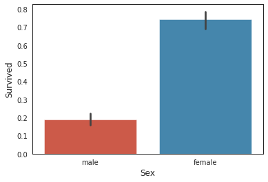
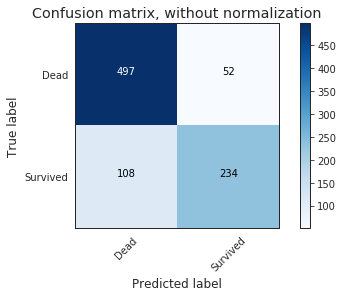

# Definir el problema

Desarrollar un algoritmo que prediga los supervivientes del Titanic
---
**Resumen del proyecto:** El hundimiento del RMS Titanic es uno de los mayores
naufragios de la historia. En abril de 1912 durante su viaje inaugural, el Titanic
se hundió después de colisionar con un iceberg, matando 1502 de 2224 pasajeros y
tripulación. Esta tragedia sensacional impactó la comunidad internacional e impulsaron
a tener una mejores regularizaciones para la seguridad de los barcos.

Una de las razones de que el naufragio tuviese muchas perdidas de vidas fue que tenían
suficientes salvavidas para los pasajeros y tripulación. A pesar de que hubo mucha
suerte involucrada en la supervivencia del hundimiento, algunos grupos tuvieron
mayor probabilidad de sobrevivir que otros, tales como mujeres, niños y la clase alta.

Análisar que grupo tuvo más probabilidad de supervivencia. Usar machine learning
para predecir que pasajeros sobrevivieron a la tragedia.

# Reunir los datos

Los datos serán reunidos de [Kaggle's Titanic: Machine Learning from Disaster](https://www.kaggle.com/c/titanic/data)

# Preparar los datos para el consumo

## Importar librerias


```python
import pandas as pd
import numpy as np
import scipy as sp
import random
import time
```

## Cargar librerias de modelado de datos


```python
from sklearn import svm, tree, linear_model, neighbors, naive_bayes, ensemble, discriminant_analysis, gaussian_process
from xgboost import XGBClassifier

from sklearn.preprocessing import OneHotEncoder, LabelEncoder
from sklearn import feature_selection
from sklearn import model_selection
from sklearn import metrics

import matplotlib as mpl
import matplotlib.pyplot as plt
import matplotlib.pylab as pylab
import seaborn as sns

%matplotlib inline
mpl.style.use('ggplot')
sns.set_style('white')
pylab.rcParams['figure.figsize'] = 6,4
```

## Conoce y saluda a los datos


```python
train = pd.read_csv("data/train.csv")
test = pd.read_csv("data/test.csv")
data1 = train.copy(deep=True)
data_cleaner = [data1, test]
```


```python
train.info()
```

    <class 'pandas.core.frame.DataFrame'>
    RangeIndex: 891 entries, 0 to 890
    Data columns (total 12 columns):
     #   Column       Non-Null Count  Dtype  
    ---  ------       --------------  -----  
     0   PassengerId  891 non-null    int64  
     1   Survived     891 non-null    int64  
     2   Pclass       891 non-null    int64  
     3   Name         891 non-null    object 
     4   Sex          891 non-null    object 
     5   Age          714 non-null    float64
     6   SibSp        891 non-null    int64  
     7   Parch        891 non-null    int64  
     8   Ticket       891 non-null    object 
     9   Fare         891 non-null    float64
     10  Cabin        204 non-null    object 
     11  Embarked     889 non-null    object 
    dtypes: float64(2), int64(5), object(5)
    memory usage: 83.7+ KB


```python
train.head()
```


<div>
<style scoped>
    .dataframe tbody tr th:only-of-type {
        vertical-align: middle;
    }

    .dataframe tbody tr th {
        vertical-align: top;
    }

    .dataframe thead th {
        text-align: right;
    }
</style>
<table border="1" class="dataframe">
  <thead>
    <tr style="text-align: right;">
      <th></th>
      <th>PassengerId</th>
      <th>Survived</th>
      <th>Pclass</th>
      <th>Name</th>
      <th>Sex</th>
      <th>Age</th>
      <th>SibSp</th>
      <th>Parch</th>
      <th>Ticket</th>
      <th>Fare</th>
      <th>Cabin</th>
      <th>Embarked</th>
    </tr>
  </thead>
  <tbody>
    <tr>
      <th>0</th>
      <td>1</td>
      <td>0</td>
      <td>3</td>
      <td>Braund, Mr. Owen Harris</td>
      <td>male</td>
      <td>22.0</td>
      <td>1</td>
      <td>0</td>
      <td>A/5 21171</td>
      <td>7.2500</td>
      <td>NaN</td>
      <td>S</td>
    </tr>
    <tr>
      <th>1</th>
      <td>2</td>
      <td>1</td>
      <td>1</td>
      <td>Cumings, Mrs. John Bradley (Florence Briggs Th...</td>
      <td>female</td>
      <td>38.0</td>
      <td>1</td>
      <td>0</td>
      <td>PC 17599</td>
      <td>71.2833</td>
      <td>C85</td>
      <td>C</td>
    </tr>
    <tr>
      <th>2</th>
      <td>3</td>
      <td>1</td>
      <td>3</td>
      <td>Heikkinen, Miss. Laina</td>
      <td>female</td>
      <td>26.0</td>
      <td>0</td>
      <td>0</td>
      <td>STON/O2. 3101282</td>
      <td>7.9250</td>
      <td>NaN</td>
      <td>S</td>
    </tr>
    <tr>
      <th>3</th>
      <td>4</td>
      <td>1</td>
      <td>1</td>
      <td>Futrelle, Mrs. Jacques Heath (Lily May Peel)</td>
      <td>female</td>
      <td>35.0</td>
      <td>1</td>
      <td>0</td>
      <td>113803</td>
      <td>53.1000</td>
      <td>C123</td>
      <td>S</td>
    </tr>
    <tr>
      <th>4</th>
      <td>5</td>
      <td>0</td>
      <td>3</td>
      <td>Allen, Mr. William Henry</td>
      <td>male</td>
      <td>35.0</td>
      <td>0</td>
      <td>0</td>
      <td>373450</td>
      <td>8.0500</td>
      <td>NaN</td>
      <td>S</td>
    </tr>
  </tbody>
</table>
</div>


## Las 4 C's de la limpieza de datos: Corregir, Completar, Crear y Convertir

1. **Corregir:** Revisando los datos, no parecen haber datos aberrantes. Podemos apreciar algunos outliers potenciales en "age" y "fare".

2. **Completar:** Hay valores perdidos en los campos "age", "cabin" y "embarked".

3. **Crear:** Crearemos una columna con el titulo del pasajero.

4. **Convertir:** Convertiremos las variables categoricas en variables fiticias.


```python
data1.isnull().sum()
```


    PassengerId      0
    Survived         0
    Pclass           0
    Name             0
    Sex              0
    Age            177
    SibSp            0
    Parch            0
    Ticket           0
    Fare             0
    Cabin          687
    Embarked         2
    dtype: int64


```python
test.isnull().sum()
```


    PassengerId      0
    Pclass           0
    Name             0
    Sex              0
    Age             86
    SibSp            0
    Parch            0
    Ticket           0
    Fare             1
    Cabin          327
    Embarked         0
    dtype: int64


```python
train.describe(include='all')
```


<div>
<style scoped>
    .dataframe tbody tr th:only-of-type {
        vertical-align: middle;
    }

    .dataframe tbody tr th {
        vertical-align: top;
    }

    .dataframe thead th {
        text-align: right;
    }
</style>
<table border="1" class="dataframe">
  <thead>
    <tr style="text-align: right;">
      <th></th>
      <th>PassengerId</th>
      <th>Survived</th>
      <th>Pclass</th>
      <th>Name</th>
      <th>Sex</th>
      <th>Age</th>
      <th>SibSp</th>
      <th>Parch</th>
      <th>Ticket</th>
      <th>Fare</th>
      <th>Cabin</th>
      <th>Embarked</th>
    </tr>
  </thead>
  <tbody>
    <tr>
      <th>count</th>
      <td>891.000000</td>
      <td>891.000000</td>
      <td>891.000000</td>
      <td>891</td>
      <td>891</td>
      <td>714.000000</td>
      <td>891.000000</td>
      <td>891.000000</td>
      <td>891</td>
      <td>891.000000</td>
      <td>204</td>
      <td>889</td>
    </tr>
    <tr>
      <th>unique</th>
      <td>NaN</td>
      <td>NaN</td>
      <td>NaN</td>
      <td>891</td>
      <td>2</td>
      <td>NaN</td>
      <td>NaN</td>
      <td>NaN</td>
      <td>681</td>
      <td>NaN</td>
      <td>147</td>
      <td>3</td>
    </tr>
    <tr>
      <th>top</th>
      <td>NaN</td>
      <td>NaN</td>
      <td>NaN</td>
      <td>Petroff, Mr. Pastcho ("Pentcho")</td>
      <td>male</td>
      <td>NaN</td>
      <td>NaN</td>
      <td>NaN</td>
      <td>347082</td>
      <td>NaN</td>
      <td>B96 B98</td>
      <td>S</td>
    </tr>
    <tr>
      <th>freq</th>
      <td>NaN</td>
      <td>NaN</td>
      <td>NaN</td>
      <td>1</td>
      <td>577</td>
      <td>NaN</td>
      <td>NaN</td>
      <td>NaN</td>
      <td>7</td>
      <td>NaN</td>
      <td>4</td>
      <td>644</td>
    </tr>
    <tr>
      <th>mean</th>
      <td>446.000000</td>
      <td>0.383838</td>
      <td>2.308642</td>
      <td>NaN</td>
      <td>NaN</td>
      <td>29.699118</td>
      <td>0.523008</td>
      <td>0.381594</td>
      <td>NaN</td>
      <td>32.204208</td>
      <td>NaN</td>
      <td>NaN</td>
    </tr>
    <tr>
      <th>std</th>
      <td>257.353842</td>
      <td>0.486592</td>
      <td>0.836071</td>
      <td>NaN</td>
      <td>NaN</td>
      <td>14.526497</td>
      <td>1.102743</td>
      <td>0.806057</td>
      <td>NaN</td>
      <td>49.693429</td>
      <td>NaN</td>
      <td>NaN</td>
    </tr>
    <tr>
      <th>min</th>
      <td>1.000000</td>
      <td>0.000000</td>
      <td>1.000000</td>
      <td>NaN</td>
      <td>NaN</td>
      <td>0.420000</td>
      <td>0.000000</td>
      <td>0.000000</td>
      <td>NaN</td>
      <td>0.000000</td>
      <td>NaN</td>
      <td>NaN</td>
    </tr>
    <tr>
      <th>25%</th>
      <td>223.500000</td>
      <td>0.000000</td>
      <td>2.000000</td>
      <td>NaN</td>
      <td>NaN</td>
      <td>20.125000</td>
      <td>0.000000</td>
      <td>0.000000</td>
      <td>NaN</td>
      <td>7.910400</td>
      <td>NaN</td>
      <td>NaN</td>
    </tr>
    <tr>
      <th>50%</th>
      <td>446.000000</td>
      <td>0.000000</td>
      <td>3.000000</td>
      <td>NaN</td>
      <td>NaN</td>
      <td>28.000000</td>
      <td>0.000000</td>
      <td>0.000000</td>
      <td>NaN</td>
      <td>14.454200</td>
      <td>NaN</td>
      <td>NaN</td>
    </tr>
    <tr>
      <th>75%</th>
      <td>668.500000</td>
      <td>1.000000</td>
      <td>3.000000</td>
      <td>NaN</td>
      <td>NaN</td>
      <td>38.000000</td>
      <td>1.000000</td>
      <td>0.000000</td>
      <td>NaN</td>
      <td>31.000000</td>
      <td>NaN</td>
      <td>NaN</td>
    </tr>
    <tr>
      <th>max</th>
      <td>891.000000</td>
      <td>1.000000</td>
      <td>3.000000</td>
      <td>NaN</td>
      <td>NaN</td>
      <td>80.000000</td>
      <td>8.000000</td>
      <td>6.000000</td>
      <td>NaN</td>
      <td>512.329200</td>
      <td>NaN</td>
      <td>NaN</td>
    </tr>
  </tbody>
</table>
</div>


## Limpiar los datos


```python
for dataset in data_cleaner:    

    dataset['Age'].fillna(dataset['Age'].median(), inplace = True)

    dataset['Embarked'].fillna(dataset['Embarked'].mode()[0], inplace = True)

    dataset['Fare'].fillna(dataset['Fare'].median(), inplace = True)
    
drop_column = ['PassengerId','Cabin', 'Ticket']
data1.drop(drop_column, axis=1, inplace = True)
```


```python
data1.isnull().sum()
```


    Survived    0
    Pclass      0
    Name        0
    Sex         0
    Age         0
    SibSp       0
    Parch       0
    Fare        0
    Embarked    0
    dtype: int64


```python
test.isnull().sum()
```


    PassengerId      0
    Pclass           0
    Name             0
    Sex              0
    Age              0
    SibSp            0
    Parch            0
    Ticket           0
    Fare             0
    Cabin          327
    Embarked         0
    dtype: int64


```python
for dataset in data_cleaner:    
    dataset['FamilySize'] = dataset ['SibSp'] + dataset['Parch'] + 1

    dataset['IsAlone'] = 1
    dataset['IsAlone'].loc[dataset['FamilySize'] > 1] = 0

    dataset['Title'] = dataset['Name'].str.split(", ", expand=True)[1]\
        .str.split(".", expand=True)[0]

    dataset['FareBin'] = pd.qcut(dataset['Fare'], 4)

    dataset['AgeBin'] = pd.cut(dataset['Age'].astype(int), 5)

stat_min = 10 
title_names = (data1['Title'].value_counts() < stat_min)


data1['Title'] = data1['Title'].apply(lambda x: 'Misc' 
                                      if title_names.loc[x] == True else x)
data1['Title'].value_counts()
```

    /home/kevin/anaconda3/lib/python3.7/site-packages/pandas/core/indexing.py:670: SettingWithCopyWarning: 
    A value is trying to be set on a copy of a slice from a DataFrame
    
    See the caveats in the documentation: https://pandas.pydata.org/pandas-docs/stable/user_guide/indexing.html#returning-a-view-versus-a-copy
      self._setitem_with_indexer(indexer, value)


    Mr        517
    Miss      182
    Mrs       125
    Master     40
    Misc       27
    Name: Title, dtype: int64


```python
data1.info()
```

    <class 'pandas.core.frame.DataFrame'>
    RangeIndex: 891 entries, 0 to 890
    Data columns (total 14 columns):
     #   Column      Non-Null Count  Dtype   
    ---  ------      --------------  -----   
     0   Survived    891 non-null    int64   
     1   Pclass      891 non-null    int64   
     2   Name        891 non-null    object  
     3   Sex         891 non-null    object  
     4   Age         891 non-null    float64 
     5   SibSp       891 non-null    int64   
     6   Parch       891 non-null    int64   
     7   Fare        891 non-null    float64 
     8   Embarked    891 non-null    object  
     9   FamilySize  891 non-null    int64   
     10  IsAlone     891 non-null    int64   
     11  Title       891 non-null    object  
     12  FareBin     891 non-null    category
     13  AgeBin      891 non-null    category
    dtypes: category(2), float64(2), int64(6), object(4)
    memory usage: 85.8+ KB


```python
test.info()
```

    <class 'pandas.core.frame.DataFrame'>
    RangeIndex: 418 entries, 0 to 417
    Data columns (total 16 columns):
     #   Column       Non-Null Count  Dtype   
    ---  ------       --------------  -----   
     0   PassengerId  418 non-null    int64   
     1   Pclass       418 non-null    int64   
     2   Name         418 non-null    object  
     3   Sex          418 non-null    object  
     4   Age          418 non-null    float64 
     5   SibSp        418 non-null    int64   
     6   Parch        418 non-null    int64   
     7   Ticket       418 non-null    object  
     8   Fare         418 non-null    float64 
     9   Cabin        91 non-null     object  
     10  Embarked     418 non-null    object  
     11  FamilySize   418 non-null    int64   
     12  IsAlone      418 non-null    int64   
     13  Title        418 non-null    object  
     14  FareBin      418 non-null    category
     15  AgeBin       418 non-null    category
    dtypes: category(2), float64(2), int64(6), object(6)
    memory usage: 47.1+ KB


```python
data1.head()
```


<div>
<style scoped>
    .dataframe tbody tr th:only-of-type {
        vertical-align: middle;
    }

    .dataframe tbody tr th {
        vertical-align: top;
    }

    .dataframe thead th {
        text-align: right;
    }
</style>
<table border="1" class="dataframe">
  <thead>
    <tr style="text-align: right;">
      <th></th>
      <th>Survived</th>
      <th>Pclass</th>
      <th>Name</th>
      <th>Sex</th>
      <th>Age</th>
      <th>SibSp</th>
      <th>Parch</th>
      <th>Fare</th>
      <th>Embarked</th>
      <th>FamilySize</th>
      <th>IsAlone</th>
      <th>Title</th>
      <th>FareBin</th>
      <th>AgeBin</th>
    </tr>
  </thead>
  <tbody>
    <tr>
      <th>0</th>
      <td>0</td>
      <td>3</td>
      <td>Braund, Mr. Owen Harris</td>
      <td>male</td>
      <td>22.0</td>
      <td>1</td>
      <td>0</td>
      <td>7.2500</td>
      <td>S</td>
      <td>2</td>
      <td>0</td>
      <td>Mr</td>
      <td>(-0.001, 7.91]</td>
      <td>(16.0, 32.0]</td>
    </tr>
    <tr>
      <th>1</th>
      <td>1</td>
      <td>1</td>
      <td>Cumings, Mrs. John Bradley (Florence Briggs Th...</td>
      <td>female</td>
      <td>38.0</td>
      <td>1</td>
      <td>0</td>
      <td>71.2833</td>
      <td>C</td>
      <td>2</td>
      <td>0</td>
      <td>Mrs</td>
      <td>(31.0, 512.329]</td>
      <td>(32.0, 48.0]</td>
    </tr>
    <tr>
      <th>2</th>
      <td>1</td>
      <td>3</td>
      <td>Heikkinen, Miss. Laina</td>
      <td>female</td>
      <td>26.0</td>
      <td>0</td>
      <td>0</td>
      <td>7.9250</td>
      <td>S</td>
      <td>1</td>
      <td>1</td>
      <td>Miss</td>
      <td>(7.91, 14.454]</td>
      <td>(16.0, 32.0]</td>
    </tr>
    <tr>
      <th>3</th>
      <td>1</td>
      <td>1</td>
      <td>Futrelle, Mrs. Jacques Heath (Lily May Peel)</td>
      <td>female</td>
      <td>35.0</td>
      <td>1</td>
      <td>0</td>
      <td>53.1000</td>
      <td>S</td>
      <td>2</td>
      <td>0</td>
      <td>Mrs</td>
      <td>(31.0, 512.329]</td>
      <td>(32.0, 48.0]</td>
    </tr>
    <tr>
      <th>4</th>
      <td>0</td>
      <td>3</td>
      <td>Allen, Mr. William Henry</td>
      <td>male</td>
      <td>35.0</td>
      <td>0</td>
      <td>0</td>
      <td>8.0500</td>
      <td>S</td>
      <td>1</td>
      <td>1</td>
      <td>Mr</td>
      <td>(7.91, 14.454]</td>
      <td>(32.0, 48.0]</td>
    </tr>
  </tbody>
</table>
</div>


## Convertir formatos


```python
label = LabelEncoder()
for dataset in data_cleaner:    
    dataset['Sex_Code'] = label.fit_transform(dataset['Sex'])
    dataset['Embarked_Code'] = label.fit_transform(dataset['Embarked'])
    dataset['Title_Code'] = label.fit_transform(dataset['Title'])
    dataset['AgeBin_Code'] = label.fit_transform(dataset['AgeBin'])
    dataset['FareBin_Code'] = label.fit_transform(dataset['FareBin'])

Target = ['Survived']

data1_x = ['Sex','Pclass', 'Embarked', 'Title','SibSp', 'Parch', 
           'Age', 'Fare', 'FamilySize', 'IsAlone']

data1_x_calc = ['Sex_Code','Pclass', 'Embarked_Code', 
                'Title_Code','SibSp', 'Parch', 'Age', 'Fare']
data1_xy =  Target + data1_x

print('Original X Y: ', data1_xy, '\n')
```

    Original X Y:  ['Survived', 'Sex', 'Pclass', 'Embarked', 'Title', 'SibSp', 'Parch', 'Age', 'Fare', 'FamilySize', 'IsAlone'] 
    


```python
data1_x_bin = ['Sex_Code','Pclass', 'Embarked_Code', 'Title_Code', 
               'FamilySize', 'AgeBin_Code', 'FareBin_Code']
data1_xy_bin = Target + data1_x_bin
print('Bin X Y: ', data1_xy_bin, '\n')
```

    Bin X Y:  ['Survived', 'Sex_Code', 'Pclass', 'Embarked_Code', 'Title_Code', 'FamilySize', 'AgeBin_Code', 'FareBin_Code'] 
    


```python
data1_dummy = pd.get_dummies(data1[data1_x])
data1_x_dummy = data1_dummy.columns.tolist()
data1_xy_dummy = Target + data1_x_dummy
print('Dummy X Y: ', data1_xy_dummy, '\n')
```

    Dummy X Y:  ['Survived', 'Pclass', 'SibSp', 'Parch', 'Age', 'Fare', 'FamilySize', 'IsAlone', 'Sex_female', 'Sex_male', 'Embarked_C', 'Embarked_Q', 'Embarked_S', 'Title_Master', 'Title_Misc', 'Title_Miss', 'Title_Mr', 'Title_Mrs'] 
    


```python
data1_dummy.head()
```


<div>
<style scoped>
    .dataframe tbody tr th:only-of-type {
        vertical-align: middle;
    }

    .dataframe tbody tr th {
        vertical-align: top;
    }

    .dataframe thead th {
        text-align: right;
    }
</style>
<table border="1" class="dataframe">
  <thead>
    <tr style="text-align: right;">
      <th></th>
      <th>Pclass</th>
      <th>SibSp</th>
      <th>Parch</th>
      <th>Age</th>
      <th>Fare</th>
      <th>FamilySize</th>
      <th>IsAlone</th>
      <th>Sex_female</th>
      <th>Sex_male</th>
      <th>Embarked_C</th>
      <th>Embarked_Q</th>
      <th>Embarked_S</th>
      <th>Title_Master</th>
      <th>Title_Misc</th>
      <th>Title_Miss</th>
      <th>Title_Mr</th>
      <th>Title_Mrs</th>
    </tr>
  </thead>
  <tbody>
    <tr>
      <th>0</th>
      <td>3</td>
      <td>1</td>
      <td>0</td>
      <td>22.0</td>
      <td>7.2500</td>
      <td>2</td>
      <td>0</td>
      <td>0</td>
      <td>1</td>
      <td>0</td>
      <td>0</td>
      <td>1</td>
      <td>0</td>
      <td>0</td>
      <td>0</td>
      <td>1</td>
      <td>0</td>
    </tr>
    <tr>
      <th>1</th>
      <td>1</td>
      <td>1</td>
      <td>0</td>
      <td>38.0</td>
      <td>71.2833</td>
      <td>2</td>
      <td>0</td>
      <td>1</td>
      <td>0</td>
      <td>1</td>
      <td>0</td>
      <td>0</td>
      <td>0</td>
      <td>0</td>
      <td>0</td>
      <td>0</td>
      <td>1</td>
    </tr>
    <tr>
      <th>2</th>
      <td>3</td>
      <td>0</td>
      <td>0</td>
      <td>26.0</td>
      <td>7.9250</td>
      <td>1</td>
      <td>1</td>
      <td>1</td>
      <td>0</td>
      <td>0</td>
      <td>0</td>
      <td>1</td>
      <td>0</td>
      <td>0</td>
      <td>1</td>
      <td>0</td>
      <td>0</td>
    </tr>
    <tr>
      <th>3</th>
      <td>1</td>
      <td>1</td>
      <td>0</td>
      <td>35.0</td>
      <td>53.1000</td>
      <td>2</td>
      <td>0</td>
      <td>1</td>
      <td>0</td>
      <td>0</td>
      <td>0</td>
      <td>1</td>
      <td>0</td>
      <td>0</td>
      <td>0</td>
      <td>0</td>
      <td>1</td>
    </tr>
    <tr>
      <th>4</th>
      <td>3</td>
      <td>0</td>
      <td>0</td>
      <td>35.0</td>
      <td>8.0500</td>
      <td>1</td>
      <td>1</td>
      <td>0</td>
      <td>1</td>
      <td>0</td>
      <td>0</td>
      <td>1</td>
      <td>0</td>
      <td>0</td>
      <td>0</td>
      <td>1</td>
      <td>0</td>
    </tr>
  </tbody>
</table>
</div>


## Doble revisión de la limpieza de los datos


```python
data1.isnull().sum()
```


    Survived         0
    Pclass           0
    Name             0
    Sex              0
    Age              0
    SibSp            0
    Parch            0
    Fare             0
    Embarked         0
    FamilySize       0
    IsAlone          0
    Title            0
    FareBin          0
    AgeBin           0
    Sex_Code         0
    Embarked_Code    0
    Title_Code       0
    AgeBin_Code      0
    FareBin_Code     0
    dtype: int64


```python
data1.info()
```

    <class 'pandas.core.frame.DataFrame'>
    RangeIndex: 891 entries, 0 to 890
    Data columns (total 19 columns):
     #   Column         Non-Null Count  Dtype   
    ---  ------         --------------  -----   
     0   Survived       891 non-null    int64   
     1   Pclass         891 non-null    int64   
     2   Name           891 non-null    object  
     3   Sex            891 non-null    object  
     4   Age            891 non-null    float64 
     5   SibSp          891 non-null    int64   
     6   Parch          891 non-null    int64   
     7   Fare           891 non-null    float64 
     8   Embarked       891 non-null    object  
     9   FamilySize     891 non-null    int64   
     10  IsAlone        891 non-null    int64   
     11  Title          891 non-null    object  
     12  FareBin        891 non-null    category
     13  AgeBin         891 non-null    category
     14  Sex_Code       891 non-null    int64   
     15  Embarked_Code  891 non-null    int64   
     16  Title_Code     891 non-null    int64   
     17  AgeBin_Code    891 non-null    int64   
     18  FareBin_Code   891 non-null    int64   
    dtypes: category(2), float64(2), int64(11), object(4)
    memory usage: 120.7+ KB


```python
test.isnull().sum()
```


    PassengerId        0
    Pclass             0
    Name               0
    Sex                0
    Age                0
    SibSp              0
    Parch              0
    Ticket             0
    Fare               0
    Cabin            327
    Embarked           0
    FamilySize         0
    IsAlone            0
    Title              0
    FareBin            0
    AgeBin             0
    Sex_Code           0
    Embarked_Code      0
    Title_Code         0
    AgeBin_Code        0
    FareBin_Code       0
    dtype: int64


```python
test.info()
```

    <class 'pandas.core.frame.DataFrame'>
    RangeIndex: 418 entries, 0 to 417
    Data columns (total 21 columns):
     #   Column         Non-Null Count  Dtype   
    ---  ------         --------------  -----   
     0   PassengerId    418 non-null    int64   
     1   Pclass         418 non-null    int64   
     2   Name           418 non-null    object  
     3   Sex            418 non-null    object  
     4   Age            418 non-null    float64 
     5   SibSp          418 non-null    int64   
     6   Parch          418 non-null    int64   
     7   Ticket         418 non-null    object  
     8   Fare           418 non-null    float64 
     9   Cabin          91 non-null     object  
     10  Embarked       418 non-null    object  
     11  FamilySize     418 non-null    int64   
     12  IsAlone        418 non-null    int64   
     13  Title          418 non-null    object  
     14  FareBin        418 non-null    category
     15  AgeBin         418 non-null    category
     16  Sex_Code       418 non-null    int64   
     17  Embarked_Code  418 non-null    int64   
     18  Title_Code     418 non-null    int64   
     19  AgeBin_Code    418 non-null    int64   
     20  FareBin_Code   418 non-null    int64   
    dtypes: category(2), float64(2), int64(11), object(6)
    memory usage: 63.4+ KB


```python
train.describe(include = 'all')
```


<div>
<style scoped>
    .dataframe tbody tr th:only-of-type {
        vertical-align: middle;
    }

    .dataframe tbody tr th {
        vertical-align: top;
    }

    .dataframe thead th {
        text-align: right;
    }
</style>
<table border="1" class="dataframe">
  <thead>
    <tr style="text-align: right;">
      <th></th>
      <th>PassengerId</th>
      <th>Survived</th>
      <th>Pclass</th>
      <th>Name</th>
      <th>Sex</th>
      <th>Age</th>
      <th>SibSp</th>
      <th>Parch</th>
      <th>Ticket</th>
      <th>Fare</th>
      <th>Cabin</th>
      <th>Embarked</th>
    </tr>
  </thead>
  <tbody>
    <tr>
      <th>count</th>
      <td>891.000000</td>
      <td>891.000000</td>
      <td>891.000000</td>
      <td>891</td>
      <td>891</td>
      <td>714.000000</td>
      <td>891.000000</td>
      <td>891.000000</td>
      <td>891</td>
      <td>891.000000</td>
      <td>204</td>
      <td>889</td>
    </tr>
    <tr>
      <th>unique</th>
      <td>NaN</td>
      <td>NaN</td>
      <td>NaN</td>
      <td>891</td>
      <td>2</td>
      <td>NaN</td>
      <td>NaN</td>
      <td>NaN</td>
      <td>681</td>
      <td>NaN</td>
      <td>147</td>
      <td>3</td>
    </tr>
    <tr>
      <th>top</th>
      <td>NaN</td>
      <td>NaN</td>
      <td>NaN</td>
      <td>Petroff, Mr. Pastcho ("Pentcho")</td>
      <td>male</td>
      <td>NaN</td>
      <td>NaN</td>
      <td>NaN</td>
      <td>347082</td>
      <td>NaN</td>
      <td>B96 B98</td>
      <td>S</td>
    </tr>
    <tr>
      <th>freq</th>
      <td>NaN</td>
      <td>NaN</td>
      <td>NaN</td>
      <td>1</td>
      <td>577</td>
      <td>NaN</td>
      <td>NaN</td>
      <td>NaN</td>
      <td>7</td>
      <td>NaN</td>
      <td>4</td>
      <td>644</td>
    </tr>
    <tr>
      <th>mean</th>
      <td>446.000000</td>
      <td>0.383838</td>
      <td>2.308642</td>
      <td>NaN</td>
      <td>NaN</td>
      <td>29.699118</td>
      <td>0.523008</td>
      <td>0.381594</td>
      <td>NaN</td>
      <td>32.204208</td>
      <td>NaN</td>
      <td>NaN</td>
    </tr>
    <tr>
      <th>std</th>
      <td>257.353842</td>
      <td>0.486592</td>
      <td>0.836071</td>
      <td>NaN</td>
      <td>NaN</td>
      <td>14.526497</td>
      <td>1.102743</td>
      <td>0.806057</td>
      <td>NaN</td>
      <td>49.693429</td>
      <td>NaN</td>
      <td>NaN</td>
    </tr>
    <tr>
      <th>min</th>
      <td>1.000000</td>
      <td>0.000000</td>
      <td>1.000000</td>
      <td>NaN</td>
      <td>NaN</td>
      <td>0.420000</td>
      <td>0.000000</td>
      <td>0.000000</td>
      <td>NaN</td>
      <td>0.000000</td>
      <td>NaN</td>
      <td>NaN</td>
    </tr>
    <tr>
      <th>25%</th>
      <td>223.500000</td>
      <td>0.000000</td>
      <td>2.000000</td>
      <td>NaN</td>
      <td>NaN</td>
      <td>20.125000</td>
      <td>0.000000</td>
      <td>0.000000</td>
      <td>NaN</td>
      <td>7.910400</td>
      <td>NaN</td>
      <td>NaN</td>
    </tr>
    <tr>
      <th>50%</th>
      <td>446.000000</td>
      <td>0.000000</td>
      <td>3.000000</td>
      <td>NaN</td>
      <td>NaN</td>
      <td>28.000000</td>
      <td>0.000000</td>
      <td>0.000000</td>
      <td>NaN</td>
      <td>14.454200</td>
      <td>NaN</td>
      <td>NaN</td>
    </tr>
    <tr>
      <th>75%</th>
      <td>668.500000</td>
      <td>1.000000</td>
      <td>3.000000</td>
      <td>NaN</td>
      <td>NaN</td>
      <td>38.000000</td>
      <td>1.000000</td>
      <td>0.000000</td>
      <td>NaN</td>
      <td>31.000000</td>
      <td>NaN</td>
      <td>NaN</td>
    </tr>
    <tr>
      <th>max</th>
      <td>891.000000</td>
      <td>1.000000</td>
      <td>3.000000</td>
      <td>NaN</td>
      <td>NaN</td>
      <td>80.000000</td>
      <td>8.000000</td>
      <td>6.000000</td>
      <td>NaN</td>
      <td>512.329200</td>
      <td>NaN</td>
      <td>NaN</td>
    </tr>
  </tbody>
</table>
</div>


## Dividir los datos


```python
train1_x, test1_x, train1_y, test1_y =\
    model_selection.train_test_split(data1[data1_x_calc], data1[Target], random_state = 0)

train1_x_bin, test1_x_bin, train1_y_bin, test1_y_bin =\
    model_selection.train_test_split(data1[data1_x_bin], data1[Target] , random_state = 0)

train1_x_dummy, test1_x_dummy, train1_y_dummy, test1_y_dummy =\
    model_selection.train_test_split(data1_dummy[data1_x_dummy], data1[Target], random_state = 0)
```


```python
print("Data1 Shape: {}".format(data1.shape))
print("Train1 Shape: {}".format(train1_x.shape))
print("Test1 Shape: {}".format(test1_x.shape))
```

    Data1 Shape: (891, 19)
    Train1 Shape: (668, 8)
    Test1 Shape: (223, 8)


# Realizar análisis exploratorio


```python
sns.barplot(x="Sex",y="Survived",data=data1);
```





```python
sns.barplot(x="Pclass",y="Survived",data=data1);
```


```python
sns.barplot(x="Embarked",y="Survived",data=data1);
```


```python
sns.barplot(x="Title",y="Survived",data=data1);
```


```python
sns.barplot(x="SibSp",y="Survived",data=data1);
```


```python
sns.barplot(x="Parch",y="Survived",data=data1);
```


```python
sns.barplot(x="FamilySize",y="Survived",data=data1);
```


```python
sns.barplot(x="IsAlone",y="Survived",data=data1);
```


```python
pd.crosstab(data1['Title'],data1[Target]).plot.bar(stacked=False);
```


```python
plt.figure(figsize=[16,12])

plt.subplot(231)
plt.boxplot(x=data1['Fare'], showmeans = True, meanline = True)
plt.title('Fare Boxplot')
plt.ylabel('Fare ($)')

plt.subplot(232)
plt.boxplot(data1['Age'], showmeans = True, meanline = True)
plt.title('Age Boxplot')
plt.ylabel('Age (Years)')

plt.subplot(233)
plt.boxplot(data1['FamilySize'], showmeans = True, meanline = True)
plt.title('Family Size Boxplot')
plt.ylabel('Family Size (#)')

plt.subplot(234)
plt.hist(x = [data1[data1['Survived']==1]['Fare'], 
              data1[data1['Survived']==0]['Fare']], 
         stacked=True, color = ['g','r'],label = ['Survived','Dead'])
plt.title('Fare Histogram by Survival')
plt.xlabel('Fare ($)')
plt.ylabel('# of Passengers')
plt.legend()

plt.subplot(235)
plt.hist(x = [data1[data1['Survived']==1]['Age'], 
              data1[data1['Survived']==0]['Age']], 
         stacked=True, color = ['g','r'],label = ['Survived','Dead'])
plt.title('Age Histogram by Survival')
plt.xlabel('Age (Years)')
plt.ylabel('# of Passengers')
plt.legend()

plt.subplot(236)
plt.hist(x = [data1[data1['Survived']==1]['FamilySize'], 
              data1[data1['Survived']==0]['FamilySize']], 
         stacked=True, color = ['g','r'],label = ['Survived','Dead'])
plt.title('Family Size Histogram by Survival')
plt.xlabel('Family Size (#)')
plt.ylabel('# of Passengers')
plt.legend();
```


```python
def correlation_heatmap(df):
    _ , ax = plt.subplots(figsize =(14, 12))
    colormap = sns.diverging_palette(220, 10, as_cmap = True)
    
    _ = sns.heatmap(
        df.corr(), 
        cmap = colormap,
        square=True, 
        cbar_kws={'shrink':.9 }, 
        ax=ax,
        annot=True, 
        linewidths=0.1,vmax=1.0, linecolor='white',
        annot_kws={'fontsize':12 }
    )
    
    plt.title('Pearson Correlation of Features', y=1.05, size=15)

correlation_heatmap(data1)
```


# Modelar los datos


```python
MLA = [
    #Ensemble Methods
    ensemble.AdaBoostClassifier(),
    ensemble.BaggingClassifier(),
    ensemble.ExtraTreesClassifier(),
    ensemble.GradientBoostingClassifier(),
    ensemble.RandomForestClassifier(),

    #Gaussian Processes
    gaussian_process.GaussianProcessClassifier(),
    
    #Nearest Neighbor
    neighbors.KNeighborsClassifier(),
    
    #SVM
    svm.SVC(probability=True),
    svm.NuSVC(probability=True),
    
    #Trees    
    tree.DecisionTreeClassifier(),
    tree.ExtraTreeClassifier(),
    
    #Discriminant Analysis
    discriminant_analysis.QuadraticDiscriminantAnalysis(),

    #xgboost: http://xgboost.readthedocs.io/en/latest/model.html
    XGBClassifier()    
    ]
```


```python
print(data1[data1_x_bin].shape)
data1[Target].shape
```

    (891, 7)


    (891, 1)


```python
cv_split = model_selection.ShuffleSplit(n_splits = 10, test_size = .3, train_size = .6, random_state = 0 ) # run model 10x with 60/30 split intentionally leaving out 10%


MLA_columns = ['MLA Name', 'MLA Parameters','MLA Train Accuracy Mean', 
               'MLA Test Accuracy Mean', 'MLA Test Accuracy 3*STD' ,'MLA Time']
MLA_compare = pd.DataFrame(columns = MLA_columns)

#create table to compare MLA predictions
MLA_predict = data1[Target]

#index through MLA and save performance to table
row_index = 0
for alg in MLA:

    MLA_name = alg.__class__.__name__
    MLA_compare.loc[row_index, 'MLA Name'] = MLA_name
    MLA_compare.loc[row_index, 'MLA Parameters'] = str(alg.get_params())
    

    cv_results = model_selection.cross_validate(alg, data1[data1_x_bin], data1["Survived"], cv  = cv_split,
                                                return_train_score=True)

    MLA_compare.loc[row_index, 'MLA Time'] = cv_results['fit_time'].mean()
    MLA_compare.loc[row_index, 'MLA Train Accuracy Mean'] = cv_results['train_score'].mean()
    MLA_compare.loc[row_index, 'MLA Test Accuracy Mean'] = cv_results['test_score'].mean()   

    MLA_compare.loc[row_index, 'MLA Test Accuracy 3*STD'] = cv_results['test_score'].std()*3
    
    alg.fit(data1[data1_x_bin], data1["Survived"])
    MLA_predict[MLA_name] = alg.predict(data1[data1_x_bin])
    
    row_index+=1

MLA_compare.sort_values(by = ['MLA Test Accuracy Mean'], ascending = False, inplace = True)
MLA_compare
#MLA_predict
```

    /home/kevin/anaconda3/lib/python3.7/site-packages/ipykernel_launcher.py:30: SettingWithCopyWarning: 
    A value is trying to be set on a copy of a slice from a DataFrame.
    Try using .loc[row_indexer,col_indexer] = value instead
    
    See the caveats in the documentation: https://pandas.pydata.org/pandas-docs/stable/user_guide/indexing.html#returning-a-view-versus-a-copy
    /home/kevin/anaconda3/lib/python3.7/site-packages/ipykernel_launcher.py:30: SettingWithCopyWarning: 
    A value is trying to be set on a copy of a slice from a DataFrame.
    Try using .loc[row_indexer,col_indexer] = value instead
    
    See the caveats in the documentation: https://pandas.pydata.org/pandas-docs/stable/user_guide/indexing.html#returning-a-view-versus-a-copy
    /home/kevin/anaconda3/lib/python3.7/site-packages/ipykernel_launcher.py:30: SettingWithCopyWarning: 
    A value is trying to be set on a copy of a slice from a DataFrame.
    Try using .loc[row_indexer,col_indexer] = value instead
    
    See the caveats in the documentation: https://pandas.pydata.org/pandas-docs/stable/user_guide/indexing.html#returning-a-view-versus-a-copy
    /home/kevin/anaconda3/lib/python3.7/site-packages/ipykernel_launcher.py:30: SettingWithCopyWarning: 
    A value is trying to be set on a copy of a slice from a DataFrame.
    Try using .loc[row_indexer,col_indexer] = value instead
    
    See the caveats in the documentation: https://pandas.pydata.org/pandas-docs/stable/user_guide/indexing.html#returning-a-view-versus-a-copy
    /home/kevin/anaconda3/lib/python3.7/site-packages/ipykernel_launcher.py:30: SettingWithCopyWarning: 
    A value is trying to be set on a copy of a slice from a DataFrame.
    Try using .loc[row_indexer,col_indexer] = value instead
    
    See the caveats in the documentation: https://pandas.pydata.org/pandas-docs/stable/user_guide/indexing.html#returning-a-view-versus-a-copy
    /home/kevin/anaconda3/lib/python3.7/site-packages/ipykernel_launcher.py:30: SettingWithCopyWarning: 
    A value is trying to be set on a copy of a slice from a DataFrame.
    Try using .loc[row_indexer,col_indexer] = value instead
    
    See the caveats in the documentation: https://pandas.pydata.org/pandas-docs/stable/user_guide/indexing.html#returning-a-view-versus-a-copy
    /home/kevin/anaconda3/lib/python3.7/site-packages/ipykernel_launcher.py:30: SettingWithCopyWarning: 
    A value is trying to be set on a copy of a slice from a DataFrame.
    Try using .loc[row_indexer,col_indexer] = value instead
    
    See the caveats in the documentation: https://pandas.pydata.org/pandas-docs/stable/user_guide/indexing.html#returning-a-view-versus-a-copy
    /home/kevin/anaconda3/lib/python3.7/site-packages/ipykernel_launcher.py:30: SettingWithCopyWarning: 
    A value is trying to be set on a copy of a slice from a DataFrame.
    Try using .loc[row_indexer,col_indexer] = value instead
    
    See the caveats in the documentation: https://pandas.pydata.org/pandas-docs/stable/user_guide/indexing.html#returning-a-view-versus-a-copy
    /home/kevin/anaconda3/lib/python3.7/site-packages/ipykernel_launcher.py:30: SettingWithCopyWarning: 
    A value is trying to be set on a copy of a slice from a DataFrame.
    Try using .loc[row_indexer,col_indexer] = value instead
    
    See the caveats in the documentation: https://pandas.pydata.org/pandas-docs/stable/user_guide/indexing.html#returning-a-view-versus-a-copy
    /home/kevin/anaconda3/lib/python3.7/site-packages/ipykernel_launcher.py:30: SettingWithCopyWarning: 
    A value is trying to be set on a copy of a slice from a DataFrame.
    Try using .loc[row_indexer,col_indexer] = value instead
    
    See the caveats in the documentation: https://pandas.pydata.org/pandas-docs/stable/user_guide/indexing.html#returning-a-view-versus-a-copy
    /home/kevin/anaconda3/lib/python3.7/site-packages/ipykernel_launcher.py:30: SettingWithCopyWarning: 
    A value is trying to be set on a copy of a slice from a DataFrame.
    Try using .loc[row_indexer,col_indexer] = value instead
    
    See the caveats in the documentation: https://pandas.pydata.org/pandas-docs/stable/user_guide/indexing.html#returning-a-view-versus-a-copy
    /home/kevin/anaconda3/lib/python3.7/site-packages/ipykernel_launcher.py:30: SettingWithCopyWarning: 
    A value is trying to be set on a copy of a slice from a DataFrame.
    Try using .loc[row_indexer,col_indexer] = value instead
    
    See the caveats in the documentation: https://pandas.pydata.org/pandas-docs/stable/user_guide/indexing.html#returning-a-view-versus-a-copy


<div>
<style scoped>
    .dataframe tbody tr th:only-of-type {
        vertical-align: middle;
    }

    .dataframe tbody tr th {
        vertical-align: top;
    }

    .dataframe thead th {
        text-align: right;
    }
</style>
<table border="1" class="dataframe">
  <thead>
    <tr style="text-align: right;">
      <th></th>
      <th>MLA Name</th>
      <th>MLA Parameters</th>
      <th>MLA Train Accuracy Mean</th>
      <th>MLA Test Accuracy Mean</th>
      <th>MLA Test Accuracy 3*STD</th>
      <th>MLA Time</th>
    </tr>
  </thead>
  <tbody>
    <tr>
      <th>7</th>
      <td>SVC</td>
      <td>{'C': 1.0, 'break_ties': False, 'cache_size': ...</td>
      <td>0.835206</td>
      <td>0.827612</td>
      <td>0.0409157</td>
      <td>0.136107</td>
    </tr>
    <tr>
      <th>4</th>
      <td>RandomForestClassifier</td>
      <td>{'bootstrap': True, 'ccp_alpha': 0.0, 'class_w...</td>
      <td>0.895131</td>
      <td>0.826493</td>
      <td>0.0633724</td>
      <td>0.658607</td>
    </tr>
    <tr>
      <th>12</th>
      <td>XGBClassifier</td>
      <td>{'objective': 'binary:logistic', 'base_score':...</td>
      <td>0.890449</td>
      <td>0.826493</td>
      <td>0.0617704</td>
      <td>0.356233</td>
    </tr>
    <tr>
      <th>8</th>
      <td>NuSVC</td>
      <td>{'break_ties': False, 'cache_size': 200, 'clas...</td>
      <td>0.834082</td>
      <td>0.826119</td>
      <td>0.0456629</td>
      <td>0.15811</td>
    </tr>
    <tr>
      <th>2</th>
      <td>ExtraTreesClassifier</td>
      <td>{'bootstrap': False, 'ccp_alpha': 0.0, 'class_...</td>
      <td>0.895131</td>
      <td>0.824254</td>
      <td>0.0593284</td>
      <td>0.466217</td>
    </tr>
    <tr>
      <th>3</th>
      <td>GradientBoostingClassifier</td>
      <td>{'ccp_alpha': 0.0, 'criterion': 'friedman_mse'...</td>
      <td>0.866667</td>
      <td>0.822015</td>
      <td>0.0529916</td>
      <td>0.341489</td>
    </tr>
    <tr>
      <th>9</th>
      <td>DecisionTreeClassifier</td>
      <td>{'ccp_alpha': 0.0, 'class_weight': None, 'crit...</td>
      <td>0.895131</td>
      <td>0.820896</td>
      <td>0.0579501</td>
      <td>0.00795968</td>
    </tr>
    <tr>
      <th>1</th>
      <td>BaggingClassifier</td>
      <td>{'base_estimator': None, 'bootstrap': True, 'b...</td>
      <td>0.890075</td>
      <td>0.81903</td>
      <td>0.0631744</td>
      <td>0.0723112</td>
    </tr>
    <tr>
      <th>6</th>
      <td>KNeighborsClassifier</td>
      <td>{'algorithm': 'auto', 'leaf_size': 30, 'metric...</td>
      <td>0.850375</td>
      <td>0.813806</td>
      <td>0.0690863</td>
      <td>0.00837021</td>
    </tr>
    <tr>
      <th>0</th>
      <td>AdaBoostClassifier</td>
      <td>{'algorithm': 'SAMME.R', 'base_estimator': Non...</td>
      <td>0.820412</td>
      <td>0.81194</td>
      <td>0.0498606</td>
      <td>0.307621</td>
    </tr>
    <tr>
      <th>5</th>
      <td>GaussianProcessClassifier</td>
      <td>{'copy_X_train': True, 'kernel': None, 'max_it...</td>
      <td>0.871723</td>
      <td>0.810448</td>
      <td>0.0492537</td>
      <td>0.668614</td>
    </tr>
    <tr>
      <th>11</th>
      <td>QuadraticDiscriminantAnalysis</td>
      <td>{'priors': None, 'reg_param': 0.0, 'store_cova...</td>
      <td>0.821536</td>
      <td>0.80709</td>
      <td>0.0810389</td>
      <td>0.00862453</td>
    </tr>
    <tr>
      <th>10</th>
      <td>ExtraTreeClassifier</td>
      <td>{'ccp_alpha': 0.0, 'class_weight': None, 'crit...</td>
      <td>0.895131</td>
      <td>0.806716</td>
      <td>0.0557008</td>
      <td>0.0073771</td>
    </tr>
  </tbody>
</table>
</div>


```python
sns.barplot(x='MLA Test Accuracy Mean', y = 'MLA Name', data = MLA_compare, color = 'm')

plt.xlim(0.80,.83)
plt.title('Machine Learning Algorithm Accuracy Score \n')
plt.xlabel('Accuracy Score (%)')
plt.ylabel('Algorithm');
```


## Evaluar el rendimiento del modelo


```python
pivot_female = data1[data1.Sex=='female'].groupby(['Sex','Pclass', 'Embarked','FareBin'])['Survived'].mean()
print('Survival Decision Tree w/Female Node: \n', pivot_female.dropna())

pivot_male = data1[data1.Sex=='male'].groupby(['Sex','Title'])['Survived'].mean()
print('\n\nSurvival Decision Tree w/Male Node: \n',pivot_male)
```

    Survival Decision Tree w/Female Node: 
     Sex     Pclass  Embarked  FareBin        
    female  1       C         (14.454, 31.0]     0.666667
                              (31.0, 512.329]    1.000000
                    Q         (31.0, 512.329]    1.000000
                    S         (14.454, 31.0]     1.000000
                              (31.0, 512.329]    0.955556
            2       C         (7.91, 14.454]     1.000000
                              (14.454, 31.0]     1.000000
                              (31.0, 512.329]    1.000000
                    Q         (7.91, 14.454]     1.000000
                    S         (7.91, 14.454]     0.875000
                              (14.454, 31.0]     0.916667
                              (31.0, 512.329]    1.000000
            3       C         (-0.001, 7.91]     1.000000
                              (7.91, 14.454]     0.428571
                              (14.454, 31.0]     0.666667
                    Q         (-0.001, 7.91]     0.750000
                              (7.91, 14.454]     0.500000
                              (14.454, 31.0]     0.714286
                    S         (-0.001, 7.91]     0.533333
                              (7.91, 14.454]     0.448276
                              (14.454, 31.0]     0.357143
                              (31.0, 512.329]    0.125000
    Name: Survived, dtype: float64
    
    
    Survival Decision Tree w/Male Node: 
     Sex   Title 
    male  Master    0.575000
          Misc      0.250000
          Mr        0.156673
    Name: Survived, dtype: float64


```python
def mytree(df):
    Model = pd.DataFrame(data = {'Predict':[]})
    male_title = ['Master']
    for index, row in df.iterrows():
        
        #Question 1: Were you on the Titanic; majority died
        Model.loc[index, 'Predict'] = 0
        
        #Question 2: Are you female; majority survived
        if (df.loc[index, 'Sex'] == 'female'):
                  Model.loc[index, 'Predict'] = 1

        #Question 5B Female - FareBin; set anything less than .5 in female node decision tree back to 0       
        if ((df.loc[index, 'Sex'] == 'female') & 
            (df.loc[index, 'Pclass'] == 3) & 
            (df.loc[index, 'Embarked'] == 'S')  &
            (df.loc[index, 'Fare'] > 8)

           ):
                  Model.loc[index, 'Predict'] = 0

        #Question 3B Male: Title; set anything greater than .5 to 1 for majority survived
        if ((df.loc[index, 'Sex'] == 'male') &
            (df.loc[index, 'Title'] in male_title)
            ):
            Model.loc[index, 'Predict'] = 1
            
    return Model

Tree_Predict = mytree(data1)
print('Decision Tree Model Accuracy/Precision Score: {:.2f}%\n'.format(metrics.accuracy_score(data1['Survived'], 
                                                                                              Tree_Predict)*100))
```

    Decision Tree Model Accuracy/Precision Score: 82.04%
    


```python
print(metrics.classification_report(data1['Survived'], Tree_Predict))
```

                  precision    recall  f1-score   support
    
               0       0.82      0.91      0.86       549
               1       0.82      0.68      0.75       342
    
        accuracy                           0.82       891
       macro avg       0.82      0.79      0.80       891
    weighted avg       0.82      0.82      0.82       891
    


```python
import itertools
def plot_confusion_matrix(cm, classes,
                          normalize=False,
                          title='Confusion matrix',
                          cmap=plt.cm.Blues):
    """
    This function prints and plots the confusion matrix.
    Normalization can be applied by setting `normalize=True`.
    """
    plt.imshow(cm, interpolation='nearest', cmap=cmap)
    plt.title(title)
    plt.colorbar()
    tick_marks = np.arange(len(classes))
    plt.xticks(tick_marks, classes, rotation=45)
    plt.yticks(tick_marks, classes)

    fmt = '.2f' if normalize else 'd'
    thresh = cm.max() / 2.
    for i, j in itertools.product(range(cm.shape[0]), range(cm.shape[1])):
        plt.text(j, i, format(cm[i, j], fmt),
                 horizontalalignment="center",
                 color="white" if cm[i, j] > thresh else "black")

    plt.tight_layout()
    plt.ylabel('True label')
    plt.xlabel('Predicted label')

# Compute confusion matrix
cnf_matrix = metrics.confusion_matrix(data1['Survived'], Tree_Predict)
np.set_printoptions(precision=2)

class_names = ['Dead', 'Survived']
# Plot non-normalized confusion matrix
plt.figure()
plot_confusion_matrix(cnf_matrix, classes=class_names,
                      title='Confusion matrix, without normalization')

# Plot normalized confusion matrix
plt.figure()
plot_confusion_matrix(cnf_matrix, classes=class_names, normalize=True, 
                      title='Normalized confusion matrix')
```





## Rendimiento del modelo con Cross-Validation


```python
dtree = tree.DecisionTreeClassifier(random_state = 0)
base_results = model_selection.cross_validate(dtree, data1[data1_x_bin], data1[Target], cv  = cv_split,
                                              return_train_score=True)
dtree.fit(data1[data1_x_bin], data1[Target])

print('BEFORE DT Parameters: ', dtree.get_params())
print("BEFORE DT Training w/bin score mean: {:.2f}". format(base_results['train_score'].mean()*100)) 
print("BEFORE DT Test w/bin score mean: {:.2f}". format(base_results['test_score'].mean()*100))
print("BEFORE DT Test w/bin score 3*std: +/- {:.2f}". format(base_results['test_score'].std()*100*3))
print('-'*10)

param_grid = {'criterion': ['gini', 'entropy'],
              'splitter': ['best', 'random'],
              'max_depth': [2,4,6,8,10,None],
              'min_samples_split': [2,5,10,.03,.05],
              'min_samples_leaf': [1,5,10,.03,.05],
              'max_features': [None, 'auto'],
              'random_state': [0]
             }

tune_model = model_selection.GridSearchCV(tree.DecisionTreeClassifier(), 
                                          param_grid=param_grid, 
                                          scoring = 'roc_auc', cv = cv_split,
                                          return_train_score=True)
tune_model.fit(data1[data1_x_bin], data1[Target])

print('AFTER DT Parameters: ', tune_model.best_params_)

print("AFTER DT Training w/bin score mean: {:.2f}".format(tune_model.cv_results_['mean_train_score']
                                                          [tune_model.best_index_]*100)) 
print("AFTER DT Test w/bin score mean: {:.2f}". format(tune_model.cv_results_['mean_test_score']
                                                       [tune_model.best_index_]*100))
print("AFTER DT Test w/bin score 3*std: +/- {:.2f}". format(tune_model.cv_results_['std_test_score']
                                                            [tune_model.best_index_]*100*3))
```

    BEFORE DT Parameters:  {'ccp_alpha': 0.0, 'class_weight': None, 'criterion': 'gini', 'max_depth': None, 'max_features': None, 'max_leaf_nodes': None, 'min_impurity_decrease': 0.0, 'min_impurity_split': None, 'min_samples_leaf': 1, 'min_samples_split': 2, 'min_weight_fraction_leaf': 0.0, 'presort': 'deprecated', 'random_state': 0, 'splitter': 'best'}
    BEFORE DT Training w/bin score mean: 89.51
    BEFORE DT Test w/bin score mean: 82.09
    BEFORE DT Test w/bin score 3*std: +/- 5.57
    ----------
    AFTER DT Parameters:  {'criterion': 'gini', 'max_depth': 4, 'max_features': None, 'min_samples_leaf': 5, 'min_samples_split': 2, 'random_state': 0, 'splitter': 'best'}
    AFTER DT Training w/bin score mean: 89.25
    AFTER DT Test w/bin score mean: 87.68
    AFTER DT Test w/bin score 3*std: +/- 6.00


```python
print('BEFORE DT RFE Training Shape Old: ', data1[data1_x_bin].shape) 
print('BEFORE DT RFE Training Columns Old: ', data1[data1_x_bin].columns.values)

print("BEFORE DT RFE Training w/bin score mean: {:.2f}". format(base_results['train_score'].mean()*100)) 
print("BEFORE DT RFE Test w/bin score mean: {:.2f}". format(base_results['test_score'].mean()*100))
print("BEFORE DT RFE Test w/bin score 3*std: +/- {:.2f}". format(base_results['test_score'].std()*100*3))
print('-'*10)

#feature selection
dtree_rfe = feature_selection.RFECV(dtree, step = 1, scoring = 'accuracy', cv = cv_split)
dtree_rfe.fit(data1[data1_x_bin], data1["Survived"])

#transform x&y to reduced features and fit new model
X_rfe = data1[data1_x_bin].columns.values[dtree_rfe.get_support()]
rfe_results = model_selection.cross_validate(dtree, data1[X_rfe], data1["Survived"], cv  = cv_split,
                                             return_train_score=True)

#print(dtree_rfe.grid_scores_)
print('AFTER DT RFE Training Shape New: ', data1[X_rfe].shape) 
print('AFTER DT RFE Training Columns New: ', X_rfe)

print("AFTER DT RFE Training w/bin score mean: {:.2f}". format(rfe_results['train_score'].mean()*100)) 
print("AFTER DT RFE Test w/bin score mean: {:.2f}". format(rfe_results['test_score'].mean()*100))
print("AFTER DT RFE Test w/bin score 3*std: +/- {:.2f}". format(rfe_results['test_score'].std()*100*3))
print('-'*10)

#tune rfe model
rfe_tune_model = model_selection.GridSearchCV(tree.DecisionTreeClassifier(), 
                                              param_grid=param_grid, scoring = 'roc_auc', cv = cv_split,
                                              return_train_score=True)
rfe_tune_model.fit(data1[X_rfe], data1[Target])

#print(rfe_tune_model.cv_results_.keys())
#print(rfe_tune_model.cv_results_['params'])
print('AFTER DT RFE Tuned Parameters: ', rfe_tune_model.best_params_)
#print(rfe_tune_model.cv_results_['mean_train_score'])
print("AFTER DT RFE Tuned Training w/bin score mean: {:.2f}". format(rfe_tune_model.cv_results_['mean_train_score']
                                                                     [tune_model.best_index_]*100)) 
#print(rfe_tune_model.cv_results_['mean_test_score'])
print("AFTER DT RFE Tuned Test w/bin score mean: {:.2f}". format(rfe_tune_model.cv_results_['mean_test_score']
                                                                 [tune_model.best_index_]*100))
print("AFTER DT RFE Tuned Test w/bin score 3*std: +/- {:.2f}". format(rfe_tune_model.cv_results_['std_test_score']
                                                                      [tune_model.best_index_]*100*3))
print('-'*10)
```

    BEFORE DT RFE Training Shape Old:  (891, 7)
    BEFORE DT RFE Training Columns Old:  ['Sex_Code' 'Pclass' 'Embarked_Code' 'Title_Code' 'FamilySize'
     'AgeBin_Code' 'FareBin_Code']
    BEFORE DT RFE Training w/bin score mean: 89.51
    BEFORE DT RFE Test w/bin score mean: 82.09
    BEFORE DT RFE Test w/bin score 3*std: +/- 5.57
    ----------
    AFTER DT RFE Training Shape New:  (891, 6)
    AFTER DT RFE Training Columns New:  ['Sex_Code' 'Pclass' 'Title_Code' 'FamilySize' 'AgeBin_Code'
     'FareBin_Code']
    AFTER DT RFE Training w/bin score mean: 88.16
    AFTER DT RFE Test w/bin score mean: 83.06
    AFTER DT RFE Test w/bin score 3*std: +/- 6.22
    ----------
    AFTER DT RFE Tuned Parameters:  {'criterion': 'gini', 'max_depth': 8, 'max_features': None, 'min_samples_leaf': 5, 'min_samples_split': 2, 'random_state': 0, 'splitter': 'best'}
    AFTER DT RFE Tuned Training w/bin score mean: 89.23
    AFTER DT RFE Tuned Test w/bin score mean: 87.82
    AFTER DT RFE Tuned Test w/bin score 3*std: +/- 6.81
    ----------


```python
import graphviz 
dot_data = tree.export_graphviz(dtree, out_file=None, 
                                feature_names = data1_x_bin, class_names = True,
                                filled = True, rounded = True)
graph = graphviz.Source(dot_data) 
graph
```


# Validar e implementar el modelado de datos


```python
correlation_heatmap(MLA_predict)
```


```python
vote_est = [
    ('ada', ensemble.AdaBoostClassifier()), #

    ('etc',ensemble.ExtraTreesClassifier()), #
    ('gbc', ensemble.GradientBoostingClassifier()), #
    ('rfc', ensemble.RandomForestClassifier()), #
    ('gpc', gaussian_process.GaussianProcessClassifier()), #
    
    
    
    ('knn', neighbors.KNeighborsClassifier()), #
    ('svc', svm.SVC(probability=True)), #
    ('xgb', XGBClassifier()) #
]

#Hard Vote or majority rules
vote_hard = ensemble.VotingClassifier(estimators = vote_est , voting = 'hard')
vote_hard_cv = model_selection.cross_validate(vote_hard, data1[data1_x_bin], 
                                              data1["Survived"], cv  = cv_split,
                                              return_train_score=True)
vote_hard.fit(data1[data1_x_bin], data1["Survived"])

print("Hard Voting Training w/bin score mean: {:.2f}". format(vote_hard_cv['train_score'].mean()*100)) 
print("Hard Voting Test w/bin score mean: {:.2f}". format(vote_hard_cv['test_score'].mean()*100))
print("Hard Voting Test w/bin score 3*std: +/- {:.2f}". format(vote_hard_cv['test_score'].std()*100*3))
print('-'*10)

#Soft Vote or weighted probabilities
vote_soft = ensemble.VotingClassifier(estimators = vote_est , voting = 'soft')
vote_soft_cv = model_selection.cross_validate(vote_soft, data1[data1_x_bin], data1["Survived"], 
                                              cv  = cv_split, return_train_score=True)
vote_soft.fit(data1[data1_x_bin], data1["Survived"])

print("Soft Voting Training w/bin score mean: {:.2f}". format(vote_soft_cv['train_score'].mean()*100)) 
print("Soft Voting Test w/bin score mean: {:.2f}". format(vote_soft_cv['test_score'].mean()*100))
print("Soft Voting Test w/bin score 3*std: +/- {:.2f}". format(vote_soft_cv['test_score'].std()*100*3))
print('-'*10)
```

    Hard Voting Training w/bin score mean: 87.90
    Hard Voting Test w/bin score mean: 82.01
    Hard Voting Test w/bin score 3*std: +/- 3.50
    ----------
    Soft Voting Training w/bin score mean: 88.65
    Soft Voting Test w/bin score mean: 82.95
    Soft Voting Test w/bin score 3*std: +/- 5.82
    ----------


```python
grid_n_estimator = [10, 50, 100, 300]
grid_ratio = [.1, .25, .5, .75, 1.0]
grid_learn = [.01, .03, .05, .1, .25]
grid_max_depth = [2, 4, 6, 8, 10, None]
grid_min_samples = [5, 10, .03, .05, .10]
grid_criterion = ['gini', 'entropy']
grid_bool = [True, False]
grid_seed = [0]

grid_param = [
            [{
            'n_estimators': grid_n_estimator, #default=50
            'learning_rate': grid_learn, #default=1
            'algorithm': ['SAMME', 'SAMME.R'], #default=’SAMME.R
            'random_state': grid_seed
            }],

            [{
            'n_estimators': grid_n_estimator, #default=10
            'criterion': grid_criterion, #default=”gini”
            'max_depth': grid_max_depth, #default=None
            'random_state': grid_seed
             }],

            [{
            'loss': ['deviance', 'exponential'], #default=’deviance’
            'learning_rate': [.05], #default=0.1
            'n_estimators': [300], #default=100 
            'criterion': ['friedman_mse', 'mse', 'mae'], #default=”friedman_mse”
            'max_depth': grid_max_depth, #default=3   
            'random_state': grid_seed
             }],
    
            [{

            'n_estimators': grid_n_estimator, #default=10
            'criterion': grid_criterion, #default=”gini”
            'max_depth': grid_max_depth, #default=None
            'oob_score': [True], #default=False
            'random_state': grid_seed
             }],
    
            [{    
            #GaussianProcessClassifier
            'max_iter_predict': grid_n_estimator, #default: 100
            'random_state': grid_seed
            }],
        
            [{
            'n_neighbors': [1,2,3,4,5,6,7], #default: 5
            'weights': ['uniform', 'distance'], #default = ‘uniform’
            'algorithm': ['auto', 'ball_tree', 'kd_tree', 'brute']
            }],
            
    
            [{
            #'kernel': ['linear', 'poly', 'rbf', 'sigmoid'],
            'C': [1,2,3,4,5], #default=1.0
            'gamma': grid_ratio, #edfault: auto
            'decision_function_shape': ['ovo', 'ovr'], #default:ovr
            'probability': [True],
            'random_state': grid_seed
             }],
    
            [{
            'learning_rate': grid_learn, #default: .3
            'max_depth': [1,2,4,6,8,10], #default 2
            'n_estimators': grid_n_estimator, 
            'seed': grid_seed  
             }]   
        ]
```


```python
start_total = time.perf_counter()
for clf, param in zip (vote_est, grid_param):
        
    start = time.perf_counter()        
    best_search = model_selection.GridSearchCV(estimator = clf[1], param_grid = param, 
                                               cv = cv_split, scoring = 'roc_auc')
    best_search.fit(data1[data1_x_bin], data1["Survived"])
    run = time.perf_counter() - start

    best_param = best_search.best_params_
    print('The best parameter for {} is {} with a runtime of {:.2f} seconds.'.format(clf[1].__class__.__name__, 
                                                                                     best_param, run))
    clf[1].set_params(**best_param) 


run_total = time.perf_counter() - start_total
print('Total optimization time was {:.2f} minutes.'.format(run_total/60))

print('-'*10)
```

    The best parameter for AdaBoostClassifier is {'algorithm': 'SAMME.R', 'learning_rate': 0.1, 'n_estimators': 300, 'random_state': 0} with a runtime of 302.35 seconds.
    The best parameter for ExtraTreesClassifier is {'criterion': 'entropy', 'max_depth': 6, 'n_estimators': 100, 'random_state': 0} with a runtime of 281.81 seconds.
    The best parameter for GradientBoostingClassifier is {'criterion': 'friedman_mse', 'learning_rate': 0.05, 'loss': 'deviance', 'max_depth': 2, 'n_estimators': 300, 'random_state': 0} with a runtime of 3145.16 seconds.


    /home/kevin/anaconda3/lib/python3.7/site-packages/sklearn/ensemble/_forest.py:523: UserWarning: Some inputs do not have OOB scores. This probably means too few trees were used to compute any reliable oob estimates.
      warn("Some inputs do not have OOB scores. "
    /home/kevin/anaconda3/lib/python3.7/site-packages/sklearn/ensemble/_forest.py:528: RuntimeWarning: invalid value encountered in true_divide
      predictions[k].sum(axis=1)[:, np.newaxis])
    /home/kevin/anaconda3/lib/python3.7/site-packages/sklearn/ensemble/_forest.py:523: UserWarning: Some inputs do not have OOB scores. This probably means too few trees were used to compute any reliable oob estimates.
      warn("Some inputs do not have OOB scores. "
    /home/kevin/anaconda3/lib/python3.7/site-packages/sklearn/ensemble/_forest.py:528: RuntimeWarning: invalid value encountered in true_divide
      predictions[k].sum(axis=1)[:, np.newaxis])
    /home/kevin/anaconda3/lib/python3.7/site-packages/sklearn/ensemble/_forest.py:523: UserWarning: Some inputs do not have OOB scores. This probably means too few trees were used to compute any reliable oob estimates.
      warn("Some inputs do not have OOB scores. "
    /home/kevin/anaconda3/lib/python3.7/site-packages/sklearn/ensemble/_forest.py:528: RuntimeWarning: invalid value encountered in true_divide
      predictions[k].sum(axis=1)[:, np.newaxis])
    /home/kevin/anaconda3/lib/python3.7/site-packages/sklearn/ensemble/_forest.py:523: UserWarning: Some inputs do not have OOB scores. This probably means too few trees were used to compute any reliable oob estimates.
      warn("Some inputs do not have OOB scores. "
    /home/kevin/anaconda3/lib/python3.7/site-packages/sklearn/ensemble/_forest.py:528: RuntimeWarning: invalid value encountered in true_divide
      predictions[k].sum(axis=1)[:, np.newaxis])
    /home/kevin/anaconda3/lib/python3.7/site-packages/sklearn/ensemble/_forest.py:523: UserWarning: Some inputs do not have OOB scores. This probably means too few trees were used to compute any reliable oob estimates.
      warn("Some inputs do not have OOB scores. "
    /home/kevin/anaconda3/lib/python3.7/site-packages/sklearn/ensemble/_forest.py:528: RuntimeWarning: invalid value encountered in true_divide
      predictions[k].sum(axis=1)[:, np.newaxis])
    /home/kevin/anaconda3/lib/python3.7/site-packages/sklearn/ensemble/_forest.py:523: UserWarning: Some inputs do not have OOB scores. This probably means too few trees were used to compute any reliable oob estimates.
      warn("Some inputs do not have OOB scores. "
    /home/kevin/anaconda3/lib/python3.7/site-packages/sklearn/ensemble/_forest.py:528: RuntimeWarning: invalid value encountered in true_divide
      predictions[k].sum(axis=1)[:, np.newaxis])
    /home/kevin/anaconda3/lib/python3.7/site-packages/sklearn/ensemble/_forest.py:523: UserWarning: Some inputs do not have OOB scores. This probably means too few trees were used to compute any reliable oob estimates.
      warn("Some inputs do not have OOB scores. "
    /home/kevin/anaconda3/lib/python3.7/site-packages/sklearn/ensemble/_forest.py:528: RuntimeWarning: invalid value encountered in true_divide
      predictions[k].sum(axis=1)[:, np.newaxis])
    /home/kevin/anaconda3/lib/python3.7/site-packages/sklearn/ensemble/_forest.py:523: UserWarning: Some inputs do not have OOB scores. This probably means too few trees were used to compute any reliable oob estimates.
      warn("Some inputs do not have OOB scores. "
    /home/kevin/anaconda3/lib/python3.7/site-packages/sklearn/ensemble/_forest.py:528: RuntimeWarning: invalid value encountered in true_divide
      predictions[k].sum(axis=1)[:, np.newaxis])
    /home/kevin/anaconda3/lib/python3.7/site-packages/sklearn/ensemble/_forest.py:523: UserWarning: Some inputs do not have OOB scores. This probably means too few trees were used to compute any reliable oob estimates.
      warn("Some inputs do not have OOB scores. "
    /home/kevin/anaconda3/lib/python3.7/site-packages/sklearn/ensemble/_forest.py:528: RuntimeWarning: invalid value encountered in true_divide
      predictions[k].sum(axis=1)[:, np.newaxis])
    /home/kevin/anaconda3/lib/python3.7/site-packages/sklearn/ensemble/_forest.py:523: UserWarning: Some inputs do not have OOB scores. This probably means too few trees were used to compute any reliable oob estimates.
      warn("Some inputs do not have OOB scores. "
    /home/kevin/anaconda3/lib/python3.7/site-packages/sklearn/ensemble/_forest.py:528: RuntimeWarning: invalid value encountered in true_divide
      predictions[k].sum(axis=1)[:, np.newaxis])
    /home/kevin/anaconda3/lib/python3.7/site-packages/sklearn/ensemble/_forest.py:523: UserWarning: Some inputs do not have OOB scores. This probably means too few trees were used to compute any reliable oob estimates.
      warn("Some inputs do not have OOB scores. "
    /home/kevin/anaconda3/lib/python3.7/site-packages/sklearn/ensemble/_forest.py:528: RuntimeWarning: invalid value encountered in true_divide
      predictions[k].sum(axis=1)[:, np.newaxis])
    /home/kevin/anaconda3/lib/python3.7/site-packages/sklearn/ensemble/_forest.py:523: UserWarning: Some inputs do not have OOB scores. This probably means too few trees were used to compute any reliable oob estimates.
      warn("Some inputs do not have OOB scores. "
    /home/kevin/anaconda3/lib/python3.7/site-packages/sklearn/ensemble/_forest.py:528: RuntimeWarning: invalid value encountered in true_divide
      predictions[k].sum(axis=1)[:, np.newaxis])
    /home/kevin/anaconda3/lib/python3.7/site-packages/sklearn/ensemble/_forest.py:523: UserWarning: Some inputs do not have OOB scores. This probably means too few trees were used to compute any reliable oob estimates.
      warn("Some inputs do not have OOB scores. "
    /home/kevin/anaconda3/lib/python3.7/site-packages/sklearn/ensemble/_forest.py:528: RuntimeWarning: invalid value encountered in true_divide
      predictions[k].sum(axis=1)[:, np.newaxis])
    /home/kevin/anaconda3/lib/python3.7/site-packages/sklearn/ensemble/_forest.py:523: UserWarning: Some inputs do not have OOB scores. This probably means too few trees were used to compute any reliable oob estimates.
      warn("Some inputs do not have OOB scores. "
    /home/kevin/anaconda3/lib/python3.7/site-packages/sklearn/ensemble/_forest.py:528: RuntimeWarning: invalid value encountered in true_divide
      predictions[k].sum(axis=1)[:, np.newaxis])
    /home/kevin/anaconda3/lib/python3.7/site-packages/sklearn/ensemble/_forest.py:523: UserWarning: Some inputs do not have OOB scores. This probably means too few trees were used to compute any reliable oob estimates.
      warn("Some inputs do not have OOB scores. "
    /home/kevin/anaconda3/lib/python3.7/site-packages/sklearn/ensemble/_forest.py:528: RuntimeWarning: invalid value encountered in true_divide
      predictions[k].sum(axis=1)[:, np.newaxis])
    /home/kevin/anaconda3/lib/python3.7/site-packages/sklearn/ensemble/_forest.py:523: UserWarning: Some inputs do not have OOB scores. This probably means too few trees were used to compute any reliable oob estimates.
      warn("Some inputs do not have OOB scores. "
    /home/kevin/anaconda3/lib/python3.7/site-packages/sklearn/ensemble/_forest.py:528: RuntimeWarning: invalid value encountered in true_divide
      predictions[k].sum(axis=1)[:, np.newaxis])
    /home/kevin/anaconda3/lib/python3.7/site-packages/sklearn/ensemble/_forest.py:523: UserWarning: Some inputs do not have OOB scores. This probably means too few trees were used to compute any reliable oob estimates.
      warn("Some inputs do not have OOB scores. "
    /home/kevin/anaconda3/lib/python3.7/site-packages/sklearn/ensemble/_forest.py:528: RuntimeWarning: invalid value encountered in true_divide
      predictions[k].sum(axis=1)[:, np.newaxis])
    /home/kevin/anaconda3/lib/python3.7/site-packages/sklearn/ensemble/_forest.py:523: UserWarning: Some inputs do not have OOB scores. This probably means too few trees were used to compute any reliable oob estimates.
      warn("Some inputs do not have OOB scores. "
    /home/kevin/anaconda3/lib/python3.7/site-packages/sklearn/ensemble/_forest.py:528: RuntimeWarning: invalid value encountered in true_divide
      predictions[k].sum(axis=1)[:, np.newaxis])
    /home/kevin/anaconda3/lib/python3.7/site-packages/sklearn/ensemble/_forest.py:523: UserWarning: Some inputs do not have OOB scores. This probably means too few trees were used to compute any reliable oob estimates.
      warn("Some inputs do not have OOB scores. "
    /home/kevin/anaconda3/lib/python3.7/site-packages/sklearn/ensemble/_forest.py:528: RuntimeWarning: invalid value encountered in true_divide
      predictions[k].sum(axis=1)[:, np.newaxis])
    /home/kevin/anaconda3/lib/python3.7/site-packages/sklearn/ensemble/_forest.py:523: UserWarning: Some inputs do not have OOB scores. This probably means too few trees were used to compute any reliable oob estimates.
      warn("Some inputs do not have OOB scores. "
    /home/kevin/anaconda3/lib/python3.7/site-packages/sklearn/ensemble/_forest.py:528: RuntimeWarning: invalid value encountered in true_divide
      predictions[k].sum(axis=1)[:, np.newaxis])
    /home/kevin/anaconda3/lib/python3.7/site-packages/sklearn/ensemble/_forest.py:523: UserWarning: Some inputs do not have OOB scores. This probably means too few trees were used to compute any reliable oob estimates.
      warn("Some inputs do not have OOB scores. "
    /home/kevin/anaconda3/lib/python3.7/site-packages/sklearn/ensemble/_forest.py:528: RuntimeWarning: invalid value encountered in true_divide
      predictions[k].sum(axis=1)[:, np.newaxis])
    /home/kevin/anaconda3/lib/python3.7/site-packages/sklearn/ensemble/_forest.py:523: UserWarning: Some inputs do not have OOB scores. This probably means too few trees were used to compute any reliable oob estimates.
      warn("Some inputs do not have OOB scores. "
    /home/kevin/anaconda3/lib/python3.7/site-packages/sklearn/ensemble/_forest.py:528: RuntimeWarning: invalid value encountered in true_divide
      predictions[k].sum(axis=1)[:, np.newaxis])
    /home/kevin/anaconda3/lib/python3.7/site-packages/sklearn/ensemble/_forest.py:523: UserWarning: Some inputs do not have OOB scores. This probably means too few trees were used to compute any reliable oob estimates.
      warn("Some inputs do not have OOB scores. "
    /home/kevin/anaconda3/lib/python3.7/site-packages/sklearn/ensemble/_forest.py:528: RuntimeWarning: invalid value encountered in true_divide
      predictions[k].sum(axis=1)[:, np.newaxis])
    /home/kevin/anaconda3/lib/python3.7/site-packages/sklearn/ensemble/_forest.py:523: UserWarning: Some inputs do not have OOB scores. This probably means too few trees were used to compute any reliable oob estimates.
      warn("Some inputs do not have OOB scores. "
    /home/kevin/anaconda3/lib/python3.7/site-packages/sklearn/ensemble/_forest.py:528: RuntimeWarning: invalid value encountered in true_divide
      predictions[k].sum(axis=1)[:, np.newaxis])
    /home/kevin/anaconda3/lib/python3.7/site-packages/sklearn/ensemble/_forest.py:523: UserWarning: Some inputs do not have OOB scores. This probably means too few trees were used to compute any reliable oob estimates.
      warn("Some inputs do not have OOB scores. "
    /home/kevin/anaconda3/lib/python3.7/site-packages/sklearn/ensemble/_forest.py:528: RuntimeWarning: invalid value encountered in true_divide
      predictions[k].sum(axis=1)[:, np.newaxis])
    /home/kevin/anaconda3/lib/python3.7/site-packages/sklearn/ensemble/_forest.py:523: UserWarning: Some inputs do not have OOB scores. This probably means too few trees were used to compute any reliable oob estimates.
      warn("Some inputs do not have OOB scores. "
    /home/kevin/anaconda3/lib/python3.7/site-packages/sklearn/ensemble/_forest.py:528: RuntimeWarning: invalid value encountered in true_divide
      predictions[k].sum(axis=1)[:, np.newaxis])
    /home/kevin/anaconda3/lib/python3.7/site-packages/sklearn/ensemble/_forest.py:523: UserWarning: Some inputs do not have OOB scores. This probably means too few trees were used to compute any reliable oob estimates.
      warn("Some inputs do not have OOB scores. "
    /home/kevin/anaconda3/lib/python3.7/site-packages/sklearn/ensemble/_forest.py:528: RuntimeWarning: invalid value encountered in true_divide
      predictions[k].sum(axis=1)[:, np.newaxis])
    /home/kevin/anaconda3/lib/python3.7/site-packages/sklearn/ensemble/_forest.py:523: UserWarning: Some inputs do not have OOB scores. This probably means too few trees were used to compute any reliable oob estimates.
      warn("Some inputs do not have OOB scores. "
    /home/kevin/anaconda3/lib/python3.7/site-packages/sklearn/ensemble/_forest.py:528: RuntimeWarning: invalid value encountered in true_divide
      predictions[k].sum(axis=1)[:, np.newaxis])
    /home/kevin/anaconda3/lib/python3.7/site-packages/sklearn/ensemble/_forest.py:523: UserWarning: Some inputs do not have OOB scores. This probably means too few trees were used to compute any reliable oob estimates.
      warn("Some inputs do not have OOB scores. "
    /home/kevin/anaconda3/lib/python3.7/site-packages/sklearn/ensemble/_forest.py:528: RuntimeWarning: invalid value encountered in true_divide
      predictions[k].sum(axis=1)[:, np.newaxis])
    /home/kevin/anaconda3/lib/python3.7/site-packages/sklearn/ensemble/_forest.py:523: UserWarning: Some inputs do not have OOB scores. This probably means too few trees were used to compute any reliable oob estimates.
      warn("Some inputs do not have OOB scores. "
    /home/kevin/anaconda3/lib/python3.7/site-packages/sklearn/ensemble/_forest.py:528: RuntimeWarning: invalid value encountered in true_divide
      predictions[k].sum(axis=1)[:, np.newaxis])
    /home/kevin/anaconda3/lib/python3.7/site-packages/sklearn/ensemble/_forest.py:523: UserWarning: Some inputs do not have OOB scores. This probably means too few trees were used to compute any reliable oob estimates.
      warn("Some inputs do not have OOB scores. "
    /home/kevin/anaconda3/lib/python3.7/site-packages/sklearn/ensemble/_forest.py:528: RuntimeWarning: invalid value encountered in true_divide
      predictions[k].sum(axis=1)[:, np.newaxis])
    /home/kevin/anaconda3/lib/python3.7/site-packages/sklearn/ensemble/_forest.py:523: UserWarning: Some inputs do not have OOB scores. This probably means too few trees were used to compute any reliable oob estimates.
      warn("Some inputs do not have OOB scores. "
    /home/kevin/anaconda3/lib/python3.7/site-packages/sklearn/ensemble/_forest.py:528: RuntimeWarning: invalid value encountered in true_divide
      predictions[k].sum(axis=1)[:, np.newaxis])
    /home/kevin/anaconda3/lib/python3.7/site-packages/sklearn/ensemble/_forest.py:523: UserWarning: Some inputs do not have OOB scores. This probably means too few trees were used to compute any reliable oob estimates.
      warn("Some inputs do not have OOB scores. "
    /home/kevin/anaconda3/lib/python3.7/site-packages/sklearn/ensemble/_forest.py:528: RuntimeWarning: invalid value encountered in true_divide
      predictions[k].sum(axis=1)[:, np.newaxis])
    /home/kevin/anaconda3/lib/python3.7/site-packages/sklearn/ensemble/_forest.py:523: UserWarning: Some inputs do not have OOB scores. This probably means too few trees were used to compute any reliable oob estimates.
      warn("Some inputs do not have OOB scores. "
    /home/kevin/anaconda3/lib/python3.7/site-packages/sklearn/ensemble/_forest.py:528: RuntimeWarning: invalid value encountered in true_divide
      predictions[k].sum(axis=1)[:, np.newaxis])
    /home/kevin/anaconda3/lib/python3.7/site-packages/sklearn/ensemble/_forest.py:523: UserWarning: Some inputs do not have OOB scores. This probably means too few trees were used to compute any reliable oob estimates.
      warn("Some inputs do not have OOB scores. "
    /home/kevin/anaconda3/lib/python3.7/site-packages/sklearn/ensemble/_forest.py:528: RuntimeWarning: invalid value encountered in true_divide
      predictions[k].sum(axis=1)[:, np.newaxis])
    /home/kevin/anaconda3/lib/python3.7/site-packages/sklearn/ensemble/_forest.py:523: UserWarning: Some inputs do not have OOB scores. This probably means too few trees were used to compute any reliable oob estimates.
      warn("Some inputs do not have OOB scores. "
    /home/kevin/anaconda3/lib/python3.7/site-packages/sklearn/ensemble/_forest.py:528: RuntimeWarning: invalid value encountered in true_divide
      predictions[k].sum(axis=1)[:, np.newaxis])
    /home/kevin/anaconda3/lib/python3.7/site-packages/sklearn/ensemble/_forest.py:523: UserWarning: Some inputs do not have OOB scores. This probably means too few trees were used to compute any reliable oob estimates.
      warn("Some inputs do not have OOB scores. "
    /home/kevin/anaconda3/lib/python3.7/site-packages/sklearn/ensemble/_forest.py:528: RuntimeWarning: invalid value encountered in true_divide
      predictions[k].sum(axis=1)[:, np.newaxis])
    /home/kevin/anaconda3/lib/python3.7/site-packages/sklearn/ensemble/_forest.py:523: UserWarning: Some inputs do not have OOB scores. This probably means too few trees were used to compute any reliable oob estimates.
      warn("Some inputs do not have OOB scores. "
    /home/kevin/anaconda3/lib/python3.7/site-packages/sklearn/ensemble/_forest.py:528: RuntimeWarning: invalid value encountered in true_divide
      predictions[k].sum(axis=1)[:, np.newaxis])
    /home/kevin/anaconda3/lib/python3.7/site-packages/sklearn/ensemble/_forest.py:523: UserWarning: Some inputs do not have OOB scores. This probably means too few trees were used to compute any reliable oob estimates.
      warn("Some inputs do not have OOB scores. "
    /home/kevin/anaconda3/lib/python3.7/site-packages/sklearn/ensemble/_forest.py:528: RuntimeWarning: invalid value encountered in true_divide
      predictions[k].sum(axis=1)[:, np.newaxis])
    /home/kevin/anaconda3/lib/python3.7/site-packages/sklearn/ensemble/_forest.py:523: UserWarning: Some inputs do not have OOB scores. This probably means too few trees were used to compute any reliable oob estimates.
      warn("Some inputs do not have OOB scores. "
    /home/kevin/anaconda3/lib/python3.7/site-packages/sklearn/ensemble/_forest.py:528: RuntimeWarning: invalid value encountered in true_divide
      predictions[k].sum(axis=1)[:, np.newaxis])
    /home/kevin/anaconda3/lib/python3.7/site-packages/sklearn/ensemble/_forest.py:523: UserWarning: Some inputs do not have OOB scores. This probably means too few trees were used to compute any reliable oob estimates.
      warn("Some inputs do not have OOB scores. "
    /home/kevin/anaconda3/lib/python3.7/site-packages/sklearn/ensemble/_forest.py:528: RuntimeWarning: invalid value encountered in true_divide
      predictions[k].sum(axis=1)[:, np.newaxis])
    /home/kevin/anaconda3/lib/python3.7/site-packages/sklearn/ensemble/_forest.py:523: UserWarning: Some inputs do not have OOB scores. This probably means too few trees were used to compute any reliable oob estimates.
      warn("Some inputs do not have OOB scores. "
    /home/kevin/anaconda3/lib/python3.7/site-packages/sklearn/ensemble/_forest.py:528: RuntimeWarning: invalid value encountered in true_divide
      predictions[k].sum(axis=1)[:, np.newaxis])
    /home/kevin/anaconda3/lib/python3.7/site-packages/sklearn/ensemble/_forest.py:523: UserWarning: Some inputs do not have OOB scores. This probably means too few trees were used to compute any reliable oob estimates.
      warn("Some inputs do not have OOB scores. "
    /home/kevin/anaconda3/lib/python3.7/site-packages/sklearn/ensemble/_forest.py:528: RuntimeWarning: invalid value encountered in true_divide
      predictions[k].sum(axis=1)[:, np.newaxis])
    /home/kevin/anaconda3/lib/python3.7/site-packages/sklearn/ensemble/_forest.py:523: UserWarning: Some inputs do not have OOB scores. This probably means too few trees were used to compute any reliable oob estimates.
      warn("Some inputs do not have OOB scores. "
    /home/kevin/anaconda3/lib/python3.7/site-packages/sklearn/ensemble/_forest.py:528: RuntimeWarning: invalid value encountered in true_divide
      predictions[k].sum(axis=1)[:, np.newaxis])
    /home/kevin/anaconda3/lib/python3.7/site-packages/sklearn/ensemble/_forest.py:523: UserWarning: Some inputs do not have OOB scores. This probably means too few trees were used to compute any reliable oob estimates.
      warn("Some inputs do not have OOB scores. "
    /home/kevin/anaconda3/lib/python3.7/site-packages/sklearn/ensemble/_forest.py:528: RuntimeWarning: invalid value encountered in true_divide
      predictions[k].sum(axis=1)[:, np.newaxis])
    /home/kevin/anaconda3/lib/python3.7/site-packages/sklearn/ensemble/_forest.py:523: UserWarning: Some inputs do not have OOB scores. This probably means too few trees were used to compute any reliable oob estimates.
      warn("Some inputs do not have OOB scores. "
    /home/kevin/anaconda3/lib/python3.7/site-packages/sklearn/ensemble/_forest.py:528: RuntimeWarning: invalid value encountered in true_divide
      predictions[k].sum(axis=1)[:, np.newaxis])
    /home/kevin/anaconda3/lib/python3.7/site-packages/sklearn/ensemble/_forest.py:523: UserWarning: Some inputs do not have OOB scores. This probably means too few trees were used to compute any reliable oob estimates.
      warn("Some inputs do not have OOB scores. "
    /home/kevin/anaconda3/lib/python3.7/site-packages/sklearn/ensemble/_forest.py:528: RuntimeWarning: invalid value encountered in true_divide
      predictions[k].sum(axis=1)[:, np.newaxis])
    /home/kevin/anaconda3/lib/python3.7/site-packages/sklearn/ensemble/_forest.py:523: UserWarning: Some inputs do not have OOB scores. This probably means too few trees were used to compute any reliable oob estimates.
      warn("Some inputs do not have OOB scores. "
    /home/kevin/anaconda3/lib/python3.7/site-packages/sklearn/ensemble/_forest.py:528: RuntimeWarning: invalid value encountered in true_divide
      predictions[k].sum(axis=1)[:, np.newaxis])
    /home/kevin/anaconda3/lib/python3.7/site-packages/sklearn/ensemble/_forest.py:523: UserWarning: Some inputs do not have OOB scores. This probably means too few trees were used to compute any reliable oob estimates.
      warn("Some inputs do not have OOB scores. "
    /home/kevin/anaconda3/lib/python3.7/site-packages/sklearn/ensemble/_forest.py:528: RuntimeWarning: invalid value encountered in true_divide
      predictions[k].sum(axis=1)[:, np.newaxis])
    /home/kevin/anaconda3/lib/python3.7/site-packages/sklearn/ensemble/_forest.py:523: UserWarning: Some inputs do not have OOB scores. This probably means too few trees were used to compute any reliable oob estimates.
      warn("Some inputs do not have OOB scores. "
    /home/kevin/anaconda3/lib/python3.7/site-packages/sklearn/ensemble/_forest.py:528: RuntimeWarning: invalid value encountered in true_divide
      predictions[k].sum(axis=1)[:, np.newaxis])
    /home/kevin/anaconda3/lib/python3.7/site-packages/sklearn/ensemble/_forest.py:523: UserWarning: Some inputs do not have OOB scores. This probably means too few trees were used to compute any reliable oob estimates.
      warn("Some inputs do not have OOB scores. "
    /home/kevin/anaconda3/lib/python3.7/site-packages/sklearn/ensemble/_forest.py:528: RuntimeWarning: invalid value encountered in true_divide
      predictions[k].sum(axis=1)[:, np.newaxis])
    /home/kevin/anaconda3/lib/python3.7/site-packages/sklearn/ensemble/_forest.py:523: UserWarning: Some inputs do not have OOB scores. This probably means too few trees were used to compute any reliable oob estimates.
      warn("Some inputs do not have OOB scores. "
    /home/kevin/anaconda3/lib/python3.7/site-packages/sklearn/ensemble/_forest.py:528: RuntimeWarning: invalid value encountered in true_divide
      predictions[k].sum(axis=1)[:, np.newaxis])
    /home/kevin/anaconda3/lib/python3.7/site-packages/sklearn/ensemble/_forest.py:523: UserWarning: Some inputs do not have OOB scores. This probably means too few trees were used to compute any reliable oob estimates.
      warn("Some inputs do not have OOB scores. "
    /home/kevin/anaconda3/lib/python3.7/site-packages/sklearn/ensemble/_forest.py:528: RuntimeWarning: invalid value encountered in true_divide
      predictions[k].sum(axis=1)[:, np.newaxis])
    /home/kevin/anaconda3/lib/python3.7/site-packages/sklearn/ensemble/_forest.py:523: UserWarning: Some inputs do not have OOB scores. This probably means too few trees were used to compute any reliable oob estimates.
      warn("Some inputs do not have OOB scores. "
    /home/kevin/anaconda3/lib/python3.7/site-packages/sklearn/ensemble/_forest.py:528: RuntimeWarning: invalid value encountered in true_divide
      predictions[k].sum(axis=1)[:, np.newaxis])
    /home/kevin/anaconda3/lib/python3.7/site-packages/sklearn/ensemble/_forest.py:523: UserWarning: Some inputs do not have OOB scores. This probably means too few trees were used to compute any reliable oob estimates.
      warn("Some inputs do not have OOB scores. "
    /home/kevin/anaconda3/lib/python3.7/site-packages/sklearn/ensemble/_forest.py:528: RuntimeWarning: invalid value encountered in true_divide
      predictions[k].sum(axis=1)[:, np.newaxis])
    /home/kevin/anaconda3/lib/python3.7/site-packages/sklearn/ensemble/_forest.py:523: UserWarning: Some inputs do not have OOB scores. This probably means too few trees were used to compute any reliable oob estimates.
      warn("Some inputs do not have OOB scores. "
    /home/kevin/anaconda3/lib/python3.7/site-packages/sklearn/ensemble/_forest.py:528: RuntimeWarning: invalid value encountered in true_divide
      predictions[k].sum(axis=1)[:, np.newaxis])
    /home/kevin/anaconda3/lib/python3.7/site-packages/sklearn/ensemble/_forest.py:523: UserWarning: Some inputs do not have OOB scores. This probably means too few trees were used to compute any reliable oob estimates.
      warn("Some inputs do not have OOB scores. "
    /home/kevin/anaconda3/lib/python3.7/site-packages/sklearn/ensemble/_forest.py:528: RuntimeWarning: invalid value encountered in true_divide
      predictions[k].sum(axis=1)[:, np.newaxis])
    /home/kevin/anaconda3/lib/python3.7/site-packages/sklearn/ensemble/_forest.py:523: UserWarning: Some inputs do not have OOB scores. This probably means too few trees were used to compute any reliable oob estimates.
      warn("Some inputs do not have OOB scores. "
    /home/kevin/anaconda3/lib/python3.7/site-packages/sklearn/ensemble/_forest.py:528: RuntimeWarning: invalid value encountered in true_divide
      predictions[k].sum(axis=1)[:, np.newaxis])
    /home/kevin/anaconda3/lib/python3.7/site-packages/sklearn/ensemble/_forest.py:523: UserWarning: Some inputs do not have OOB scores. This probably means too few trees were used to compute any reliable oob estimates.
      warn("Some inputs do not have OOB scores. "
    /home/kevin/anaconda3/lib/python3.7/site-packages/sklearn/ensemble/_forest.py:528: RuntimeWarning: invalid value encountered in true_divide
      predictions[k].sum(axis=1)[:, np.newaxis])
    /home/kevin/anaconda3/lib/python3.7/site-packages/sklearn/ensemble/_forest.py:523: UserWarning: Some inputs do not have OOB scores. This probably means too few trees were used to compute any reliable oob estimates.
      warn("Some inputs do not have OOB scores. "
    /home/kevin/anaconda3/lib/python3.7/site-packages/sklearn/ensemble/_forest.py:528: RuntimeWarning: invalid value encountered in true_divide
      predictions[k].sum(axis=1)[:, np.newaxis])
    /home/kevin/anaconda3/lib/python3.7/site-packages/sklearn/ensemble/_forest.py:523: UserWarning: Some inputs do not have OOB scores. This probably means too few trees were used to compute any reliable oob estimates.
      warn("Some inputs do not have OOB scores. "
    /home/kevin/anaconda3/lib/python3.7/site-packages/sklearn/ensemble/_forest.py:528: RuntimeWarning: invalid value encountered in true_divide
      predictions[k].sum(axis=1)[:, np.newaxis])
    /home/kevin/anaconda3/lib/python3.7/site-packages/sklearn/ensemble/_forest.py:523: UserWarning: Some inputs do not have OOB scores. This probably means too few trees were used to compute any reliable oob estimates.
      warn("Some inputs do not have OOB scores. "
    /home/kevin/anaconda3/lib/python3.7/site-packages/sklearn/ensemble/_forest.py:528: RuntimeWarning: invalid value encountered in true_divide
      predictions[k].sum(axis=1)[:, np.newaxis])
    /home/kevin/anaconda3/lib/python3.7/site-packages/sklearn/ensemble/_forest.py:523: UserWarning: Some inputs do not have OOB scores. This probably means too few trees were used to compute any reliable oob estimates.
      warn("Some inputs do not have OOB scores. "
    /home/kevin/anaconda3/lib/python3.7/site-packages/sklearn/ensemble/_forest.py:528: RuntimeWarning: invalid value encountered in true_divide
      predictions[k].sum(axis=1)[:, np.newaxis])
    /home/kevin/anaconda3/lib/python3.7/site-packages/sklearn/ensemble/_forest.py:523: UserWarning: Some inputs do not have OOB scores. This probably means too few trees were used to compute any reliable oob estimates.
      warn("Some inputs do not have OOB scores. "
    /home/kevin/anaconda3/lib/python3.7/site-packages/sklearn/ensemble/_forest.py:528: RuntimeWarning: invalid value encountered in true_divide
      predictions[k].sum(axis=1)[:, np.newaxis])
    /home/kevin/anaconda3/lib/python3.7/site-packages/sklearn/ensemble/_forest.py:523: UserWarning: Some inputs do not have OOB scores. This probably means too few trees were used to compute any reliable oob estimates.
      warn("Some inputs do not have OOB scores. "
    /home/kevin/anaconda3/lib/python3.7/site-packages/sklearn/ensemble/_forest.py:528: RuntimeWarning: invalid value encountered in true_divide
      predictions[k].sum(axis=1)[:, np.newaxis])
    /home/kevin/anaconda3/lib/python3.7/site-packages/sklearn/ensemble/_forest.py:523: UserWarning: Some inputs do not have OOB scores. This probably means too few trees were used to compute any reliable oob estimates.
      warn("Some inputs do not have OOB scores. "
    /home/kevin/anaconda3/lib/python3.7/site-packages/sklearn/ensemble/_forest.py:528: RuntimeWarning: invalid value encountered in true_divide
      predictions[k].sum(axis=1)[:, np.newaxis])
    /home/kevin/anaconda3/lib/python3.7/site-packages/sklearn/ensemble/_forest.py:523: UserWarning: Some inputs do not have OOB scores. This probably means too few trees were used to compute any reliable oob estimates.
      warn("Some inputs do not have OOB scores. "
    /home/kevin/anaconda3/lib/python3.7/site-packages/sklearn/ensemble/_forest.py:528: RuntimeWarning: invalid value encountered in true_divide
      predictions[k].sum(axis=1)[:, np.newaxis])
    /home/kevin/anaconda3/lib/python3.7/site-packages/sklearn/ensemble/_forest.py:523: UserWarning: Some inputs do not have OOB scores. This probably means too few trees were used to compute any reliable oob estimates.
      warn("Some inputs do not have OOB scores. "
    /home/kevin/anaconda3/lib/python3.7/site-packages/sklearn/ensemble/_forest.py:528: RuntimeWarning: invalid value encountered in true_divide
      predictions[k].sum(axis=1)[:, np.newaxis])
    /home/kevin/anaconda3/lib/python3.7/site-packages/sklearn/ensemble/_forest.py:523: UserWarning: Some inputs do not have OOB scores. This probably means too few trees were used to compute any reliable oob estimates.
      warn("Some inputs do not have OOB scores. "
    /home/kevin/anaconda3/lib/python3.7/site-packages/sklearn/ensemble/_forest.py:528: RuntimeWarning: invalid value encountered in true_divide
      predictions[k].sum(axis=1)[:, np.newaxis])
    /home/kevin/anaconda3/lib/python3.7/site-packages/sklearn/ensemble/_forest.py:523: UserWarning: Some inputs do not have OOB scores. This probably means too few trees were used to compute any reliable oob estimates.
      warn("Some inputs do not have OOB scores. "
    /home/kevin/anaconda3/lib/python3.7/site-packages/sklearn/ensemble/_forest.py:528: RuntimeWarning: invalid value encountered in true_divide
      predictions[k].sum(axis=1)[:, np.newaxis])
    /home/kevin/anaconda3/lib/python3.7/site-packages/sklearn/ensemble/_forest.py:523: UserWarning: Some inputs do not have OOB scores. This probably means too few trees were used to compute any reliable oob estimates.
      warn("Some inputs do not have OOB scores. "
    /home/kevin/anaconda3/lib/python3.7/site-packages/sklearn/ensemble/_forest.py:528: RuntimeWarning: invalid value encountered in true_divide
      predictions[k].sum(axis=1)[:, np.newaxis])
    /home/kevin/anaconda3/lib/python3.7/site-packages/sklearn/ensemble/_forest.py:523: UserWarning: Some inputs do not have OOB scores. This probably means too few trees were used to compute any reliable oob estimates.
      warn("Some inputs do not have OOB scores. "
    /home/kevin/anaconda3/lib/python3.7/site-packages/sklearn/ensemble/_forest.py:528: RuntimeWarning: invalid value encountered in true_divide
      predictions[k].sum(axis=1)[:, np.newaxis])
    /home/kevin/anaconda3/lib/python3.7/site-packages/sklearn/ensemble/_forest.py:523: UserWarning: Some inputs do not have OOB scores. This probably means too few trees were used to compute any reliable oob estimates.
      warn("Some inputs do not have OOB scores. "
    /home/kevin/anaconda3/lib/python3.7/site-packages/sklearn/ensemble/_forest.py:528: RuntimeWarning: invalid value encountered in true_divide
      predictions[k].sum(axis=1)[:, np.newaxis])
    /home/kevin/anaconda3/lib/python3.7/site-packages/sklearn/ensemble/_forest.py:523: UserWarning: Some inputs do not have OOB scores. This probably means too few trees were used to compute any reliable oob estimates.
      warn("Some inputs do not have OOB scores. "
    /home/kevin/anaconda3/lib/python3.7/site-packages/sklearn/ensemble/_forest.py:528: RuntimeWarning: invalid value encountered in true_divide
      predictions[k].sum(axis=1)[:, np.newaxis])
    /home/kevin/anaconda3/lib/python3.7/site-packages/sklearn/ensemble/_forest.py:523: UserWarning: Some inputs do not have OOB scores. This probably means too few trees were used to compute any reliable oob estimates.
      warn("Some inputs do not have OOB scores. "
    /home/kevin/anaconda3/lib/python3.7/site-packages/sklearn/ensemble/_forest.py:528: RuntimeWarning: invalid value encountered in true_divide
      predictions[k].sum(axis=1)[:, np.newaxis])
    /home/kevin/anaconda3/lib/python3.7/site-packages/sklearn/ensemble/_forest.py:523: UserWarning: Some inputs do not have OOB scores. This probably means too few trees were used to compute any reliable oob estimates.
      warn("Some inputs do not have OOB scores. "
    /home/kevin/anaconda3/lib/python3.7/site-packages/sklearn/ensemble/_forest.py:528: RuntimeWarning: invalid value encountered in true_divide
      predictions[k].sum(axis=1)[:, np.newaxis])
    /home/kevin/anaconda3/lib/python3.7/site-packages/sklearn/ensemble/_forest.py:523: UserWarning: Some inputs do not have OOB scores. This probably means too few trees were used to compute any reliable oob estimates.
      warn("Some inputs do not have OOB scores. "
    /home/kevin/anaconda3/lib/python3.7/site-packages/sklearn/ensemble/_forest.py:528: RuntimeWarning: invalid value encountered in true_divide
      predictions[k].sum(axis=1)[:, np.newaxis])
    /home/kevin/anaconda3/lib/python3.7/site-packages/sklearn/ensemble/_forest.py:523: UserWarning: Some inputs do not have OOB scores. This probably means too few trees were used to compute any reliable oob estimates.
      warn("Some inputs do not have OOB scores. "
    /home/kevin/anaconda3/lib/python3.7/site-packages/sklearn/ensemble/_forest.py:528: RuntimeWarning: invalid value encountered in true_divide
      predictions[k].sum(axis=1)[:, np.newaxis])
    /home/kevin/anaconda3/lib/python3.7/site-packages/sklearn/ensemble/_forest.py:523: UserWarning: Some inputs do not have OOB scores. This probably means too few trees were used to compute any reliable oob estimates.
      warn("Some inputs do not have OOB scores. "
    /home/kevin/anaconda3/lib/python3.7/site-packages/sklearn/ensemble/_forest.py:528: RuntimeWarning: invalid value encountered in true_divide
      predictions[k].sum(axis=1)[:, np.newaxis])
    /home/kevin/anaconda3/lib/python3.7/site-packages/sklearn/ensemble/_forest.py:523: UserWarning: Some inputs do not have OOB scores. This probably means too few trees were used to compute any reliable oob estimates.
      warn("Some inputs do not have OOB scores. "
    /home/kevin/anaconda3/lib/python3.7/site-packages/sklearn/ensemble/_forest.py:528: RuntimeWarning: invalid value encountered in true_divide
      predictions[k].sum(axis=1)[:, np.newaxis])
    /home/kevin/anaconda3/lib/python3.7/site-packages/sklearn/ensemble/_forest.py:523: UserWarning: Some inputs do not have OOB scores. This probably means too few trees were used to compute any reliable oob estimates.
      warn("Some inputs do not have OOB scores. "
    /home/kevin/anaconda3/lib/python3.7/site-packages/sklearn/ensemble/_forest.py:528: RuntimeWarning: invalid value encountered in true_divide
      predictions[k].sum(axis=1)[:, np.newaxis])
    /home/kevin/anaconda3/lib/python3.7/site-packages/sklearn/ensemble/_forest.py:523: UserWarning: Some inputs do not have OOB scores. This probably means too few trees were used to compute any reliable oob estimates.
      warn("Some inputs do not have OOB scores. "
    /home/kevin/anaconda3/lib/python3.7/site-packages/sklearn/ensemble/_forest.py:528: RuntimeWarning: invalid value encountered in true_divide
      predictions[k].sum(axis=1)[:, np.newaxis])
    /home/kevin/anaconda3/lib/python3.7/site-packages/sklearn/ensemble/_forest.py:523: UserWarning: Some inputs do not have OOB scores. This probably means too few trees were used to compute any reliable oob estimates.
      warn("Some inputs do not have OOB scores. "
    /home/kevin/anaconda3/lib/python3.7/site-packages/sklearn/ensemble/_forest.py:528: RuntimeWarning: invalid value encountered in true_divide
      predictions[k].sum(axis=1)[:, np.newaxis])
    /home/kevin/anaconda3/lib/python3.7/site-packages/sklearn/ensemble/_forest.py:523: UserWarning: Some inputs do not have OOB scores. This probably means too few trees were used to compute any reliable oob estimates.
      warn("Some inputs do not have OOB scores. "
    /home/kevin/anaconda3/lib/python3.7/site-packages/sklearn/ensemble/_forest.py:528: RuntimeWarning: invalid value encountered in true_divide
      predictions[k].sum(axis=1)[:, np.newaxis])
    /home/kevin/anaconda3/lib/python3.7/site-packages/sklearn/ensemble/_forest.py:523: UserWarning: Some inputs do not have OOB scores. This probably means too few trees were used to compute any reliable oob estimates.
      warn("Some inputs do not have OOB scores. "
    /home/kevin/anaconda3/lib/python3.7/site-packages/sklearn/ensemble/_forest.py:528: RuntimeWarning: invalid value encountered in true_divide
      predictions[k].sum(axis=1)[:, np.newaxis])
    /home/kevin/anaconda3/lib/python3.7/site-packages/sklearn/ensemble/_forest.py:523: UserWarning: Some inputs do not have OOB scores. This probably means too few trees were used to compute any reliable oob estimates.
      warn("Some inputs do not have OOB scores. "
    /home/kevin/anaconda3/lib/python3.7/site-packages/sklearn/ensemble/_forest.py:528: RuntimeWarning: invalid value encountered in true_divide
      predictions[k].sum(axis=1)[:, np.newaxis])
    /home/kevin/anaconda3/lib/python3.7/site-packages/sklearn/ensemble/_forest.py:523: UserWarning: Some inputs do not have OOB scores. This probably means too few trees were used to compute any reliable oob estimates.
      warn("Some inputs do not have OOB scores. "
    /home/kevin/anaconda3/lib/python3.7/site-packages/sklearn/ensemble/_forest.py:528: RuntimeWarning: invalid value encountered in true_divide
      predictions[k].sum(axis=1)[:, np.newaxis])
    /home/kevin/anaconda3/lib/python3.7/site-packages/sklearn/ensemble/_forest.py:523: UserWarning: Some inputs do not have OOB scores. This probably means too few trees were used to compute any reliable oob estimates.
      warn("Some inputs do not have OOB scores. "
    /home/kevin/anaconda3/lib/python3.7/site-packages/sklearn/ensemble/_forest.py:528: RuntimeWarning: invalid value encountered in true_divide
      predictions[k].sum(axis=1)[:, np.newaxis])
    /home/kevin/anaconda3/lib/python3.7/site-packages/sklearn/ensemble/_forest.py:523: UserWarning: Some inputs do not have OOB scores. This probably means too few trees were used to compute any reliable oob estimates.
      warn("Some inputs do not have OOB scores. "
    /home/kevin/anaconda3/lib/python3.7/site-packages/sklearn/ensemble/_forest.py:528: RuntimeWarning: invalid value encountered in true_divide
      predictions[k].sum(axis=1)[:, np.newaxis])
    /home/kevin/anaconda3/lib/python3.7/site-packages/sklearn/ensemble/_forest.py:523: UserWarning: Some inputs do not have OOB scores. This probably means too few trees were used to compute any reliable oob estimates.
      warn("Some inputs do not have OOB scores. "
    /home/kevin/anaconda3/lib/python3.7/site-packages/sklearn/ensemble/_forest.py:528: RuntimeWarning: invalid value encountered in true_divide
      predictions[k].sum(axis=1)[:, np.newaxis])
    /home/kevin/anaconda3/lib/python3.7/site-packages/sklearn/ensemble/_forest.py:523: UserWarning: Some inputs do not have OOB scores. This probably means too few trees were used to compute any reliable oob estimates.
      warn("Some inputs do not have OOB scores. "
    /home/kevin/anaconda3/lib/python3.7/site-packages/sklearn/ensemble/_forest.py:528: RuntimeWarning: invalid value encountered in true_divide
      predictions[k].sum(axis=1)[:, np.newaxis])
    /home/kevin/anaconda3/lib/python3.7/site-packages/sklearn/ensemble/_forest.py:523: UserWarning: Some inputs do not have OOB scores. This probably means too few trees were used to compute any reliable oob estimates.
      warn("Some inputs do not have OOB scores. "
    /home/kevin/anaconda3/lib/python3.7/site-packages/sklearn/ensemble/_forest.py:528: RuntimeWarning: invalid value encountered in true_divide
      predictions[k].sum(axis=1)[:, np.newaxis])
    /home/kevin/anaconda3/lib/python3.7/site-packages/sklearn/ensemble/_forest.py:523: UserWarning: Some inputs do not have OOB scores. This probably means too few trees were used to compute any reliable oob estimates.
      warn("Some inputs do not have OOB scores. "
    /home/kevin/anaconda3/lib/python3.7/site-packages/sklearn/ensemble/_forest.py:528: RuntimeWarning: invalid value encountered in true_divide
      predictions[k].sum(axis=1)[:, np.newaxis])
    /home/kevin/anaconda3/lib/python3.7/site-packages/sklearn/ensemble/_forest.py:523: UserWarning: Some inputs do not have OOB scores. This probably means too few trees were used to compute any reliable oob estimates.
      warn("Some inputs do not have OOB scores. "
    /home/kevin/anaconda3/lib/python3.7/site-packages/sklearn/ensemble/_forest.py:528: RuntimeWarning: invalid value encountered in true_divide
      predictions[k].sum(axis=1)[:, np.newaxis])
    /home/kevin/anaconda3/lib/python3.7/site-packages/sklearn/ensemble/_forest.py:523: UserWarning: Some inputs do not have OOB scores. This probably means too few trees were used to compute any reliable oob estimates.
      warn("Some inputs do not have OOB scores. "
    /home/kevin/anaconda3/lib/python3.7/site-packages/sklearn/ensemble/_forest.py:528: RuntimeWarning: invalid value encountered in true_divide
      predictions[k].sum(axis=1)[:, np.newaxis])
    /home/kevin/anaconda3/lib/python3.7/site-packages/sklearn/ensemble/_forest.py:523: UserWarning: Some inputs do not have OOB scores. This probably means too few trees were used to compute any reliable oob estimates.
      warn("Some inputs do not have OOB scores. "
    /home/kevin/anaconda3/lib/python3.7/site-packages/sklearn/ensemble/_forest.py:528: RuntimeWarning: invalid value encountered in true_divide
      predictions[k].sum(axis=1)[:, np.newaxis])
    /home/kevin/anaconda3/lib/python3.7/site-packages/sklearn/ensemble/_forest.py:523: UserWarning: Some inputs do not have OOB scores. This probably means too few trees were used to compute any reliable oob estimates.
      warn("Some inputs do not have OOB scores. "
    /home/kevin/anaconda3/lib/python3.7/site-packages/sklearn/ensemble/_forest.py:528: RuntimeWarning: invalid value encountered in true_divide
      predictions[k].sum(axis=1)[:, np.newaxis])
    /home/kevin/anaconda3/lib/python3.7/site-packages/sklearn/ensemble/_forest.py:523: UserWarning: Some inputs do not have OOB scores. This probably means too few trees were used to compute any reliable oob estimates.
      warn("Some inputs do not have OOB scores. "
    /home/kevin/anaconda3/lib/python3.7/site-packages/sklearn/ensemble/_forest.py:528: RuntimeWarning: invalid value encountered in true_divide
      predictions[k].sum(axis=1)[:, np.newaxis])
    /home/kevin/anaconda3/lib/python3.7/site-packages/sklearn/ensemble/_forest.py:523: UserWarning: Some inputs do not have OOB scores. This probably means too few trees were used to compute any reliable oob estimates.
      warn("Some inputs do not have OOB scores. "
    /home/kevin/anaconda3/lib/python3.7/site-packages/sklearn/ensemble/_forest.py:528: RuntimeWarning: invalid value encountered in true_divide
      predictions[k].sum(axis=1)[:, np.newaxis])
    /home/kevin/anaconda3/lib/python3.7/site-packages/sklearn/ensemble/_forest.py:523: UserWarning: Some inputs do not have OOB scores. This probably means too few trees were used to compute any reliable oob estimates.
      warn("Some inputs do not have OOB scores. "
    /home/kevin/anaconda3/lib/python3.7/site-packages/sklearn/ensemble/_forest.py:528: RuntimeWarning: invalid value encountered in true_divide
      predictions[k].sum(axis=1)[:, np.newaxis])
    /home/kevin/anaconda3/lib/python3.7/site-packages/sklearn/ensemble/_forest.py:523: UserWarning: Some inputs do not have OOB scores. This probably means too few trees were used to compute any reliable oob estimates.
      warn("Some inputs do not have OOB scores. "
    /home/kevin/anaconda3/lib/python3.7/site-packages/sklearn/ensemble/_forest.py:528: RuntimeWarning: invalid value encountered in true_divide
      predictions[k].sum(axis=1)[:, np.newaxis])
    /home/kevin/anaconda3/lib/python3.7/site-packages/sklearn/ensemble/_forest.py:523: UserWarning: Some inputs do not have OOB scores. This probably means too few trees were used to compute any reliable oob estimates.
      warn("Some inputs do not have OOB scores. "
    /home/kevin/anaconda3/lib/python3.7/site-packages/sklearn/ensemble/_forest.py:528: RuntimeWarning: invalid value encountered in true_divide
      predictions[k].sum(axis=1)[:, np.newaxis])
    /home/kevin/anaconda3/lib/python3.7/site-packages/sklearn/ensemble/_forest.py:523: UserWarning: Some inputs do not have OOB scores. This probably means too few trees were used to compute any reliable oob estimates.
      warn("Some inputs do not have OOB scores. "
    /home/kevin/anaconda3/lib/python3.7/site-packages/sklearn/ensemble/_forest.py:528: RuntimeWarning: invalid value encountered in true_divide
      predictions[k].sum(axis=1)[:, np.newaxis])
    /home/kevin/anaconda3/lib/python3.7/site-packages/sklearn/ensemble/_forest.py:523: UserWarning: Some inputs do not have OOB scores. This probably means too few trees were used to compute any reliable oob estimates.
      warn("Some inputs do not have OOB scores. "
    /home/kevin/anaconda3/lib/python3.7/site-packages/sklearn/ensemble/_forest.py:528: RuntimeWarning: invalid value encountered in true_divide
      predictions[k].sum(axis=1)[:, np.newaxis])
    /home/kevin/anaconda3/lib/python3.7/site-packages/sklearn/ensemble/_forest.py:523: UserWarning: Some inputs do not have OOB scores. This probably means too few trees were used to compute any reliable oob estimates.
      warn("Some inputs do not have OOB scores. "
    /home/kevin/anaconda3/lib/python3.7/site-packages/sklearn/ensemble/_forest.py:528: RuntimeWarning: invalid value encountered in true_divide
      predictions[k].sum(axis=1)[:, np.newaxis])
    /home/kevin/anaconda3/lib/python3.7/site-packages/sklearn/ensemble/_forest.py:523: UserWarning: Some inputs do not have OOB scores. This probably means too few trees were used to compute any reliable oob estimates.
      warn("Some inputs do not have OOB scores. "
    /home/kevin/anaconda3/lib/python3.7/site-packages/sklearn/ensemble/_forest.py:528: RuntimeWarning: invalid value encountered in true_divide
      predictions[k].sum(axis=1)[:, np.newaxis])
    /home/kevin/anaconda3/lib/python3.7/site-packages/sklearn/ensemble/_forest.py:523: UserWarning: Some inputs do not have OOB scores. This probably means too few trees were used to compute any reliable oob estimates.
      warn("Some inputs do not have OOB scores. "
    /home/kevin/anaconda3/lib/python3.7/site-packages/sklearn/ensemble/_forest.py:528: RuntimeWarning: invalid value encountered in true_divide
      predictions[k].sum(axis=1)[:, np.newaxis])
    /home/kevin/anaconda3/lib/python3.7/site-packages/sklearn/ensemble/_forest.py:523: UserWarning: Some inputs do not have OOB scores. This probably means too few trees were used to compute any reliable oob estimates.
      warn("Some inputs do not have OOB scores. "
    /home/kevin/anaconda3/lib/python3.7/site-packages/sklearn/ensemble/_forest.py:528: RuntimeWarning: invalid value encountered in true_divide
      predictions[k].sum(axis=1)[:, np.newaxis])
    /home/kevin/anaconda3/lib/python3.7/site-packages/sklearn/ensemble/_forest.py:523: UserWarning: Some inputs do not have OOB scores. This probably means too few trees were used to compute any reliable oob estimates.
      warn("Some inputs do not have OOB scores. "
    /home/kevin/anaconda3/lib/python3.7/site-packages/sklearn/ensemble/_forest.py:528: RuntimeWarning: invalid value encountered in true_divide
      predictions[k].sum(axis=1)[:, np.newaxis])
    /home/kevin/anaconda3/lib/python3.7/site-packages/sklearn/ensemble/_forest.py:523: UserWarning: Some inputs do not have OOB scores. This probably means too few trees were used to compute any reliable oob estimates.
      warn("Some inputs do not have OOB scores. "
    /home/kevin/anaconda3/lib/python3.7/site-packages/sklearn/ensemble/_forest.py:528: RuntimeWarning: invalid value encountered in true_divide
      predictions[k].sum(axis=1)[:, np.newaxis])
    /home/kevin/anaconda3/lib/python3.7/site-packages/sklearn/ensemble/_forest.py:523: UserWarning: Some inputs do not have OOB scores. This probably means too few trees were used to compute any reliable oob estimates.
      warn("Some inputs do not have OOB scores. "
    /home/kevin/anaconda3/lib/python3.7/site-packages/sklearn/ensemble/_forest.py:528: RuntimeWarning: invalid value encountered in true_divide
      predictions[k].sum(axis=1)[:, np.newaxis])
    /home/kevin/anaconda3/lib/python3.7/site-packages/sklearn/ensemble/_forest.py:523: UserWarning: Some inputs do not have OOB scores. This probably means too few trees were used to compute any reliable oob estimates.
      warn("Some inputs do not have OOB scores. "
    /home/kevin/anaconda3/lib/python3.7/site-packages/sklearn/ensemble/_forest.py:528: RuntimeWarning: invalid value encountered in true_divide
      predictions[k].sum(axis=1)[:, np.newaxis])
    /home/kevin/anaconda3/lib/python3.7/site-packages/sklearn/ensemble/_forest.py:523: UserWarning: Some inputs do not have OOB scores. This probably means too few trees were used to compute any reliable oob estimates.
      warn("Some inputs do not have OOB scores. "
    /home/kevin/anaconda3/lib/python3.7/site-packages/sklearn/ensemble/_forest.py:528: RuntimeWarning: invalid value encountered in true_divide
      predictions[k].sum(axis=1)[:, np.newaxis])
    /home/kevin/anaconda3/lib/python3.7/site-packages/sklearn/ensemble/_forest.py:523: UserWarning: Some inputs do not have OOB scores. This probably means too few trees were used to compute any reliable oob estimates.
      warn("Some inputs do not have OOB scores. "
    /home/kevin/anaconda3/lib/python3.7/site-packages/sklearn/ensemble/_forest.py:528: RuntimeWarning: invalid value encountered in true_divide
      predictions[k].sum(axis=1)[:, np.newaxis])
    /home/kevin/anaconda3/lib/python3.7/site-packages/sklearn/ensemble/_forest.py:523: UserWarning: Some inputs do not have OOB scores. This probably means too few trees were used to compute any reliable oob estimates.
      warn("Some inputs do not have OOB scores. "
    /home/kevin/anaconda3/lib/python3.7/site-packages/sklearn/ensemble/_forest.py:528: RuntimeWarning: invalid value encountered in true_divide
      predictions[k].sum(axis=1)[:, np.newaxis])
    /home/kevin/anaconda3/lib/python3.7/site-packages/sklearn/ensemble/_forest.py:523: UserWarning: Some inputs do not have OOB scores. This probably means too few trees were used to compute any reliable oob estimates.
      warn("Some inputs do not have OOB scores. "
    /home/kevin/anaconda3/lib/python3.7/site-packages/sklearn/ensemble/_forest.py:528: RuntimeWarning: invalid value encountered in true_divide
      predictions[k].sum(axis=1)[:, np.newaxis])
    /home/kevin/anaconda3/lib/python3.7/site-packages/sklearn/ensemble/_forest.py:523: UserWarning: Some inputs do not have OOB scores. This probably means too few trees were used to compute any reliable oob estimates.
      warn("Some inputs do not have OOB scores. "
    /home/kevin/anaconda3/lib/python3.7/site-packages/sklearn/ensemble/_forest.py:528: RuntimeWarning: invalid value encountered in true_divide
      predictions[k].sum(axis=1)[:, np.newaxis])
    /home/kevin/anaconda3/lib/python3.7/site-packages/sklearn/ensemble/_forest.py:523: UserWarning: Some inputs do not have OOB scores. This probably means too few trees were used to compute any reliable oob estimates.
      warn("Some inputs do not have OOB scores. "
    /home/kevin/anaconda3/lib/python3.7/site-packages/sklearn/ensemble/_forest.py:528: RuntimeWarning: invalid value encountered in true_divide
      predictions[k].sum(axis=1)[:, np.newaxis])
    /home/kevin/anaconda3/lib/python3.7/site-packages/sklearn/ensemble/_forest.py:523: UserWarning: Some inputs do not have OOB scores. This probably means too few trees were used to compute any reliable oob estimates.
      warn("Some inputs do not have OOB scores. "
    /home/kevin/anaconda3/lib/python3.7/site-packages/sklearn/ensemble/_forest.py:528: RuntimeWarning: invalid value encountered in true_divide
      predictions[k].sum(axis=1)[:, np.newaxis])
    /home/kevin/anaconda3/lib/python3.7/site-packages/sklearn/ensemble/_forest.py:523: UserWarning: Some inputs do not have OOB scores. This probably means too few trees were used to compute any reliable oob estimates.
      warn("Some inputs do not have OOB scores. "
    /home/kevin/anaconda3/lib/python3.7/site-packages/sklearn/ensemble/_forest.py:528: RuntimeWarning: invalid value encountered in true_divide
      predictions[k].sum(axis=1)[:, np.newaxis])


    The best parameter for RandomForestClassifier is {'criterion': 'entropy', 'max_depth': 6, 'n_estimators': 100, 'oob_score': True, 'random_state': 0} with a runtime of 466.24 seconds.
    The best parameter for GaussianProcessClassifier is {'max_iter_predict': 10, 'random_state': 0} with a runtime of 43.35 seconds.
    The best parameter for KNeighborsClassifier is {'algorithm': 'brute', 'n_neighbors': 7, 'weights': 'uniform'} with a runtime of 14.40 seconds.
    The best parameter for SVC is {'C': 2, 'decision_function_shape': 'ovo', 'gamma': 0.1, 'probability': True, 'random_state': 0} with a runtime of 86.27 seconds.
    The best parameter for XGBClassifier is {'learning_rate': 0.01, 'max_depth': 4, 'n_estimators': 300, 'seed': 0} with a runtime of 271.92 seconds.
    Total optimization time was 76.86 minutes.
    ----------


```python
grid_hard = ensemble.VotingClassifier(estimators = vote_est , voting = 'hard')
grid_hard_cv = model_selection.cross_validate(grid_hard, data1[data1_x_bin], data1["Survived"], cv  = cv_split,
                                              return_train_score=True)
grid_hard.fit(data1[data1_x_bin], data1["Survived"])

print("Hard Voting w/Tuned Hyperparameters Training w/bin score mean: {:.2f}".format(grid_hard_cv['train_score']
                                                                                     .mean()*100)) 
print("Hard Voting w/Tuned Hyperparameters Test w/bin score mean: {:.2f}".format(grid_hard_cv['test_score']
                                                                                 .mean()*100))
print("Hard Voting w/Tuned Hyperparameters Test w/bin score 3*std: +/- {:.2f}".format(grid_hard_cv['test_score']
                                                                                      .std()*100*3))
print('-'*10)

#Soft Vote or weighted probabilities w/Tuned Hyperparameters
grid_soft = ensemble.VotingClassifier(estimators = vote_est , voting = 'soft')
grid_soft_cv = model_selection.cross_validate(grid_soft, data1[data1_x_bin], data1["Survived"], cv  = cv_split,
                                              return_train_score=True)
grid_soft.fit(data1[data1_x_bin], data1["Survived"])

print("Soft Voting w/Tuned Hyperparameters Training w/bin score mean: {:.2f}". format(grid_soft_cv['train_score']
                                                                                      .mean()*100)) 
print("Soft Voting w/Tuned Hyperparameters Test w/bin score mean: {:.2f}". format(grid_soft_cv['test_score']
                                                                                  .mean()*100))
print("Soft Voting w/Tuned Hyperparameters Test w/bin score 3*std: +/- {:.2f}". format(grid_soft_cv['test_score']
                                                                                       .std()*100*3))
print('-'*10)

```

    Hard Voting w/Tuned Hyperparameters Training w/bin score mean: 85.52
    Hard Voting w/Tuned Hyperparameters Test w/bin score mean: 82.46
    Hard Voting w/Tuned Hyperparameters Test w/bin score 3*std: +/- 4.90
    ----------
    Soft Voting w/Tuned Hyperparameters Training w/bin score mean: 85.22
    Soft Voting w/Tuned Hyperparameters Test w/bin score mean: 82.46
    Soft Voting w/Tuned Hyperparameters Test w/bin score 3*std: +/- 5.88
    ----------


```python
print(test.info())
print("-"*10)

test['Survived'] = mytree(test).astype(int)

test['Survived'] = grid_hard.predict(test[data1_x_bin])

#submit file
submit = test[['PassengerId','Survived']]
submit.to_csv("data/submit.csv", index=False)

print('Validation Data Distribution: \n', test['Survived'].value_counts(normalize = True))
submit.head()
```

    <class 'pandas.core.frame.DataFrame'>
    RangeIndex: 418 entries, 0 to 417
    Data columns (total 22 columns):
     #   Column         Non-Null Count  Dtype   
    ---  ------         --------------  -----   
     0   PassengerId    418 non-null    int64   
     1   Pclass         418 non-null    int64   
     2   Name           418 non-null    object  
     3   Sex            418 non-null    object  
     4   Age            418 non-null    float64 
     5   SibSp          418 non-null    int64   
     6   Parch          418 non-null    int64   
     7   Ticket         418 non-null    object  
     8   Fare           418 non-null    float64 
     9   Cabin          91 non-null     object  
     10  Embarked       418 non-null    object  
     11  FamilySize     418 non-null    int64   
     12  IsAlone        418 non-null    int64   
     13  Title          418 non-null    object  
     14  FareBin        418 non-null    category
     15  AgeBin         418 non-null    category
     16  Sex_Code       418 non-null    int64   
     17  Embarked_Code  418 non-null    int64   
     18  Title_Code     418 non-null    int64   
     19  AgeBin_Code    418 non-null    int64   
     20  FareBin_Code   418 non-null    int64   
     21  Survived       418 non-null    int64   
    dtypes: category(2), float64(2), int64(12), object(6)
    memory usage: 66.7+ KB
    None
    ----------
    Validation Data Distribution: 
     0    0.614833
    1    0.385167
    Name: Survived, dtype: float64


<div>
<style scoped>
    .dataframe tbody tr th:only-of-type {
        vertical-align: middle;
    }

    .dataframe tbody tr th {
        vertical-align: top;
    }

    .dataframe thead th {
        text-align: right;
    }
</style>
<table border="1" class="dataframe">
  <thead>
    <tr style="text-align: right;">
      <th></th>
      <th>PassengerId</th>
      <th>Survived</th>
    </tr>
  </thead>
  <tbody>
    <tr>
      <th>0</th>
      <td>892</td>
      <td>0</td>
    </tr>
    <tr>
      <th>1</th>
      <td>893</td>
      <td>1</td>
    </tr>
    <tr>
      <th>2</th>
      <td>894</td>
      <td>0</td>
    </tr>
    <tr>
      <th>3</th>
      <td>895</td>
      <td>0</td>
    </tr>
    <tr>
      <th>4</th>
      <td>896</td>
      <td>1</td>
    </tr>
  </tbody>
</table>
</div>


